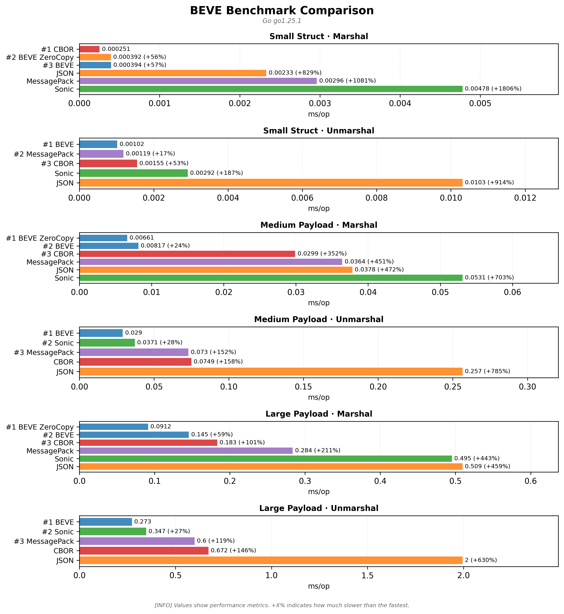
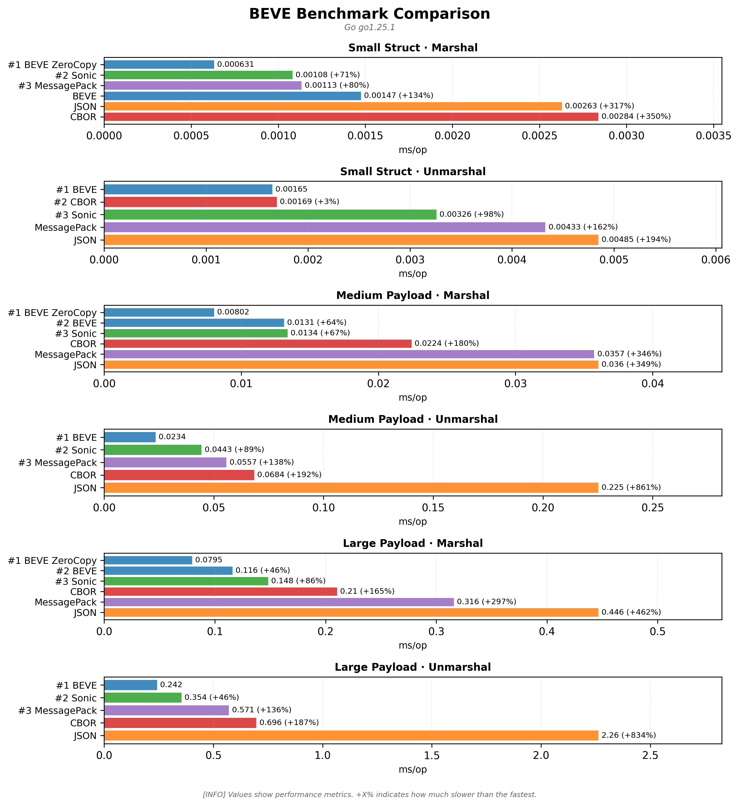
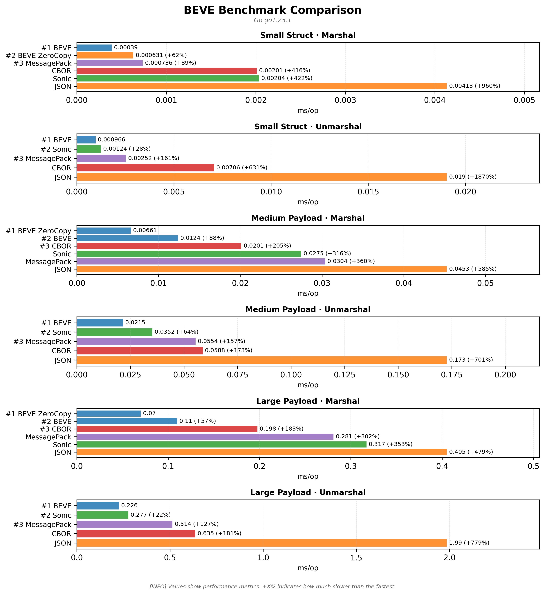
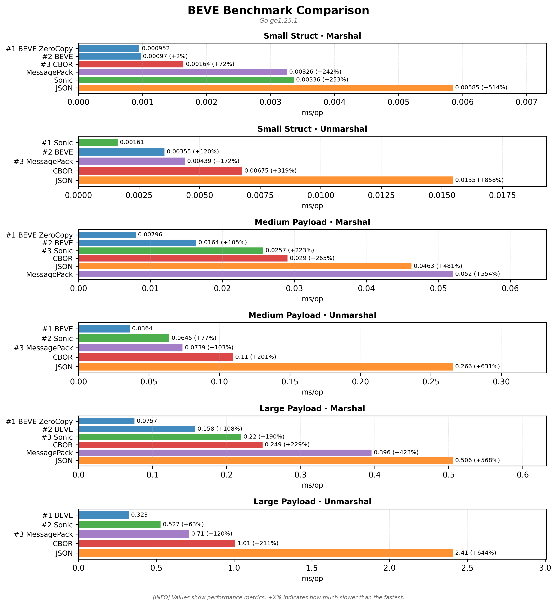

# 🚀 BEVE-Go Multi-Platform Benchmark Results

**Generated:** 2025-12-29 04:11:16 UTC

This report consolidates benchmark results from multiple platforms tested in CI/CD.

## � Visual Comparisons

### Overall Performance Comparison

### Performance Heatmap

### Memory Efficiency

---

## �🖥️ Tested Platforms

| Platform | CPU | OS | Artifacts |
|----------|-----|----|-----------| 
| benchmark-darwin-apple-m1-virtual | Apple M1 (Virtual) | Darwin | [📄 Report](benchmark-darwin-apple-m1-virtual/benchmark.md) · [📊 JSON](benchmark-darwin-apple-m1-virtual/benchmark.json) · [📈 Chart](benchmark-darwin-apple-m1-virtual/benchmark.png) |
| benchmark-linux-amd-epyc-7763-64-core-processor | AMD EPYC 7763 64-Core Processor | Linux | [📄 Report](benchmark-linux-amd-epyc-7763-64-core-processor/benchmark.md) · [📊 JSON](benchmark-linux-amd-epyc-7763-64-core-processor/benchmark.json) · [📈 Chart](benchmark-linux-amd-epyc-7763-64-core-processor/benchmark.png) |
| benchmark-linux-neoverse-n2 | Neoverse-N2 | Linux | [📄 Report](benchmark-linux-neoverse-n2/benchmark.md) · [📊 JSON](benchmark-linux-neoverse-n2/benchmark.json) · [📈 Chart](benchmark-linux-neoverse-n2/benchmark.png) |
| benchmark-windows-unknown-cpu | Unknown CPU | Windows | [📄 Report](benchmark-windows-unknown-cpu/benchmark.md) · [📊 JSON](benchmark-windows-unknown-cpu/benchmark.json) · [📈 Chart](benchmark-windows-unknown-cpu/benchmark.png) |

---

## 📊 Cross-Platform Performance Comparison

### Marshal Performance (Small Struct)

| Platform | BEVE | BEVE ZeroCopy | JSON | CBOR | MessagePack |
|----------|------|---------------|------|------|-------------|
| Apple M1 (Virtual) | 394ns | 392ns | 2.33μs | 251ns | 2.96μs |
| AMD EPYC 7763 64-Core Processor | 1.48μs | 631ns | 2.63μs | 2.84μs | 1.13μs |
| Neoverse-N2 | 390ns | 631ns | 4.13μs | 2.01μs | 736ns |
| Unknown CPU | 970ns | 952ns | 5.85μs | 1.64μs | 3.26μs |

### Unmarshal Performance (Small Struct)

| Platform | BEVE | JSON | CBOR | MessagePack |
|----------|------|------|------|-------------|
| Apple M1 (Virtual) | 1.02μs | 10.31μs | 1.55μs | 1.19μs |
| AMD EPYC 7763 64-Core Processor | 1.65μs | 4.85μs | 1.69μs | 4.33μs |
| Neoverse-N2 | 966ns | 19.04μs | 7.06μs | 2.52μs |
| Unknown CPU | 3.55μs | 15.46μs | 6.75μs | 4.39μs |

## 🏆 Performance Champions

| Platform | Fastest Marshal | Fastest Unmarshal | Memory Efficient |
|----------|----------------|-------------------|------------------|
| Apple M1 (Virtual) | 🥈 CBOR (251ns) | 🥇 BEVE (1.02μs) | 💾 BEVE (1 allocs) |
| AMD EPYC 7763 64-Core Processor | 🥇 BEVE ZeroCopy (631ns) | 🥇 BEVE (1.65μs) | 💾 BEVE (1 allocs) |
| Neoverse-N2 | 🥇 BEVE (390ns) | 🥇 BEVE (966ns) | 💾 BEVE (1 allocs) |
| Unknown CPU | 🥇 BEVE ZeroCopy (952ns) | 🥉 Sonic (1.61μs) | 💾 BEVE (1 allocs) |

## 📈 Summary Statistics

**Total Platforms Tested:** 4

**Average BEVE vs JSON Improvement:** 75.2% faster

### Platform Details

- **Apple M1 (Virtual)** (Darwin)
  - Architecture: arm64
  - Test Scenarios: 3

- **AMD EPYC 7763 64-Core Processor** (Linux)
  - Architecture: x86_64
  - Test Scenarios: 3

- **Neoverse-N2** (Linux)
  - Architecture: aarch64
  - Test Scenarios: 3

- **Unknown CPU** (Windows)
  - Architecture: AMD64
  - Test Scenarios: 3

---

## 📋 Detailed Platform Results

### Apple M1 (Virtual) — Darwin

_Performance visualization: lower is better._

| Scenario | Codec | Operation | Time | Memory | Allocations |
|----------|-------|-----------|------|--------|-------------|
| Small Struct | 🥈 CBOR | Marshal | 251ns | 144 | 1 |
| Small Struct | 🥇 BEVE ZeroCopy | Marshal | 392ns | 0 | 0 |
| Small Struct | 🥇 BEVE | Marshal | 394ns | 896 | 1 |
| Small Struct | 🥉 JSON | Marshal | 2.33μs | 1.8K | 1 |
| Small Struct | 🥈 MessagePack | Marshal | 2.96μs | 8.2K | 9 |
| Small Struct | 🥉 Sonic | Marshal | 4.78μs | 2.3K | 2 |
| Small Struct | 🥇 BEVE | Unmarshal | 1.02μs | 2.1K | 4 |
| Small Struct | 🥈 MessagePack | Unmarshal | 1.19μs | 688 | 17 |
| Small Struct | 🥈 CBOR | Unmarshal | 1.55μs | 712 | 18 |
| Small Struct | 🥉 Sonic | Unmarshal | 2.92μs | 4.3K | 6 |
| Small Struct | 🥉 JSON | Unmarshal | 10.31μs | 3.7K | 52 |
| Medium Payload | 🥇 BEVE ZeroCopy | Marshal | 6.61μs | 0 | 0 |
| Medium Payload | 🥇 BEVE | Marshal | 8.17μs | 18.4K | 1 |
| Medium Payload | 🥈 CBOR | Marshal | 29.89μs | 18.4K | 1 |
| Medium Payload | 🥈 MessagePack | Marshal | 36.42μs | 65.8K | 22 |
| Medium Payload | 🥉 JSON | Marshal | 37.82μs | 20.7K | 8 |
| Medium Payload | 🥉 Sonic | Marshal | 53.09μs | 20.7K | 3 |
| Medium Payload | 🥇 BEVE | Unmarshal | 29.00μs | 32.0K | 59 |
| Medium Payload | 🥉 Sonic | Unmarshal | 37.07μs | 32.3K | 33 |
| Medium Payload | 🥈 MessagePack | Unmarshal | 72.96μs | 40.9K | 763 |
| Medium Payload | 🥈 CBOR | Unmarshal | 74.93μs | 33.2K | 682 |
| Medium Payload | 🥉 JSON | Unmarshal | 256.56μs | 57.8K | 756 |
| Large Payload | 🥇 BEVE ZeroCopy | Marshal | 91.21μs | 52 | 0 |
| Large Payload | 🥇 BEVE | Marshal | 145.44μs | 180.3K | 1 |
| Large Payload | 🥈 CBOR | Marshal | 183.19μs | 188.6K | 1 |
| Large Payload | 🥈 MessagePack | Marshal | 283.61μs | 526.8K | 115 |
| Large Payload | 🥉 Sonic | Marshal | 495.30μs | 197.7K | 3 |
| Large Payload | 🥉 JSON | Marshal | 509.43μs | 221.5K | 8 |
| Large Payload | 🥇 BEVE | Unmarshal | 273.25μs | 278.0K | 419 |
| Large Payload | 🥉 Sonic | Unmarshal | 347.35μs | 360.7K | 211 |
| Large Payload | 🥈 MessagePack | Unmarshal | 599.55μs | 369.9K | 6.8K |
| Large Payload | 🥈 CBOR | Unmarshal | 671.63μs | 333.6K | 6.8K |
| Large Payload | 🥉 JSON | Unmarshal | 2.00ms | 543.7K | 7.1K |

[📄 View full report](benchmark-darwin-apple-m1-virtual/benchmark.md)

### AMD EPYC 7763 64-Core Processor — Linux

_Performance visualization: lower is better._

| Scenario | Codec | Operation | Time | Memory | Allocations |
|----------|-------|-----------|------|--------|-------------|
| Small Struct | 🥇 BEVE ZeroCopy | Marshal | 631ns | 0 | 0 |
| Small Struct | 🥉 Sonic | Marshal | 1.08μs | 1.5K | 2 |
| Small Struct | 🥈 MessagePack | Marshal | 1.13μs | 1.0K | 6 |
| Small Struct | 🥇 BEVE | Marshal | 1.48μs | 2.7K | 1 |
| Small Struct | 🥉 JSON | Marshal | 2.63μs | 1.3K | 1 |
| Small Struct | 🥈 CBOR | Marshal | 2.84μs | 3.1K | 1 |
| Small Struct | 🥇 BEVE | Unmarshal | 1.65μs | 2.6K | 4 |
| Small Struct | 🥈 CBOR | Unmarshal | 1.69μs | 520 | 14 |
| Small Struct | 🥉 Sonic | Unmarshal | 3.26μs | 4.7K | 9 |
| Small Struct | 🥈 MessagePack | Unmarshal | 4.33μs | 3.2K | 68 |
| Small Struct | 🥉 JSON | Unmarshal | 4.85μs | 904 | 22 |
| Medium Payload | 🥇 BEVE ZeroCopy | Marshal | 8.02μs | 5 | 0 |
| Medium Payload | 🥇 BEVE | Marshal | 13.12μs | 21.8K | 1 |
| Medium Payload | 🥉 Sonic | Marshal | 13.37μs | 18.9K | 3 |
| Medium Payload | 🥈 CBOR | Marshal | 22.41μs | 20.5K | 1 |
| Medium Payload | 🥈 MessagePack | Marshal | 35.74μs | 65.8K | 22 |
| Medium Payload | 🥉 JSON | Marshal | 36.04μs | 18.7K | 8 |
| Medium Payload | 🥇 BEVE | Unmarshal | 23.43μs | 26.7K | 59 |
| Medium Payload | 🥉 Sonic | Unmarshal | 44.34μs | 63.2K | 76 |
| Medium Payload | 🥈 MessagePack | Unmarshal | 55.71μs | 36.8K | 678 |
| Medium Payload | 🥈 CBOR | Unmarshal | 68.36μs | 31.2K | 644 |
| Medium Payload | 🥉 JSON | Unmarshal | 225.24μs | 56.9K | 731 |
| Large Payload | 🥇 BEVE ZeroCopy | Marshal | 79.47μs | 26 | 0 |
| Large Payload | 🥇 BEVE | Marshal | 115.99μs | 196.7K | 1 |
| Large Payload | 🥉 Sonic | Marshal | 148.13μs | 207.4K | 3 |
| Large Payload | 🥈 CBOR | Marshal | 210.41μs | 196.8K | 1 |
| Large Payload | 🥈 MessagePack | Marshal | 315.86μs | 526.8K | 115 |
| Large Payload | 🥉 JSON | Marshal | 446.39μs | 213.3K | 8 |
| Large Payload | 🥇 BEVE | Unmarshal | 242.25μs | 276.3K | 418 |
| Large Payload | 🥉 Sonic | Unmarshal | 353.98μs | 529.8K | 569 |
| Large Payload | 🥈 MessagePack | Unmarshal | 571.19μs | 350.0K | 6.4K |
| Large Payload | 🥈 CBOR | Unmarshal | 696.29μs | 308.2K | 6.3K |
| Large Payload | 🥉 JSON | Unmarshal | 2.26ms | 534.9K | 6.9K |

[📄 View full report](benchmark-linux-amd-epyc-7763-64-core-processor/benchmark.md)

### Neoverse-N2 — Linux

_Performance visualization: lower is better._

| Scenario | Codec | Operation | Time | Memory | Allocations |
|----------|-------|-----------|------|--------|-------------|
| Small Struct | 🥇 BEVE | Marshal | 390ns | 416 | 1 |
| Small Struct | 🥇 BEVE ZeroCopy | Marshal | 631ns | 0 | 0 |
| Small Struct | 🥈 MessagePack | Marshal | 736ns | 520 | 5 |
| Small Struct | 🥈 CBOR | Marshal | 2.01μs | 2.3K | 1 |
| Small Struct | 🥉 Sonic | Marshal | 2.04μs | 1.5K | 2 |
| Small Struct | 🥉 JSON | Marshal | 4.13μs | 2.7K | 1 |
| Small Struct | 🥇 BEVE | Unmarshal | 966ns | 1.2K | 4 |
| Small Struct | 🥉 Sonic | Unmarshal | 1.24μs | 1.2K | 6 |
| Small Struct | 🥈 MessagePack | Unmarshal | 2.52μs | 1.8K | 39 |
| Small Struct | 🥈 CBOR | Unmarshal | 7.06μs | 4.4K | 93 |
| Small Struct | 🥉 JSON | Unmarshal | 19.04μs | 4.9K | 89 |
| Medium Payload | 🥇 BEVE ZeroCopy | Marshal | 6.61μs | 1 | 0 |
| Medium Payload | 🥇 BEVE | Marshal | 12.39μs | 27.3K | 1 |
| Medium Payload | 🥈 CBOR | Marshal | 20.13μs | 21.8K | 1 |
| Medium Payload | 🥉 Sonic | Marshal | 27.46μs | 19.4K | 3 |
| Medium Payload | 🥈 MessagePack | Marshal | 30.38μs | 65.8K | 22 |
| Medium Payload | 🥉 JSON | Marshal | 45.27μs | 27.5K | 8 |
| Medium Payload | 🥇 BEVE | Unmarshal | 21.55μs | 26.8K | 59 |
| Medium Payload | 🥉 Sonic | Unmarshal | 35.25μs | 51.7K | 33 |
| Medium Payload | 🥈 MessagePack | Unmarshal | 55.41μs | 39.2K | 730 |
| Medium Payload | 🥈 CBOR | Unmarshal | 58.76μs | 27.6K | 569 |
| Medium Payload | 🥉 JSON | Unmarshal | 172.69μs | 45.5K | 618 |
| Large Payload | 🥇 BEVE ZeroCopy | Marshal | 69.95μs | 65 | 0 |
| Large Payload | 🥇 BEVE | Marshal | 109.86μs | 196.8K | 1 |
| Large Payload | 🥈 CBOR | Marshal | 197.73μs | 205.1K | 1 |
| Large Payload | 🥈 MessagePack | Marshal | 281.05μs | 526.8K | 115 |
| Large Payload | 🥉 Sonic | Marshal | 317.14μs | 225.7K | 3 |
| Large Payload | 🥉 JSON | Marshal | 405.13μs | 221.7K | 8 |
| Large Payload | 🥇 BEVE | Unmarshal | 225.87μs | 269.0K | 417 |
| Large Payload | 🥉 Sonic | Unmarshal | 276.57μs | 382.5K | 213 |
| Large Payload | 🥈 MessagePack | Unmarshal | 513.54μs | 344.0K | 6.2K |
| Large Payload | 🥈 CBOR | Unmarshal | 635.40μs | 306.5K | 6.2K |
| Large Payload | 🥉 JSON | Unmarshal | 1.99ms | 537.2K | 7.1K |

[📄 View full report](benchmark-linux-neoverse-n2/benchmark.md)

### Unknown CPU — Windows

_Performance visualization: lower is better._

| Scenario | Codec | Operation | Time | Memory | Allocations |
|----------|-------|-----------|------|--------|-------------|
| Small Struct | 🥇 BEVE ZeroCopy | Marshal | 952ns | 0 | 0 |
| Small Struct | 🥇 BEVE | Marshal | 970ns | 576 | 1 |
| Small Struct | 🥈 CBOR | Marshal | 1.64μs | 640 | 1 |
| Small Struct | 🥈 MessagePack | Marshal | 3.26μs | 2.1K | 7 |
| Small Struct | 🥉 Sonic | Marshal | 3.36μs | 2.8K | 2 |
| Small Struct | 🥉 JSON | Marshal | 5.85μs | 1.8K | 1 |
| Small Struct | 🥉 Sonic | Unmarshal | 1.61μs | 1.3K | 7 |
| Small Struct | 🥇 BEVE | Unmarshal | 3.55μs | 3.0K | 4 |
| Small Struct | 🥈 MessagePack | Unmarshal | 4.39μs | 2.1K | 45 |
| Small Struct | 🥈 CBOR | Unmarshal | 6.75μs | 2.7K | 58 |
| Small Struct | 🥉 JSON | Unmarshal | 15.46μs | 2.4K | 48 |
| Medium Payload | 🥇 BEVE ZeroCopy | Marshal | 7.96μs | 5 | 0 |
| Medium Payload | 🥇 BEVE | Marshal | 16.35μs | 18.4K | 1 |
| Medium Payload | 🥉 Sonic | Marshal | 25.68μs | 25.0K | 3 |
| Medium Payload | 🥈 CBOR | Marshal | 29.04μs | 19.1K | 1 |
| Medium Payload | 🥉 JSON | Marshal | 46.27μs | 18.7K | 8 |
| Medium Payload | 🥈 MessagePack | Marshal | 52.02μs | 65.8K | 22 |
| Medium Payload | 🥇 BEVE | Unmarshal | 36.36μs | 28.3K | 59 |
| Medium Payload | 🥉 Sonic | Unmarshal | 64.49μs | 61.3K | 76 |
| Medium Payload | 🥈 MessagePack | Unmarshal | 73.87μs | 34.0K | 623 |
| Medium Payload | 🥈 CBOR | Unmarshal | 109.54μs | 42.2K | 864 |
| Medium Payload | 🥉 JSON | Unmarshal | 265.64μs | 59.8K | 794 |
| Large Payload | 🥇 BEVE ZeroCopy | Marshal | 75.66μs | 65 | 0 |
| Large Payload | 🥇 BEVE | Marshal | 157.50μs | 196.8K | 1 |
| Large Payload | 🥉 Sonic | Marshal | 219.67μs | 211.1K | 3 |
| Large Payload | 🥈 CBOR | Marshal | 248.54μs | 188.6K | 1 |
| Large Payload | 🥈 MessagePack | Marshal | 395.71μs | 526.8K | 115 |
| Large Payload | 🥉 JSON | Marshal | 505.67μs | 213.4K | 8 |
| Large Payload | 🥇 BEVE | Unmarshal | 323.27μs | 261.5K | 418 |
| Large Payload | 🥉 Sonic | Unmarshal | 527.07μs | 522.2K | 558 |
| Large Payload | 🥈 MessagePack | Unmarshal | 709.90μs | 340.4K | 6.2K |
| Large Payload | 🥈 CBOR | Unmarshal | 1.01ms | 335.7K | 6.8K |
| Large Payload | 🥉 JSON | Unmarshal | 2.41ms | 522.8K | 6.8K |

[📄 View full report](benchmark-windows-unknown-cpu/benchmark.md)

---

## 📚 Additional Resources

- [BEVE Specification](../SPECIFICATION.md)
- [Go Package Documentation](../README.md)
- [Translator Package](../translator/README.md)
- [Examples](../examples/)

**Legend:**
- 🥇 BEVE family (fastest)
- 🥈 CBOR/MessagePack (fast)
- 🥉 JSON/Sonic (standard)

