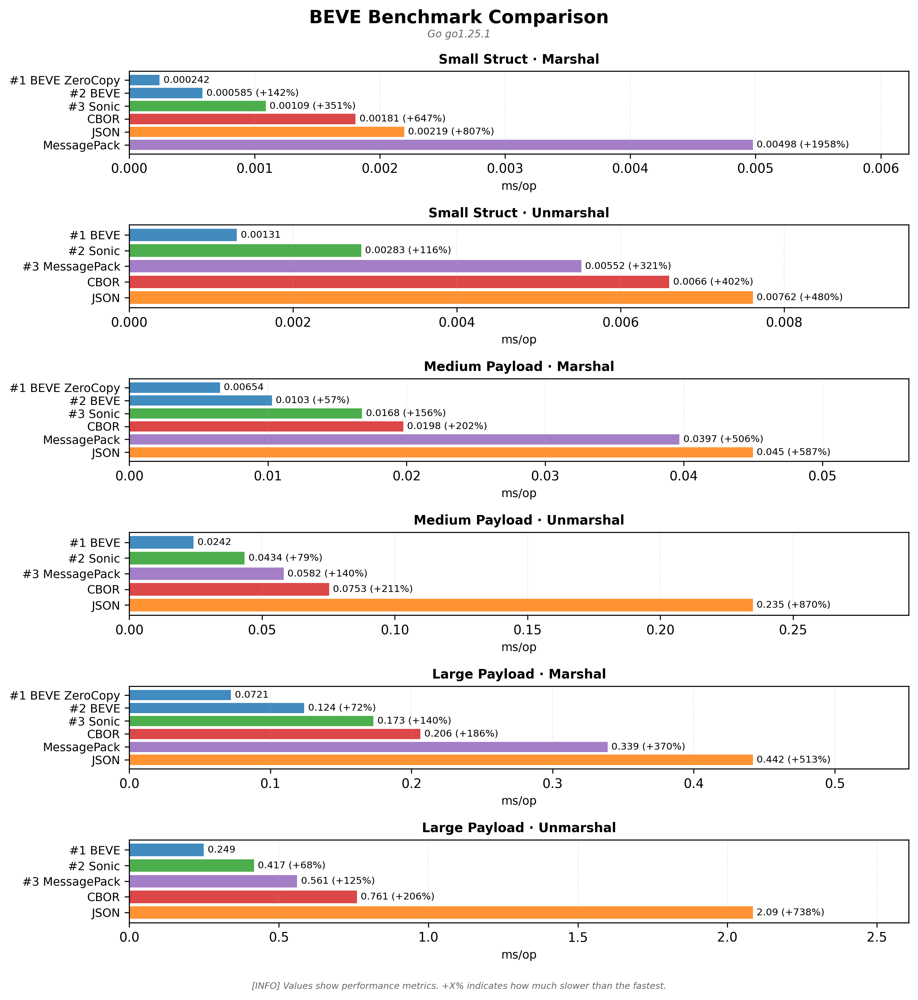

# 🚀 BEVE-Go Multi-Platform Benchmark Results

**Generated:** 2026-05-18 06:50:26 UTC

This report consolidates benchmark results from multiple platforms tested in CI/CD.

## � Visual Comparisons

### Overall Performance Comparison

### Performance Heatmap

### Memory Efficiency

---

## �🖥️ Tested Platforms

| Platform | CPU | OS | Artifacts |
|----------|-----|----|-----------| 
| benchmark-darwin-apple-m1-virtual | Apple M1 (Virtual) | Darwin | [📄 Report](benchmark-darwin-apple-m1-virtual/benchmark.md) · [📊 JSON](benchmark-darwin-apple-m1-virtual/benchmark.json) · [📈 Chart](benchmark-darwin-apple-m1-virtual/benchmark.png) |
| benchmark-linux-amd-epyc-9v74-80-core-processor | AMD EPYC 9V74 80-Core Processor | Linux | [📄 Report](benchmark-linux-amd-epyc-9v74-80-core-processor/benchmark.md) · [📊 JSON](benchmark-linux-amd-epyc-9v74-80-core-processor/benchmark.json) · [📈 Chart](benchmark-linux-amd-epyc-9v74-80-core-processor/benchmark.png) |
| benchmark-linux-neoverse-n2 | Neoverse-N2 | Linux | [📄 Report](benchmark-linux-neoverse-n2/benchmark.md) · [📊 JSON](benchmark-linux-neoverse-n2/benchmark.json) · [📈 Chart](benchmark-linux-neoverse-n2/benchmark.png) |
| benchmark-windows-unknown-cpu | Unknown CPU | Windows | [📄 Report](benchmark-windows-unknown-cpu/benchmark.md) · [📊 JSON](benchmark-windows-unknown-cpu/benchmark.json) · [📈 Chart](benchmark-windows-unknown-cpu/benchmark.png) |

---

## 📊 Cross-Platform Performance Comparison

### Marshal Performance (Small Struct)

| Platform | BEVE | BEVE ZeroCopy | JSON | CBOR | MessagePack |
|----------|------|---------------|------|------|-------------|
| Apple M1 (Virtual) | 742ns | 143ns | 3.00μs | 1.39μs | 2.37μs |
| AMD EPYC 9V74 80-Core Processor | 585ns | 242ns | 2.19μs | 1.81μs | 4.98μs |
| Neoverse-N2 | 320ns | 722ns | 3.90μs | 830ns | 1.53μs |
| Unknown CPU | 1.89μs | 716ns | 894ns | 894ns | 1.14μs |

### Unmarshal Performance (Small Struct)

| Platform | BEVE | JSON | CBOR | MessagePack |
|----------|------|------|------|-------------|
| Apple M1 (Virtual) | 1.06μs | 15.09μs | 5.33μs | 1.47μs |
| AMD EPYC 9V74 80-Core Processor | 1.31μs | 7.62μs | 6.60μs | 5.52μs |
| Neoverse-N2 | 1.08μs | 21.10μs | 5.63μs | 4.51μs |
| Unknown CPU | 1.83μs | 23.36μs | 7.33μs | 6.01μs |

## 🏆 Performance Champions

| Platform | Fastest Marshal | Fastest Unmarshal | Memory Efficient |
|----------|----------------|-------------------|------------------|
| Apple M1 (Virtual) | 🥇 BEVE ZeroCopy (143ns) | 🥇 BEVE (1.06μs) | 💾 BEVE (1 allocs) |
| AMD EPYC 9V74 80-Core Processor | 🥇 BEVE ZeroCopy (242ns) | 🥇 BEVE (1.31μs) | 💾 BEVE (1 allocs) |
| Neoverse-N2 | 🥇 BEVE (320ns) | 🥇 BEVE (1.08μs) | 💾 BEVE (1 allocs) |
| Unknown CPU | 🥇 BEVE ZeroCopy (716ns) | 🥇 BEVE (1.83μs) | 💾 BEVE (1 allocs) |

## 📈 Summary Statistics

**Total Platforms Tested:** 4

**Average BEVE vs JSON Improvement:** 32.2% faster

### Platform Details

- **Apple M1 (Virtual)** (Darwin)
  - Architecture: arm64
  - Test Scenarios: 3

- **AMD EPYC 9V74 80-Core Processor** (Linux)
  - Architecture: x86_64
  - Test Scenarios: 3

- **Neoverse-N2** (Linux)
  - Architecture: aarch64
  - Test Scenarios: 3

- **Unknown CPU** (Windows)
  - Architecture: AMD64
  - Test Scenarios: 3

---

## 📋 Detailed Platform Results

### Apple M1 (Virtual) — Darwin

_Performance visualization: lower is better._

| Scenario | Codec | Operation | Time | Memory | Allocations |
|----------|-------|-----------|------|--------|-------------|
| Small Struct | 🥇 BEVE ZeroCopy | Marshal | 143ns | 0 | 0 |
| Small Struct | 🥇 BEVE | Marshal | 742ns | 2.0K | 1 |
| Small Struct | 🥈 CBOR | Marshal | 1.39μs | 2.0K | 1 |
| Small Struct | 🥈 MessagePack | Marshal | 2.37μs | 4.1K | 8 |
| Small Struct | 🥉 Sonic | Marshal | 2.59μs | 1.4K | 2 |
| Small Struct | 🥉 JSON | Marshal | 3.00μs | 2.3K | 1 |
| Small Struct | 🥇 BEVE | Unmarshal | 1.06μs | 696 | 4 |
| Small Struct | 🥈 MessagePack | Unmarshal | 1.47μs | 1.5K | 33 |
| Small Struct | 🥉 Sonic | Unmarshal | 2.14μs | 3.5K | 6 |
| Small Struct | 🥈 CBOR | Unmarshal | 5.33μs | 4.6K | 98 |
| Small Struct | 🥉 JSON | Unmarshal | 15.09μs | 4.8K | 86 |
| Medium Payload | 🥇 BEVE ZeroCopy | Marshal | 5.94μs | 0 | 0 |
| Medium Payload | 🥇 BEVE | Marshal | 9.54μs | 20.5K | 1 |
| Medium Payload | 🥈 CBOR | Marshal | 17.60μs | 18.4K | 1 |
| Medium Payload | 🥈 MessagePack | Marshal | 24.11μs | 65.8K | 22 |
| Medium Payload | 🥉 JSON | Marshal | 29.16μs | 20.7K | 8 |
| Medium Payload | 🥉 Sonic | Marshal | 44.91μs | 24.8K | 3 |
| Medium Payload | 🥇 BEVE | Unmarshal | 16.44μs | 24.8K | 59 |
| Medium Payload | 🥉 Sonic | Unmarshal | 31.25μs | 41.2K | 33 |
| Medium Payload | 🥈 MessagePack | Unmarshal | 52.28μs | 34.9K | 644 |
| Medium Payload | 🥈 CBOR | Unmarshal | 61.52μs | 27.4K | 565 |
| Medium Payload | 🥉 JSON | Unmarshal | 212.55μs | 71.0K | 943 |
| Large Payload | 🥇 BEVE ZeroCopy | Marshal | 50.79μs | 39 | 0 |
| Large Payload | 🥇 BEVE | Marshal | 78.66μs | 180.3K | 1 |
| Large Payload | 🥈 CBOR | Marshal | 161.56μs | 213.2K | 1 |
| Large Payload | 🥈 MessagePack | Marshal | 228.33μs | 526.8K | 115 |
| Large Payload | 🥉 JSON | Marshal | 357.27μs | 221.5K | 8 |
| Large Payload | 🥉 Sonic | Marshal | 405.58μs | 197.3K | 3 |
| Large Payload | 🥇 BEVE | Unmarshal | 210.87μs | 278.6K | 418 |
| Large Payload | 🥉 Sonic | Unmarshal | 310.00μs | 359.2K | 211 |
| Large Payload | 🥈 MessagePack | Unmarshal | 402.87μs | 335.7K | 6.1K |
| Large Payload | 🥈 CBOR | Unmarshal | 481.60μs | 308.2K | 6.3K |
| Large Payload | 🥉 JSON | Unmarshal | 1.80ms | 544.3K | 7.1K |

[📄 View full report](benchmark-darwin-apple-m1-virtual/benchmark.md)

### AMD EPYC 9V74 80-Core Processor — Linux

_Performance visualization: lower is better._

| Scenario | Codec | Operation | Time | Memory | Allocations |
|----------|-------|-----------|------|--------|-------------|
| Small Struct | 🥇 BEVE ZeroCopy | Marshal | 242ns | 0 | 0 |
| Small Struct | 🥇 BEVE | Marshal | 585ns | 896 | 1 |
| Small Struct | 🥉 Sonic | Marshal | 1.09μs | 1.3K | 2 |
| Small Struct | 🥈 CBOR | Marshal | 1.81μs | 1.8K | 1 |
| Small Struct | 🥉 JSON | Marshal | 2.19μs | 1.2K | 1 |
| Small Struct | 🥈 MessagePack | Marshal | 4.98μs | 8.2K | 9 |
| Small Struct | 🥇 BEVE | Unmarshal | 1.31μs | 1.8K | 4 |
| Small Struct | 🥉 Sonic | Unmarshal | 2.83μs | 4.2K | 9 |
| Small Struct | 🥈 MessagePack | Unmarshal | 5.52μs | 4.4K | 93 |
| Small Struct | 🥈 CBOR | Unmarshal | 6.60μs | 3.2K | 69 |
| Small Struct | 🥉 JSON | Unmarshal | 7.62μs | 1.4K | 32 |
| Medium Payload | 🥇 BEVE ZeroCopy | Marshal | 6.54μs | 3 | 0 |
| Medium Payload | 🥇 BEVE | Marshal | 10.29μs | 16.4K | 1 |
| Medium Payload | 🥉 Sonic | Marshal | 16.79μs | 22.2K | 3 |
| Medium Payload | 🥈 CBOR | Marshal | 19.76μs | 18.4K | 1 |
| Medium Payload | 🥈 MessagePack | Marshal | 39.69μs | 65.8K | 22 |
| Medium Payload | 🥉 JSON | Marshal | 44.99μs | 24.8K | 8 |
| Medium Payload | 🥇 BEVE | Unmarshal | 24.22μs | 27.2K | 59 |
| Medium Payload | 🥉 Sonic | Unmarshal | 43.42μs | 62.1K | 71 |
| Medium Payload | 🥈 MessagePack | Unmarshal | 58.15μs | 39.8K | 744 |
| Medium Payload | 🥈 CBOR | Unmarshal | 75.25μs | 32.4K | 665 |
| Medium Payload | 🥉 JSON | Unmarshal | 234.85μs | 64.8K | 847 |
| Large Payload | 🥇 BEVE ZeroCopy | Marshal | 72.07μs | 26 | 0 |
| Large Payload | 🥇 BEVE | Marshal | 123.96μs | 196.7K | 1 |
| Large Payload | 🥉 Sonic | Marshal | 173.07μs | 224.4K | 3 |
| Large Payload | 🥈 CBOR | Marshal | 206.33μs | 188.6K | 1 |
| Large Payload | 🥈 MessagePack | Marshal | 338.93μs | 526.8K | 115 |
| Large Payload | 🥉 JSON | Marshal | 441.95μs | 213.3K | 8 |
| Large Payload | 🥇 BEVE | Unmarshal | 248.94μs | 277.9K | 419 |
| Large Payload | 🥉 Sonic | Unmarshal | 417.11μs | 567.9K | 582 |
| Large Payload | 🥈 MessagePack | Unmarshal | 561.11μs | 346.7K | 6.3K |
| Large Payload | 🥈 CBOR | Unmarshal | 761.24μs | 305.3K | 6.2K |
| Large Payload | 🥉 JSON | Unmarshal | 2.09ms | 531.2K | 7.0K |

[📄 View full report](benchmark-linux-amd-epyc-9v74-80-core-processor/benchmark.md)

### Neoverse-N2 — Linux

_Performance visualization: lower is better._

| Scenario | Codec | Operation | Time | Memory | Allocations |
|----------|-------|-----------|------|--------|-------------|
| Small Struct | 🥇 BEVE | Marshal | 320ns | 288 | 1 |
| Small Struct | 🥇 BEVE ZeroCopy | Marshal | 722ns | 0 | 0 |
| Small Struct | 🥈 CBOR | Marshal | 830ns | 704 | 1 |
| Small Struct | 🥈 MessagePack | Marshal | 1.53μs | 2.1K | 7 |
| Small Struct | 🥉 Sonic | Marshal | 2.41μs | 1.9K | 2 |
| Small Struct | 🥉 JSON | Marshal | 3.90μs | 2.3K | 1 |
| Small Struct | 🥇 BEVE | Unmarshal | 1.08μs | 1.3K | 4 |
| Small Struct | 🥉 Sonic | Unmarshal | 2.10μs | 2.9K | 6 |
| Small Struct | 🥈 MessagePack | Unmarshal | 4.51μs | 3.7K | 79 |
| Small Struct | 🥈 CBOR | Unmarshal | 5.63μs | 3.1K | 67 |
| Small Struct | 🥉 JSON | Unmarshal | 21.10μs | 7.4K | 96 |
| Medium Payload | 🥇 BEVE ZeroCopy | Marshal | 7.67μs | 5 | 0 |
| Medium Payload | 🥇 BEVE | Marshal | 11.98μs | 24.6K | 1 |
| Medium Payload | 🥈 CBOR | Marshal | 20.18μs | 21.8K | 1 |
| Medium Payload | 🥉 Sonic | Marshal | 31.81μs | 25.1K | 3 |
| Medium Payload | 🥈 MessagePack | Marshal | 32.46μs | 65.8K | 22 |
| Medium Payload | 🥉 JSON | Marshal | 35.77μs | 19.3K | 8 |
| Medium Payload | 🥇 BEVE | Unmarshal | 23.11μs | 30.1K | 59 |
| Medium Payload | 🥉 Sonic | Unmarshal | 29.25μs | 38.5K | 33 |
| Medium Payload | 🥈 MessagePack | Unmarshal | 44.22μs | 27.3K | 491 |
| Medium Payload | 🥈 CBOR | Unmarshal | 70.30μs | 34.9K | 714 |
| Medium Payload | 🥉 JSON | Unmarshal | 193.04μs | 53.1K | 703 |
| Large Payload | 🥇 BEVE ZeroCopy | Marshal | 70.23μs | 52 | 0 |
| Large Payload | 🥇 BEVE | Marshal | 106.24μs | 180.4K | 1 |
| Large Payload | 🥈 CBOR | Marshal | 188.81μs | 188.8K | 1 |
| Large Payload | 🥈 MessagePack | Marshal | 293.03μs | 526.8K | 115 |
| Large Payload | 🥉 Sonic | Marshal | 326.09μs | 234.0K | 3 |
| Large Payload | 🥉 JSON | Marshal | 378.45μs | 205.2K | 8 |
| Large Payload | 🥇 BEVE | Unmarshal | 229.36μs | 274.6K | 418 |
| Large Payload | 🥉 Sonic | Unmarshal | 298.19μs | 408.0K | 209 |
| Large Payload | 🥈 MessagePack | Unmarshal | 508.14μs | 337.8K | 6.1K |
| Large Payload | 🥈 CBOR | Unmarshal | 615.00μs | 287.4K | 5.9K |
| Large Payload | 🥉 JSON | Unmarshal | 1.98ms | 540.5K | 7.0K |

[📄 View full report](benchmark-linux-neoverse-n2/benchmark.md)

### Unknown CPU — Windows

_Performance visualization: lower is better._

| Scenario | Codec | Operation | Time | Memory | Allocations |
|----------|-------|-----------|------|--------|-------------|
| Small Struct | 🥇 BEVE ZeroCopy | Marshal | 716ns | 0 | 0 |
| Small Struct | 🥉 JSON | Marshal | 894ns | 320 | 1 |
| Small Struct | 🥈 CBOR | Marshal | 894ns | 768 | 1 |
| Small Struct | 🥈 MessagePack | Marshal | 1.14μs | 1.0K | 6 |
| Small Struct | 🥇 BEVE | Marshal | 1.89μs | 2.3K | 1 |
| Small Struct | 🥉 Sonic | Marshal | 2.22μs | 2.7K | 2 |
| Small Struct | 🥇 BEVE | Unmarshal | 1.83μs | 2.4K | 4 |
| Small Struct | 🥉 Sonic | Unmarshal | 3.10μs | 3.5K | 9 |
| Small Struct | 🥈 MessagePack | Unmarshal | 6.01μs | 3.6K | 76 |
| Small Struct | 🥈 CBOR | Unmarshal | 7.33μs | 3.2K | 68 |
| Small Struct | 🥉 JSON | Unmarshal | 23.36μs | 4.6K | 82 |
| Medium Payload | 🥇 BEVE ZeroCopy | Marshal | 7.25μs | 5 | 0 |
| Medium Payload | 🥇 BEVE | Marshal | 14.14μs | 20.5K | 1 |
| Medium Payload | 🥉 Sonic | Marshal | 16.71μs | 20.8K | 3 |
| Medium Payload | 🥈 MessagePack | Marshal | 27.52μs | 33.0K | 21 |
| Medium Payload | 🥈 CBOR | Marshal | 29.24μs | 20.5K | 1 |
| Medium Payload | 🥉 JSON | Marshal | 49.21μs | 22.0K | 8 |
| Medium Payload | 🥇 BEVE | Unmarshal | 27.85μs | 26.8K | 59 |
| Medium Payload | 🥉 Sonic | Unmarshal | 59.42μs | 66.7K | 78 |
| Medium Payload | 🥈 CBOR | Unmarshal | 88.87μs | 28.2K | 580 |
| Medium Payload | 🥈 MessagePack | Unmarshal | 89.02μs | 37.7K | 703 |
| Medium Payload | 🥉 JSON | Unmarshal | 281.24μs | 56.0K | 721 |
| Large Payload | 🥇 BEVE ZeroCopy | Marshal | 97.98μs | 65 | 0 |
| Large Payload | 🥇 BEVE | Marshal | 141.50μs | 188.5K | 1 |
| Large Payload | 🥉 Sonic | Marshal | 204.10μs | 215.6K | 3 |
| Large Payload | 🥈 CBOR | Marshal | 229.17μs | 204.9K | 1 |
| Large Payload | 🥈 MessagePack | Marshal | 399.79μs | 526.7K | 115 |
| Large Payload | 🥉 JSON | Marshal | 638.09μs | 221.5K | 8 |
| Large Payload | 🥇 BEVE | Unmarshal | 365.06μs | 267.1K | 416 |
| Large Payload | 🥉 Sonic | Unmarshal | 441.22μs | 548.2K | 593 |
| Large Payload | 🥈 MessagePack | Unmarshal | 657.16μs | 331.8K | 6.0K |
| Large Payload | 🥈 CBOR | Unmarshal | 892.01μs | 329.6K | 6.7K |
| Large Payload | 🥉 JSON | Unmarshal | 2.52ms | 514.6K | 6.7K |

[📄 View full report](benchmark-windows-unknown-cpu/benchmark.md)

---

## 📚 Additional Resources

- [BEVE Specification](../SPECIFICATION.md)
- [Go Package Documentation](../README.md)
- [Translator Package](../translator/README.md)
- [Examples](../examples/)

**Legend:**
- 🥇 BEVE family (fastest)
- 🥈 CBOR/MessagePack (fast)
- 🥉 JSON/Sonic (standard)

