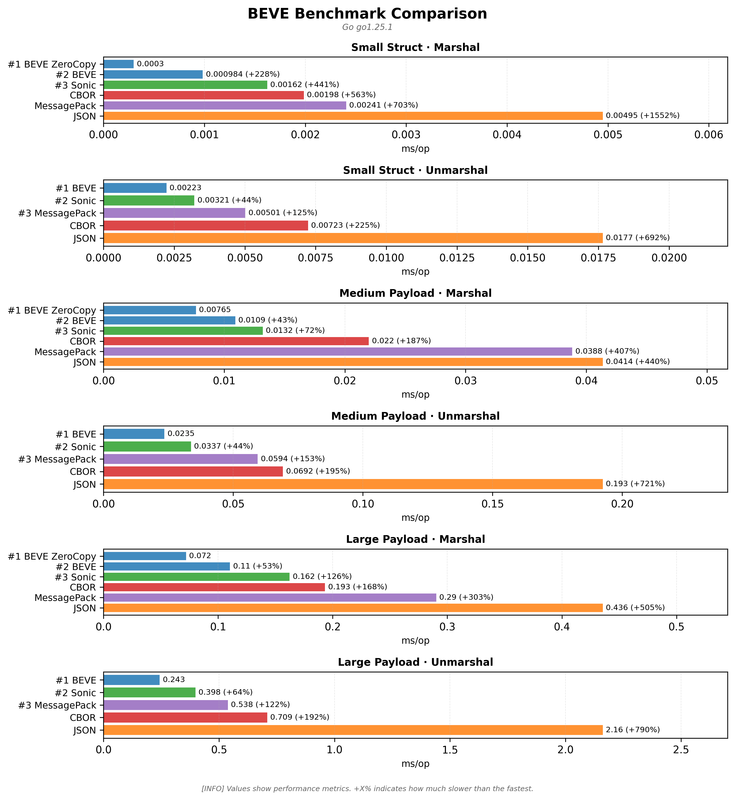

# 🚀 BEVE-Go Multi-Platform Benchmark Results

**Generated:** 2025-12-08 03:56:25 UTC

This report consolidates benchmark results from multiple platforms tested in CI/CD.

## � Visual Comparisons

### Overall Performance Comparison

### Performance Heatmap

### Memory Efficiency

---

## �🖥️ Tested Platforms

| Platform | CPU | OS | Artifacts |
|----------|-----|----|-----------| 
| benchmark-darwin-apple-m1-virtual | Apple M1 (Virtual) | Darwin | [📄 Report](benchmark-darwin-apple-m1-virtual/benchmark.md) · [📊 JSON](benchmark-darwin-apple-m1-virtual/benchmark.json) · [📈 Chart](benchmark-darwin-apple-m1-virtual/benchmark.png) |
| benchmark-linux-intel-r-xeon-r-platinum-8370c-cpu-2-80ghz | Intel(R) Xeon(R) Platinum 8370C CPU @ 2.80GHz | Linux | [📄 Report](benchmark-linux-intel-r-xeon-r-platinum-8370c-cpu-2-80ghz/benchmark.md) · [📊 JSON](benchmark-linux-intel-r-xeon-r-platinum-8370c-cpu-2-80ghz/benchmark.json) · [📈 Chart](benchmark-linux-intel-r-xeon-r-platinum-8370c-cpu-2-80ghz/benchmark.png) |
| benchmark-linux-neoverse-n2 | Neoverse-N2 | Linux | [📄 Report](benchmark-linux-neoverse-n2/benchmark.md) · [📊 JSON](benchmark-linux-neoverse-n2/benchmark.json) · [📈 Chart](benchmark-linux-neoverse-n2/benchmark.png) |
| benchmark-windows-unknown-cpu | Unknown CPU | Windows | [📄 Report](benchmark-windows-unknown-cpu/benchmark.md) · [📊 JSON](benchmark-windows-unknown-cpu/benchmark.json) · [📈 Chart](benchmark-windows-unknown-cpu/benchmark.png) |

---

## 📊 Cross-Platform Performance Comparison

### Marshal Performance (Small Struct)

| Platform | BEVE | BEVE ZeroCopy | JSON | CBOR | MessagePack |
|----------|------|---------------|------|------|-------------|
| Apple M1 (Virtual) | 1.83μs | 1.05μs | 1.75μs | 1.29μs | 3.36μs |
| Intel(R) Xeon(R) Platinum 8370C CPU @ 2.80GHz | 984ns | 300ns | 4.95μs | 1.99μs | 2.40μs |
| Neoverse-N2 | 950ns | 594ns | 2.88μs | 622ns | 752ns |
| Unknown CPU | 2.03μs | 560ns | 2.53μs | 448ns | 4.86μs |

### Unmarshal Performance (Small Struct)

| Platform | BEVE | JSON | CBOR | MessagePack |
|----------|------|------|------|-------------|
| Apple M1 (Virtual) | 3.76μs | 21.26μs | 4.50μs | 8.42μs |
| Intel(R) Xeon(R) Platinum 8370C CPU @ 2.80GHz | 2.23μs | 17.66μs | 7.23μs | 5.01μs |
| Neoverse-N2 | 1.54μs | 3.13μs | 6.65μs | 3.79μs |
| Unknown CPU | 974ns | 2.88μs | 2.66μs | 4.13μs |

## 🏆 Performance Champions

| Platform | Fastest Marshal | Fastest Unmarshal | Memory Efficient |
|----------|----------------|-------------------|------------------|
| Apple M1 (Virtual) | 🥇 BEVE ZeroCopy (1.05μs) | 🥇 BEVE (3.76μs) | 💾 BEVE (1 allocs) |
| Intel(R) Xeon(R) Platinum 8370C CPU @ 2.80GHz | 🥇 BEVE ZeroCopy (300ns) | 🥇 BEVE (2.23μs) | 💾 BEVE (1 allocs) |
| Neoverse-N2 | 🥇 BEVE ZeroCopy (594ns) | 🥇 BEVE (1.54μs) | 💾 BEVE (1 allocs) |
| Unknown CPU | 🥈 CBOR (448ns) | 🥉 Sonic (625ns) | 💾 BEVE (1 allocs) |

## 📈 Summary Statistics

**Total Platforms Tested:** 4

**Average BEVE vs JSON Improvement:** 40.6% faster

### Platform Details

- **Apple M1 (Virtual)** (Darwin)
  - Architecture: arm64
  - Test Scenarios: 3

- **Intel(R) Xeon(R) Platinum 8370C CPU @ 2.80GHz** (Linux)
  - Architecture: x86_64
  - Test Scenarios: 3

- **Neoverse-N2** (Linux)
  - Architecture: aarch64
  - Test Scenarios: 3

- **Unknown CPU** (Windows)
  - Architecture: AMD64
  - Test Scenarios: 3

---

## 📋 Detailed Platform Results

### Apple M1 (Virtual) — Darwin

_Performance visualization: lower is better._

| Scenario | Codec | Operation | Time | Memory | Allocations |
|----------|-------|-----------|------|--------|-------------|
| Small Struct | 🥇 BEVE ZeroCopy | Marshal | 1.05μs | 0 | 0 |
| Small Struct | 🥈 CBOR | Marshal | 1.29μs | 768 | 1 |
| Small Struct | 🥉 JSON | Marshal | 1.75μs | 576 | 1 |
| Small Struct | 🥇 BEVE | Marshal | 1.83μs | 2.3K | 1 |
| Small Struct | 🥉 Sonic | Marshal | 2.19μs | 656 | 2 |
| Small Struct | 🥈 MessagePack | Marshal | 3.36μs | 4.1K | 8 |
| Small Struct | 🥇 BEVE | Unmarshal | 3.76μs | 2.4K | 4 |
| Small Struct | 🥈 CBOR | Unmarshal | 4.50μs | 1.5K | 34 |
| Small Struct | 🥉 Sonic | Unmarshal | 4.90μs | 4.6K | 6 |
| Small Struct | 🥈 MessagePack | Unmarshal | 8.42μs | 3.8K | 80 |
| Small Struct | 🥉 JSON | Unmarshal | 21.26μs | 4.1K | 64 |
| Medium Payload | 🥇 BEVE ZeroCopy | Marshal | 8.05μs | 3 | 0 |
| Medium Payload | 🥇 BEVE | Marshal | 17.14μs | 21.8K | 1 |
| Medium Payload | 🥈 CBOR | Marshal | 23.41μs | 19.1K | 1 |
| Medium Payload | 🥈 MessagePack | Marshal | 33.91μs | 65.8K | 22 |
| Medium Payload | 🥉 JSON | Marshal | 47.05μs | 20.7K | 8 |
| Medium Payload | 🥉 Sonic | Marshal | 62.38μs | 24.9K | 3 |
| Medium Payload | 🥇 BEVE | Unmarshal | 34.40μs | 36.3K | 59 |
| Medium Payload | 🥉 Sonic | Unmarshal | 49.83μs | 41.6K | 33 |
| Medium Payload | 🥈 MessagePack | Unmarshal | 70.39μs | 43.0K | 803 |
| Medium Payload | 🥈 CBOR | Unmarshal | 95.74μs | 34.9K | 718 |
| Medium Payload | 🥉 JSON | Unmarshal | 239.37μs | 53.3K | 711 |
| Large Payload | 🥇 BEVE ZeroCopy | Marshal | 93.48μs | 26 | 0 |
| Large Payload | 🥇 BEVE | Marshal | 134.44μs | 188.5K | 1 |
| Large Payload | 🥈 CBOR | Marshal | 152.69μs | 196.8K | 1 |
| Large Payload | 🥈 MessagePack | Marshal | 336.03μs | 526.8K | 115 |
| Large Payload | 🥉 JSON | Marshal | 483.73μs | 213.3K | 8 |
| Large Payload | 🥉 Sonic | Marshal | 577.80μs | 206.4K | 3 |
| Large Payload | 🥇 BEVE | Unmarshal | 271.82μs | 286.4K | 419 |
| Large Payload | 🥈 MessagePack | Unmarshal | 407.73μs | 343.2K | 6.2K |
| Large Payload | 🥉 Sonic | Unmarshal | 415.33μs | 381.9K | 213 |
| Large Payload | 🥈 CBOR | Unmarshal | 737.17μs | 324.1K | 6.6K |
| Large Payload | 🥉 JSON | Unmarshal | 2.55ms | 541.6K | 7.2K |

[📄 View full report](benchmark-darwin-apple-m1-virtual/benchmark.md)

### Intel(R) Xeon(R) Platinum 8370C CPU @ 2.80GHz — Linux

_Performance visualization: lower is better._

| Scenario | Codec | Operation | Time | Memory | Allocations |
|----------|-------|-----------|------|--------|-------------|
| Small Struct | 🥇 BEVE ZeroCopy | Marshal | 300ns | 0 | 0 |
| Small Struct | 🥇 BEVE | Marshal | 984ns | 1.5K | 1 |
| Small Struct | 🥉 Sonic | Marshal | 1.62μs | 2.1K | 2 |
| Small Struct | 🥈 CBOR | Marshal | 1.99μs | 2.0K | 1 |
| Small Struct | 🥈 MessagePack | Marshal | 2.40μs | 4.1K | 8 |
| Small Struct | 🥉 JSON | Marshal | 4.95μs | 2.7K | 1 |
| Small Struct | 🥇 BEVE | Unmarshal | 2.23μs | 3.4K | 4 |
| Small Struct | 🥉 Sonic | Unmarshal | 3.21μs | 4.7K | 9 |
| Small Struct | 🥈 MessagePack | Unmarshal | 5.01μs | 3.9K | 82 |
| Small Struct | 🥈 CBOR | Unmarshal | 7.23μs | 4.2K | 88 |
| Small Struct | 🥉 JSON | Unmarshal | 17.66μs | 4.7K | 83 |
| Medium Payload | 🥇 BEVE ZeroCopy | Marshal | 7.66μs | 3 | 0 |
| Medium Payload | 🥇 BEVE | Marshal | 10.92μs | 16.4K | 1 |
| Medium Payload | 🥉 Sonic | Marshal | 13.19μs | 16.9K | 3 |
| Medium Payload | 🥈 CBOR | Marshal | 21.98μs | 21.8K | 1 |
| Medium Payload | 🥈 MessagePack | Marshal | 38.83μs | 65.8K | 22 |
| Medium Payload | 🥉 JSON | Marshal | 41.37μs | 20.7K | 8 |
| Medium Payload | 🥇 BEVE | Unmarshal | 23.45μs | 26.9K | 59 |
| Medium Payload | 🥉 Sonic | Unmarshal | 33.71μs | 45.8K | 67 |
| Medium Payload | 🥈 MessagePack | Unmarshal | 59.42μs | 40.6K | 763 |
| Medium Payload | 🥈 CBOR | Unmarshal | 69.18μs | 33.0K | 681 |
| Medium Payload | 🥉 JSON | Unmarshal | 192.51μs | 49.4K | 673 |
| Large Payload | 🥇 BEVE ZeroCopy | Marshal | 72.00μs | 26 | 0 |
| Large Payload | 🥇 BEVE | Marshal | 110.38μs | 196.7K | 1 |
| Large Payload | 🥉 Sonic | Marshal | 162.38μs | 216.2K | 3 |
| Large Payload | 🥈 CBOR | Marshal | 193.31μs | 188.6K | 1 |
| Large Payload | 🥈 MessagePack | Marshal | 290.32μs | 526.8K | 115 |
| Large Payload | 🥉 JSON | Marshal | 435.70μs | 221.5K | 8 |
| Large Payload | 🥇 BEVE | Unmarshal | 243.01μs | 282.2K | 419 |
| Large Payload | 🥉 Sonic | Unmarshal | 398.03μs | 589.9K | 607 |
| Large Payload | 🥈 MessagePack | Unmarshal | 538.39μs | 335.9K | 6.1K |
| Large Payload | 🥈 CBOR | Unmarshal | 708.76μs | 314.6K | 6.4K |
| Large Payload | 🥉 JSON | Unmarshal | 2.16ms | 564.3K | 7.4K |

[📄 View full report](benchmark-linux-intel-r-xeon-r-platinum-8370c-cpu-2-80ghz/benchmark.md)

### Neoverse-N2 — Linux

_Performance visualization: lower is better._

| Scenario | Codec | Operation | Time | Memory | Allocations |
|----------|-------|-----------|------|--------|-------------|
| Small Struct | 🥇 BEVE ZeroCopy | Marshal | 594ns | 0 | 0 |
| Small Struct | 🥈 CBOR | Marshal | 622ns | 384 | 1 |
| Small Struct | 🥈 MessagePack | Marshal | 752ns | 520 | 5 |
| Small Struct | 🥇 BEVE | Marshal | 950ns | 1.5K | 1 |
| Small Struct | 🥉 Sonic | Marshal | 1.09μs | 670 | 2 |
| Small Struct | 🥉 JSON | Marshal | 2.88μs | 1.8K | 1 |
| Small Struct | 🥇 BEVE | Unmarshal | 1.54μs | 2.4K | 4 |
| Small Struct | 🥉 Sonic | Unmarshal | 2.24μs | 3.4K | 6 |
| Small Struct | 🥉 JSON | Unmarshal | 3.13μs | 552 | 15 |
| Small Struct | 🥈 MessagePack | Unmarshal | 3.79μs | 2.9K | 63 |
| Small Struct | 🥈 CBOR | Unmarshal | 6.65μs | 3.9K | 84 |
| Medium Payload | 🥇 BEVE ZeroCopy | Marshal | 6.89μs | 3 | 0 |
| Medium Payload | 🥇 BEVE | Marshal | 9.66μs | 18.4K | 1 |
| Medium Payload | 🥈 CBOR | Marshal | 22.51μs | 24.6K | 1 |
| Medium Payload | 🥈 MessagePack | Marshal | 33.37μs | 65.8K | 22 |
| Medium Payload | 🥉 Sonic | Marshal | 37.76μs | 28.0K | 3 |
| Medium Payload | 🥉 JSON | Marshal | 41.53μs | 24.8K | 8 |
| Medium Payload | 🥇 BEVE | Unmarshal | 20.95μs | 23.2K | 59 |
| Medium Payload | 🥉 Sonic | Unmarshal | 28.26μs | 36.7K | 33 |
| Medium Payload | 🥈 MessagePack | Unmarshal | 55.39μs | 39.6K | 736 |
| Medium Payload | 🥈 CBOR | Unmarshal | 68.55μs | 34.4K | 704 |
| Medium Payload | 🥉 JSON | Unmarshal | 156.76μs | 40.3K | 540 |
| Large Payload | 🥇 BEVE ZeroCopy | Marshal | 67.69μs | 65 | 0 |
| Large Payload | 🥇 BEVE | Marshal | 119.41μs | 221.4K | 1 |
| Large Payload | 🥈 CBOR | Marshal | 180.72μs | 188.7K | 1 |
| Large Payload | 🥈 MessagePack | Marshal | 288.68μs | 526.8K | 115 |
| Large Payload | 🥉 Sonic | Marshal | 318.59μs | 225.7K | 3 |
| Large Payload | 🥉 JSON | Marshal | 390.75μs | 213.4K | 8 |
| Large Payload | 🥇 BEVE | Unmarshal | 228.76μs | 272.0K | 418 |
| Large Payload | 🥉 Sonic | Unmarshal | 277.00μs | 376.2K | 213 |
| Large Payload | 🥈 MessagePack | Unmarshal | 520.95μs | 364.8K | 6.7K |
| Large Payload | 🥈 CBOR | Unmarshal | 611.99μs | 291.5K | 5.9K |
| Large Payload | 🥉 JSON | Unmarshal | 2.05ms | 551.7K | 7.3K |

[📄 View full report](benchmark-linux-neoverse-n2/benchmark.md)

### Unknown CPU — Windows

_Performance visualization: lower is better._

| Scenario | Codec | Operation | Time | Memory | Allocations |
|----------|-------|-----------|------|--------|-------------|
| Small Struct | 🥈 CBOR | Marshal | 448ns | 256 | 1 |
| Small Struct | 🥇 BEVE ZeroCopy | Marshal | 560ns | 0 | 0 |
| Small Struct | 🥉 Sonic | Marshal | 1.37μs | 1.9K | 2 |
| Small Struct | 🥇 BEVE | Marshal | 2.03μs | 2.7K | 1 |
| Small Struct | 🥉 JSON | Marshal | 2.53μs | 1.2K | 1 |
| Small Struct | 🥈 MessagePack | Marshal | 4.86μs | 8.2K | 9 |
| Small Struct | 🥉 Sonic | Unmarshal | 625ns | 384 | 3 |
| Small Struct | 🥇 BEVE | Unmarshal | 974ns | 728 | 4 |
| Small Struct | 🥈 CBOR | Unmarshal | 2.66μs | 904 | 22 |
| Small Struct | 🥉 JSON | Unmarshal | 2.88μs | 464 | 12 |
| Small Struct | 🥈 MessagePack | Unmarshal | 4.13μs | 2.5K | 54 |
| Medium Payload | 🥇 BEVE ZeroCopy | Marshal | 7.69μs | 5 | 0 |
| Medium Payload | 🥇 BEVE | Marshal | 13.08μs | 16.4K | 1 |
| Medium Payload | 🥉 Sonic | Marshal | 21.21μs | 25.0K | 3 |
| Medium Payload | 🥈 CBOR | Marshal | 26.15μs | 24.6K | 1 |
| Medium Payload | 🥈 MessagePack | Marshal | 42.95μs | 65.8K | 22 |
| Medium Payload | 🥉 JSON | Marshal | 52.47μs | 20.7K | 8 |
| Medium Payload | 🥇 BEVE | Unmarshal | 32.30μs | 30.8K | 59 |
| Medium Payload | 🥉 Sonic | Unmarshal | 55.18μs | 64.8K | 78 |
| Medium Payload | 🥈 MessagePack | Unmarshal | 73.18μs | 39.6K | 743 |
| Medium Payload | 🥈 CBOR | Unmarshal | 102.72μs | 36.5K | 754 |
| Medium Payload | 🥉 JSON | Unmarshal | 326.77μs | 70.1K | 894 |
| Large Payload | 🥇 BEVE ZeroCopy | Marshal | 77.12μs | 65 | 0 |
| Large Payload | 🥇 BEVE | Marshal | 121.26μs | 196.7K | 1 |
| Large Payload | 🥉 Sonic | Marshal | 171.25μs | 223.2K | 3 |
| Large Payload | 🥈 CBOR | Marshal | 230.12μs | 188.5K | 1 |
| Large Payload | 🥈 MessagePack | Marshal | 293.19μs | 526.7K | 115 |
| Large Payload | 🥉 JSON | Marshal | 499.17μs | 221.5K | 8 |
| Large Payload | 🥇 BEVE | Unmarshal | 265.40μs | 248.6K | 419 |
| Large Payload | 🥉 Sonic | Unmarshal | 437.10μs | 555.7K | 579 |
| Large Payload | 🥈 MessagePack | Unmarshal | 720.01μs | 373.1K | 6.8K |
| Large Payload | 🥈 CBOR | Unmarshal | 984.55μs | 350.1K | 7.1K |
| Large Payload | 🥉 JSON | Unmarshal | 2.71ms | 536.9K | 7.1K |

[📄 View full report](benchmark-windows-unknown-cpu/benchmark.md)

---

## 📚 Additional Resources

- [BEVE Specification](../SPECIFICATION.md)
- [Go Package Documentation](../README.md)
- [Translator Package](../translator/README.md)
- [Examples](../examples/)

**Legend:**
- 🥇 BEVE family (fastest)
- 🥈 CBOR/MessagePack (fast)
- 🥉 JSON/Sonic (standard)

