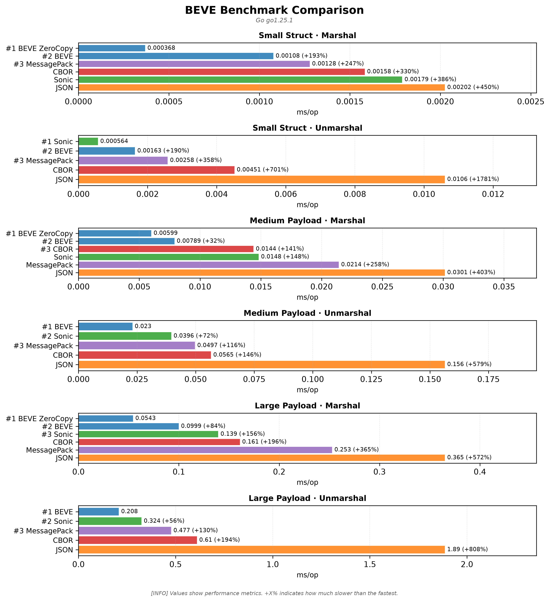

# 🚀 BEVE-Go Multi-Platform Benchmark Results

**Generated:** 2026-07-20 06:05:04 UTC

This report consolidates benchmark results from multiple platforms tested in CI/CD.

## � Visual Comparisons

### Overall Performance Comparison

### Performance Heatmap

### Memory Efficiency

---

## �🖥️ Tested Platforms

| Platform | CPU | OS | Artifacts |
|----------|-----|----|-----------| 
| benchmark-darwin-apple-m1-virtual | Apple M1 (Virtual) | Darwin | [📄 Report](benchmark-darwin-apple-m1-virtual/benchmark.md) · [📊 JSON](benchmark-darwin-apple-m1-virtual/benchmark.json) · [📈 Chart](benchmark-darwin-apple-m1-virtual/benchmark.png) |
| benchmark-linux-intel-r-xeon-r-platinum-8573c | INTEL(R) XEON(R) PLATINUM 8573C | Linux | [📄 Report](benchmark-linux-intel-r-xeon-r-platinum-8573c/benchmark.md) · [📊 JSON](benchmark-linux-intel-r-xeon-r-platinum-8573c/benchmark.json) · [📈 Chart](benchmark-linux-intel-r-xeon-r-platinum-8573c/benchmark.png) |
| benchmark-linux-neoverse-n2 | Neoverse-N2 | Linux | [📄 Report](benchmark-linux-neoverse-n2/benchmark.md) · [📊 JSON](benchmark-linux-neoverse-n2/benchmark.json) · [📈 Chart](benchmark-linux-neoverse-n2/benchmark.png) |
| benchmark-windows-unknown-cpu | Unknown CPU | Windows | [📄 Report](benchmark-windows-unknown-cpu/benchmark.md) · [📊 JSON](benchmark-windows-unknown-cpu/benchmark.json) · [📈 Chart](benchmark-windows-unknown-cpu/benchmark.png) |

---

## 📊 Cross-Platform Performance Comparison

### Marshal Performance (Small Struct)

| Platform | BEVE | BEVE ZeroCopy | JSON | CBOR | MessagePack |
|----------|------|---------------|------|------|-------------|
| Apple M1 (Virtual) | 451ns | 415ns | 2.59μs | 2.23μs | 2.69μs |
| INTEL(R) XEON(R) PLATINUM 8573C | 1.08μs | 368ns | 2.02μs | 1.58μs | 1.28μs |
| Neoverse-N2 | 1.42μs | 575ns | 2.82μs | 2.41μs | 2.30μs |
| Unknown CPU | 880ns | 553ns | 5.17μs | 1.99μs | 3.60μs |

### Unmarshal Performance (Small Struct)

| Platform | BEVE | JSON | CBOR | MessagePack |
|----------|------|------|------|-------------|
| Apple M1 (Virtual) | 1.53μs | 19.59μs | 3.52μs | 6.71μs |
| INTEL(R) XEON(R) PLATINUM 8573C | 1.64μs | 10.60μs | 4.51μs | 2.58μs |
| Neoverse-N2 | 1.30μs | 9.41μs | 2.96μs | 1.18μs |
| Unknown CPU | 2.17μs | 10.51μs | 6.17μs | 6.18μs |

## 🏆 Performance Champions

| Platform | Fastest Marshal | Fastest Unmarshal | Memory Efficient |
|----------|----------------|-------------------|------------------|
| Apple M1 (Virtual) | 🥇 BEVE ZeroCopy (415ns) | 🥇 BEVE (1.53μs) | 💾 BEVE (1 allocs) |
| INTEL(R) XEON(R) PLATINUM 8573C | 🥇 BEVE ZeroCopy (368ns) | 🥉 Sonic (564ns) | 💾 BEVE (1 allocs) |
| Neoverse-N2 | 🥇 BEVE ZeroCopy (575ns) | 🥈 MessagePack (1.18μs) | 💾 BEVE (1 allocs) |
| Unknown CPU | 🥇 BEVE ZeroCopy (553ns) | 🥇 BEVE (2.17μs) | 💾 BEVE (1 allocs) |

## 📈 Summary Statistics

**Total Platforms Tested:** 4

**Average BEVE vs JSON Improvement:** 65.5% faster

### Platform Details

- **Apple M1 (Virtual)** (Darwin)
  - Architecture: arm64
  - Test Scenarios: 3

- **INTEL(R) XEON(R) PLATINUM 8573C** (Linux)
  - Architecture: x86_64
  - Test Scenarios: 3

- **Neoverse-N2** (Linux)
  - Architecture: aarch64
  - Test Scenarios: 3

- **Unknown CPU** (Windows)
  - Architecture: AMD64
  - Test Scenarios: 3

---

## 📋 Detailed Platform Results

### Apple M1 (Virtual) — Darwin

_Performance visualization: lower is better._

| Scenario | Codec | Operation | Time | Memory | Allocations |
|----------|-------|-----------|------|--------|-------------|
| Small Struct | 🥇 BEVE ZeroCopy | Marshal | 415ns | 0 | 0 |
| Small Struct | 🥇 BEVE | Marshal | 451ns | 896 | 1 |
| Small Struct | 🥈 CBOR | Marshal | 2.23μs | 2.0K | 1 |
| Small Struct | 🥉 JSON | Marshal | 2.59μs | 2.0K | 1 |
| Small Struct | 🥈 MessagePack | Marshal | 2.69μs | 4.1K | 8 |
| Small Struct | 🥉 Sonic | Marshal | 7.00μs | 3.1K | 2 |
| Small Struct | 🥇 BEVE | Unmarshal | 1.53μs | 1.7K | 4 |
| Small Struct | 🥈 CBOR | Unmarshal | 3.52μs | 1.4K | 31 |
| Small Struct | 🥉 Sonic | Unmarshal | 4.43μs | 4.7K | 6 |
| Small Struct | 🥈 MessagePack | Unmarshal | 6.71μs | 3.6K | 76 |
| Small Struct | 🥉 JSON | Unmarshal | 19.59μs | 4.6K | 81 |
| Medium Payload | 🥇 BEVE ZeroCopy | Marshal | 9.13μs | 3 | 0 |
| Medium Payload | 🥇 BEVE | Marshal | 16.38μs | 24.6K | 1 |
| Medium Payload | 🥈 CBOR | Marshal | 20.10μs | 21.8K | 1 |
| Medium Payload | 🥈 MessagePack | Marshal | 31.83μs | 65.8K | 22 |
| Medium Payload | 🥉 JSON | Marshal | 42.09μs | 20.7K | 8 |
| Medium Payload | 🥉 Sonic | Marshal | 67.16μs | 29.0K | 3 |
| Medium Payload | 🥇 BEVE | Unmarshal | 23.35μs | 22.0K | 59 |
| Medium Payload | 🥉 Sonic | Unmarshal | 35.54μs | 37.3K | 33 |
| Medium Payload | 🥈 MessagePack | Unmarshal | 55.33μs | 33.4K | 614 |
| Medium Payload | 🥈 CBOR | Unmarshal | 68.36μs | 32.1K | 659 |
| Medium Payload | 🥉 JSON | Unmarshal | 220.41μs | 56.6K | 725 |
| Large Payload | 🥇 BEVE ZeroCopy | Marshal | 66.65μs | 26 | 0 |
| Large Payload | 🥇 BEVE | Marshal | 113.49μs | 196.6K | 1 |
| Large Payload | 🥈 CBOR | Marshal | 154.65μs | 188.6K | 1 |
| Large Payload | 🥈 MessagePack | Marshal | 186.16μs | 526.8K | 115 |
| Large Payload | 🥉 JSON | Marshal | 422.47μs | 205.2K | 8 |
| Large Payload | 🥉 Sonic | Marshal | 494.09μs | 213.8K | 3 |
| Large Payload | 🥇 BEVE | Unmarshal | 164.63μs | 269.8K | 417 |
| Large Payload | 🥉 Sonic | Unmarshal | 261.32μs | 354.0K | 211 |
| Large Payload | 🥈 MessagePack | Unmarshal | 411.50μs | 341.9K | 6.2K |
| Large Payload | 🥈 CBOR | Unmarshal | 528.15μs | 320.1K | 6.5K |
| Large Payload | 🥉 JSON | Unmarshal | 1.77ms | 546.5K | 7.2K |

[📄 View full report](benchmark-darwin-apple-m1-virtual/benchmark.md)

### INTEL(R) XEON(R) PLATINUM 8573C — Linux

_Performance visualization: lower is better._

| Scenario | Codec | Operation | Time | Memory | Allocations |
|----------|-------|-----------|------|--------|-------------|
| Small Struct | 🥇 BEVE ZeroCopy | Marshal | 368ns | 0 | 0 |
| Small Struct | 🥇 BEVE | Marshal | 1.08μs | 2.0K | 1 |
| Small Struct | 🥈 MessagePack | Marshal | 1.28μs | 2.1K | 7 |
| Small Struct | 🥈 CBOR | Marshal | 1.58μs | 2.0K | 1 |
| Small Struct | 🥉 Sonic | Marshal | 1.79μs | 2.8K | 2 |
| Small Struct | 🥉 JSON | Marshal | 2.02μs | 1.3K | 1 |
| Small Struct | 🥉 Sonic | Unmarshal | 564ns | 485 | 4 |
| Small Struct | 🥇 BEVE | Unmarshal | 1.64μs | 3.4K | 4 |
| Small Struct | 🥈 MessagePack | Unmarshal | 2.58μs | 2.1K | 47 |
| Small Struct | 🥈 CBOR | Unmarshal | 4.51μs | 2.9K | 62 |
| Small Struct | 🥉 JSON | Unmarshal | 10.60μs | 3.8K | 54 |
| Medium Payload | 🥇 BEVE ZeroCopy | Marshal | 5.99μs | 3 | 0 |
| Medium Payload | 🥇 BEVE | Marshal | 7.89μs | 14.3K | 1 |
| Medium Payload | 🥈 CBOR | Marshal | 14.40μs | 16.4K | 1 |
| Medium Payload | 🥉 Sonic | Marshal | 14.83μs | 25.3K | 3 |
| Medium Payload | 🥈 MessagePack | Marshal | 21.42μs | 33.0K | 21 |
| Medium Payload | 🥉 JSON | Marshal | 30.14μs | 19.3K | 8 |
| Medium Payload | 🥇 BEVE | Unmarshal | 23.02μs | 28.5K | 59 |
| Medium Payload | 🥉 Sonic | Unmarshal | 39.60μs | 71.1K | 79 |
| Medium Payload | 🥈 MessagePack | Unmarshal | 49.70μs | 41.6K | 780 |
| Medium Payload | 🥈 CBOR | Unmarshal | 56.54μs | 30.6K | 627 |
| Medium Payload | 🥉 JSON | Unmarshal | 156.38μs | 47.7K | 607 |
| Large Payload | 🥇 BEVE ZeroCopy | Marshal | 54.35μs | 26 | 0 |
| Large Payload | 🥇 BEVE | Marshal | 99.86μs | 196.7K | 1 |
| Large Payload | 🥉 Sonic | Marshal | 139.21μs | 217.1K | 3 |
| Large Payload | 🥈 CBOR | Marshal | 160.78μs | 196.8K | 1 |
| Large Payload | 🥈 MessagePack | Marshal | 252.70μs | 526.8K | 115 |
| Large Payload | 🥉 JSON | Marshal | 365.09μs | 229.8K | 8 |
| Large Payload | 🥇 BEVE | Unmarshal | 207.68μs | 269.7K | 419 |
| Large Payload | 🥉 Sonic | Unmarshal | 324.23μs | 550.0K | 588 |
| Large Payload | 🥈 MessagePack | Unmarshal | 476.83μs | 363.4K | 6.7K |
| Large Payload | 🥈 CBOR | Unmarshal | 609.65μs | 329.0K | 6.7K |
| Large Payload | 🥉 JSON | Unmarshal | 1.89ms | 544.7K | 7.2K |

[📄 View full report](benchmark-linux-intel-r-xeon-r-platinum-8573c/benchmark.md)

### Neoverse-N2 — Linux

_Performance visualization: lower is better._

| Scenario | Codec | Operation | Time | Memory | Allocations |
|----------|-------|-----------|------|--------|-------------|
| Small Struct | 🥇 BEVE ZeroCopy | Marshal | 575ns | 0 | 0 |
| Small Struct | 🥇 BEVE | Marshal | 1.42μs | 2.7K | 1 |
| Small Struct | 🥉 Sonic | Marshal | 2.12μs | 1.5K | 2 |
| Small Struct | 🥈 MessagePack | Marshal | 2.30μs | 4.1K | 8 |
| Small Struct | 🥈 CBOR | Marshal | 2.41μs | 3.1K | 1 |
| Small Struct | 🥉 JSON | Marshal | 2.82μs | 1.5K | 1 |
| Small Struct | 🥈 MessagePack | Unmarshal | 1.18μs | 352 | 10 |
| Small Struct | 🥇 BEVE | Unmarshal | 1.30μs | 1.8K | 4 |
| Small Struct | 🥈 CBOR | Unmarshal | 2.96μs | 1.4K | 32 |
| Small Struct | 🥉 Sonic | Unmarshal | 2.97μs | 4.9K | 6 |
| Small Struct | 🥉 JSON | Unmarshal | 9.41μs | 2.3K | 45 |
| Medium Payload | 🥇 BEVE ZeroCopy | Marshal | 7.04μs | 6 | 0 |
| Medium Payload | 🥇 BEVE | Marshal | 11.97μs | 24.6K | 1 |
| Medium Payload | 🥈 CBOR | Marshal | 18.58μs | 20.5K | 1 |
| Medium Payload | 🥉 Sonic | Marshal | 30.14μs | 22.1K | 3 |
| Medium Payload | 🥈 MessagePack | Marshal | 30.80μs | 65.8K | 22 |
| Medium Payload | 🥉 JSON | Marshal | 35.20μs | 19.3K | 8 |
| Medium Payload | 🥇 BEVE | Unmarshal | 22.06μs | 28.6K | 59 |
| Medium Payload | 🥉 Sonic | Unmarshal | 27.86μs | 38.0K | 33 |
| Medium Payload | 🥈 CBOR | Unmarshal | 52.94μs | 24.2K | 499 |
| Medium Payload | 🥈 MessagePack | Unmarshal | 57.01μs | 41.6K | 781 |
| Medium Payload | 🥉 JSON | Unmarshal | 193.06μs | 54.1K | 712 |
| Large Payload | 🥇 BEVE ZeroCopy | Marshal | 69.86μs | 65 | 0 |
| Large Payload | 🥇 BEVE | Marshal | 106.48μs | 196.8K | 1 |
| Large Payload | 🥈 CBOR | Marshal | 192.12μs | 205.1K | 1 |
| Large Payload | 🥈 MessagePack | Marshal | 277.20μs | 526.8K | 115 |
| Large Payload | 🥉 Sonic | Marshal | 306.83μs | 217.4K | 3 |
| Large Payload | 🥉 JSON | Marshal | 396.15μs | 221.7K | 8 |
| Large Payload | 🥇 BEVE | Unmarshal | 218.17μs | 273.0K | 416 |
| Large Payload | 🥉 Sonic | Unmarshal | 289.82μs | 404.8K | 211 |
| Large Payload | 🥈 MessagePack | Unmarshal | 512.54μs | 357.3K | 6.5K |
| Large Payload | 🥈 CBOR | Unmarshal | 634.42μs | 308.0K | 6.3K |
| Large Payload | 🥉 JSON | Unmarshal | 2.19ms | 601.8K | 8.0K |

[📄 View full report](benchmark-linux-neoverse-n2/benchmark.md)

### Unknown CPU — Windows

_Performance visualization: lower is better._

| Scenario | Codec | Operation | Time | Memory | Allocations |
|----------|-------|-----------|------|--------|-------------|
| Small Struct | 🥇 BEVE ZeroCopy | Marshal | 553ns | 0 | 0 |
| Small Struct | 🥇 BEVE | Marshal | 880ns | 896 | 1 |
| Small Struct | 🥈 CBOR | Marshal | 1.99μs | 1.5K | 1 |
| Small Struct | 🥉 Sonic | Marshal | 2.91μs | 2.8K | 2 |
| Small Struct | 🥈 MessagePack | Marshal | 3.60μs | 4.1K | 8 |
| Small Struct | 🥉 JSON | Marshal | 5.17μs | 2.3K | 1 |
| Small Struct | 🥇 BEVE | Unmarshal | 2.17μs | 2.1K | 4 |
| Small Struct | 🥉 Sonic | Unmarshal | 5.28μs | 7.3K | 10 |
| Small Struct | 🥈 CBOR | Unmarshal | 6.17μs | 2.5K | 55 |
| Small Struct | 🥈 MessagePack | Unmarshal | 6.18μs | 3.6K | 76 |
| Small Struct | 🥉 JSON | Unmarshal | 10.51μs | 2.2K | 39 |
| Medium Payload | 🥇 BEVE ZeroCopy | Marshal | 8.66μs | 5 | 0 |
| Medium Payload | 🥇 BEVE | Marshal | 12.78μs | 18.4K | 1 |
| Medium Payload | 🥉 Sonic | Marshal | 18.19μs | 22.1K | 3 |
| Medium Payload | 🥈 CBOR | Marshal | 21.33μs | 18.4K | 1 |
| Medium Payload | 🥈 MessagePack | Marshal | 37.69μs | 65.8K | 22 |
| Medium Payload | 🥉 JSON | Marshal | 53.35μs | 24.8K | 8 |
| Medium Payload | 🥇 BEVE | Unmarshal | 31.99μs | 32.5K | 59 |
| Medium Payload | 🥉 Sonic | Unmarshal | 52.26μs | 60.2K | 73 |
| Medium Payload | 🥈 MessagePack | Unmarshal | 70.63μs | 31.6K | 578 |
| Medium Payload | 🥈 CBOR | Unmarshal | 101.74μs | 36.8K | 752 |
| Medium Payload | 🥉 JSON | Unmarshal | 273.10μs | 54.5K | 689 |
| Large Payload | 🥇 BEVE ZeroCopy | Marshal | 82.63μs | 92 | 0 |
| Large Payload | 🥇 BEVE | Marshal | 120.34μs | 188.5K | 1 |
| Large Payload | 🥉 Sonic | Marshal | 178.44μs | 223.3K | 3 |
| Large Payload | 🥈 CBOR | Marshal | 271.08μs | 196.8K | 1 |
| Large Payload | 🥈 MessagePack | Marshal | 288.25μs | 526.7K | 115 |
| Large Payload | 🥉 JSON | Marshal | 470.87μs | 205.1K | 8 |
| Large Payload | 🥇 BEVE | Unmarshal | 296.91μs | 265.6K | 417 |
| Large Payload | 🥉 Sonic | Unmarshal | 524.39μs | 573.3K | 597 |
| Large Payload | 🥈 MessagePack | Unmarshal | 869.56μs | 347.1K | 6.3K |
| Large Payload | 🥈 CBOR | Unmarshal | 878.31μs | 306.5K | 6.3K |
| Large Payload | 🥉 JSON | Unmarshal | 2.73ms | 561.2K | 7.3K |

[📄 View full report](benchmark-windows-unknown-cpu/benchmark.md)

---

## 📚 Additional Resources

- [BEVE Specification](../SPECIFICATION.md)
- [Go Package Documentation](../README.md)
- [Translator Package](../translator/README.md)
- [Examples](../examples/)

**Legend:**
- 🥇 BEVE family (fastest)
- 🥈 CBOR/MessagePack (fast)
- 🥉 JSON/Sonic (standard)

