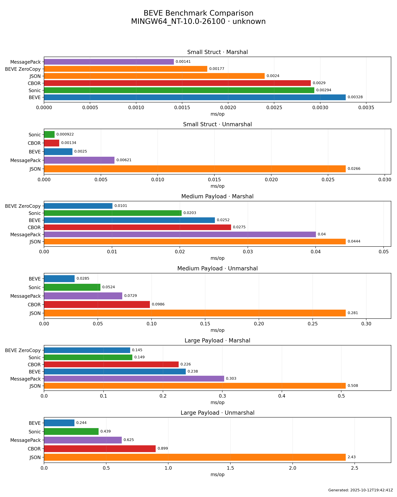

# Multi-Platform Benchmark Results

| CPU | OS | Artifacts |
|-----|----|-----------|
| Apple M1 (Virtual) | Darwin | [Markdown](benchmarks/benchmark-darwin-apple-m1-virtual/benchmark.md) · [JSON](benchmarks/benchmark-darwin-apple-m1-virtual/benchmark.json) · [PNG](benchmarks/benchmark-darwin-apple-m1-virtual/benchmark.png) |
| AMD EPYC 7763 64-Core Processor | Linux | [Markdown](benchmarks/benchmark-linux-amd-epyc-7763-64-core-processor/benchmark.md) · [JSON](benchmarks/benchmark-linux-amd-epyc-7763-64-core-processor/benchmark.json) · [PNG](benchmarks/benchmark-linux-amd-epyc-7763-64-core-processor/benchmark.png) |
| Neoverse-N2 | Linux | [Markdown](benchmarks/benchmark-linux-neoverse-n2/benchmark.md) · [JSON](benchmarks/benchmark-linux-neoverse-n2/benchmark.json) · [PNG](benchmarks/benchmark-linux-neoverse-n2/benchmark.png) |
| unknown | MINGW64_NT-10.0-26100 | [Markdown](benchmarks/benchmark-mingw64-nt-10-0-26100-unknown/benchmark.md) · [JSON](benchmarks/benchmark-mingw64-nt-10-0-26100-unknown/benchmark.json) · [PNG](benchmarks/benchmark-mingw64-nt-10-0-26100-unknown/benchmark.png) |

## Apple M1 (Virtual) — Darwin

_Performance visualization: lower is better. Chart shows relative performance across different codecs and scenarios._

### Detailed Results

| Scenario | Codec | Operation | ns/op | B/op | allocs/op |
|----------|-------|-----------|-------|------|-----------|
| Small Struct | JSON | Marshal | 654.80 | 464 | 2 |
| Small Struct | BEVE | Marshal | 804.40 | 1312 | 3 |
| Small Struct | BEVE ZeroCopy | Marshal | 965.20 | 288 | 2 |
| Small Struct | Sonic | Marshal | 2635 | 1454 | 3 |
| Small Struct | CBOR | Marshal | 3390 | 2832 | 2 |
| Small Struct | MessagePack | Marshal | 5321 | 8321 | 9 |
| Small Struct | BEVE | Unmarshal | 1012 | 1080 | 4 |
| Small Struct | Sonic | Unmarshal | 2809 | 3792 | 6 |
| Small Struct | MessagePack | Unmarshal | 4386 | 4352 | 92 |
| Small Struct | CBOR | Unmarshal | 8200 | 4800 | 103 |
| Small Struct | JSON | Unmarshal | 26711 | 7976 | 115 |
| Medium Payload | BEVE ZeroCopy | Marshal | 8868 | 128 | 2 |
| Medium Payload | BEVE | Marshal | 20974 | 16528 | 3 |
| Medium Payload | MessagePack | Marshal | 29418 | 33061 | 21 |
| Medium Payload | CBOR | Marshal | 33937 | 27380 | 2 |
| Medium Payload | JSON | Marshal | 46183 | 24881 | 9 |
| Medium Payload | Sonic | Marshal | 64361 | 25075 | 4 |
| Medium Payload | BEVE | Unmarshal | 28178 | 14426 | 58 |
| Medium Payload | Sonic | Unmarshal | 37577 | 37330 | 33 |
| Medium Payload | CBOR | Unmarshal | 60721 | 31272 | 641 |
| Medium Payload | MessagePack | Unmarshal | 64666 | 39311 | 735 |
| Medium Payload | JSON | Unmarshal | 244747 | 67257 | 840 |
| Large Payload | BEVE ZeroCopy | Marshal | 97034 | 303 | 2 |
| Large Payload | CBOR | Marshal | 164071 | 197493 | 2 |
| Large Payload | BEVE | Marshal | 182188 | 188839 | 3 |
| Large Payload | MessagePack | Marshal | 296464 | 526825 | 115 |
| Large Payload | JSON | Marshal | 382992 | 221689 | 9 |
| Large Payload | Sonic | Marshal | 401399 | 214990 | 4 |
| Large Payload | BEVE | Unmarshal | 225058 | 152243 | 418 |
| Large Payload | Sonic | Unmarshal | 390194 | 355696 | 213 |
| Large Payload | CBOR | Unmarshal | 529811 | 310218 | 6308 |
| Large Payload | MessagePack | Unmarshal | 560174 | 359034 | 6566 |
| Large Payload | JSON | Unmarshal | 1837714 | 505820 | 6645 |

## AMD EPYC 7763 64-Core Processor — Linux

_Performance visualization: lower is better. Chart shows relative performance across different codecs and scenarios._

### Detailed Results

| Scenario | Codec | Operation | ns/op | B/op | allocs/op |
|----------|-------|-----------|-------|------|-----------|
| Small Struct | BEVE ZeroCopy | Marshal | 731.70 | 289 | 2 |
| Small Struct | Sonic | Marshal | 739.40 | 857 | 3 |
| Small Struct | CBOR | Marshal | 780.80 | 656 | 2 |
| Small Struct | JSON | Marshal | 2229 | 1040 | 2 |
| Small Struct | BEVE | Marshal | 2593 | 2979 | 3 |
| Small Struct | MessagePack | Marshal | 4177 | 8321 | 9 |
| Small Struct | BEVE | Unmarshal | 1356 | 1336 | 4 |
| Small Struct | CBOR | Unmarshal | 2265 | 760 | 19 |
| Small Struct | Sonic | Unmarshal | 2551 | 3899 | 9 |
| Small Struct | MessagePack | Unmarshal | 6134 | 4760 | 101 |
| Small Struct | JSON | Unmarshal | 24763 | 7632 | 104 |
| Medium Payload | BEVE ZeroCopy | Marshal | 14111 | 141 | 2 |
| Medium Payload | BEVE | Marshal | 15813 | 16549 | 3 |
| Medium Payload | Sonic | Marshal | 18005 | 25711 | 4 |
| Medium Payload | CBOR | Marshal | 19319 | 18653 | 2 |
| Medium Payload | MessagePack | Marshal | 33652 | 65838 | 22 |
| Medium Payload | JSON | Marshal | 45417 | 22197 | 9 |
| Medium Payload | BEVE | Unmarshal | 19917 | 16075 | 59 |
| Medium Payload | Sonic | Unmarshal | 36350 | 55565 | 73 |
| Medium Payload | MessagePack | Unmarshal | 64057 | 43409 | 815 |
| Medium Payload | CBOR | Unmarshal | 77377 | 33592 | 688 |
| Medium Payload | JSON | Unmarshal | 228670 | 59576 | 785 |
| Large Payload | BEVE ZeroCopy | Marshal | 138427 | 391 | 2 |
| Large Payload | BEVE | Marshal | 177433 | 188672 | 3 |
| Large Payload | Sonic | Marshal | 185337 | 209263 | 4 |
| Large Payload | CBOR | Marshal | 213826 | 205884 | 2 |
| Large Payload | MessagePack | Marshal | 314135 | 526856 | 115 |
| Large Payload | JSON | Marshal | 455240 | 222216 | 9 |
| Large Payload | BEVE | Unmarshal | 186734 | 147949 | 419 |
| Large Payload | Sonic | Unmarshal | 386988 | 568519 | 596 |
| Large Payload | MessagePack | Unmarshal | 569065 | 361539 | 6600 |
| Large Payload | CBOR | Unmarshal | 726896 | 305241 | 6228 |
| Large Payload | JSON | Unmarshal | 2247297 | 553797 | 7301 |

## Neoverse-N2 — Linux

_Performance visualization: lower is better. Chart shows relative performance across different codecs and scenarios._

### Detailed Results

| Scenario | Codec | Operation | ns/op | B/op | allocs/op |
|----------|-------|-----------|-------|------|-----------|
| Small Struct | BEVE | Marshal | 1303 | 1441 | 3 |
| Small Struct | BEVE ZeroCopy | Marshal | 1309 | 288 | 2 |
| Small Struct | Sonic | Marshal | 1577 | 1085 | 3 |
| Small Struct | MessagePack | Marshal | 2205 | 4225 | 8 |
| Small Struct | CBOR | Marshal | 2473 | 2835 | 2 |
| Small Struct | JSON | Marshal | 3326 | 2193 | 2 |
| Small Struct | CBOR | Unmarshal | 1258 | 328 | 10 |
| Small Struct | BEVE | Unmarshal | 1667 | 2104 | 4 |
| Small Struct | Sonic | Unmarshal | 2738 | 4211 | 6 |
| Small Struct | MessagePack | Unmarshal | 4018 | 3169 | 67 |
| Small Struct | JSON | Unmarshal | 15808 | 4360 | 73 |
| Medium Payload | BEVE ZeroCopy | Marshal | 11898 | 148 | 2 |
| Medium Payload | BEVE | Marshal | 14386 | 18590 | 3 |
| Medium Payload | CBOR | Marshal | 18374 | 19147 | 2 |
| Medium Payload | MessagePack | Marshal | 31567 | 65838 | 22 |
| Medium Payload | Sonic | Marshal | 32846 | 24895 | 4 |
| Medium Payload | JSON | Marshal | 39220 | 22105 | 9 |
| Medium Payload | BEVE | Unmarshal | 19899 | 16876 | 59 |
| Medium Payload | Sonic | Unmarshal | 28095 | 35460 | 33 |
| Medium Payload | MessagePack | Unmarshal | 47175 | 30310 | 548 |
| Medium Payload | CBOR | Unmarshal | 58290 | 27704 | 571 |
| Medium Payload | JSON | Unmarshal | 159610 | 41272 | 553 |
| Large Payload | BEVE ZeroCopy | Marshal | 109260 | 654 | 2 |
| Large Payload | BEVE | Marshal | 152208 | 188757 | 3 |
| Large Payload | CBOR | Marshal | 192978 | 206592 | 2 |
| Large Payload | MessagePack | Marshal | 269944 | 526869 | 115 |
| Large Payload | Sonic | Marshal | 284541 | 207169 | 4 |
| Large Payload | JSON | Marshal | 367527 | 205833 | 9 |
| Large Payload | BEVE | Unmarshal | 183974 | 158044 | 418 |
| Large Payload | Sonic | Unmarshal | 282152 | 379593 | 211 |
| Large Payload | MessagePack | Unmarshal | 488070 | 334513 | 6060 |
| Large Payload | CBOR | Unmarshal | 632140 | 314347 | 6404 |
| Large Payload | JSON | Unmarshal | 1837388 | 491947 | 6424 |

## unknown — MINGW64_NT-10.0-26100

_Performance visualization: lower is better. Chart shows relative performance across different codecs and scenarios._

### Detailed Results

| Scenario | Codec | Operation | ns/op | B/op | allocs/op |
|----------|-------|-----------|-------|------|-----------|
| Small Struct | MessagePack | Marshal | 1410 | 1152 | 6 |
| Small Struct | BEVE ZeroCopy | Marshal | 1774 | 289 | 2 |
| Small Struct | JSON | Marshal | 2397 | 1040 | 2 |
| Small Struct | CBOR | Marshal | 2899 | 2449 | 2 |
| Small Struct | Sonic | Marshal | 2936 | 3304 | 3 |
| Small Struct | BEVE | Marshal | 3278 | 2337 | 3 |
| Small Struct | Sonic | Unmarshal | 921.90 | 602 | 5 |
| Small Struct | CBOR | Unmarshal | 1341 | 280 | 9 |
| Small Struct | BEVE | Unmarshal | 2497 | 1848 | 4 |
| Small Struct | MessagePack | Unmarshal | 6207 | 3456 | 72 |
| Small Struct | JSON | Unmarshal | 26564 | 7432 | 98 |
| Medium Payload | BEVE ZeroCopy | Marshal | 10086 | 148 | 2 |
| Medium Payload | Sonic | Marshal | 20257 | 24936 | 4 |
| Medium Payload | BEVE | Marshal | 25166 | 18598 | 3 |
| Medium Payload | CBOR | Marshal | 27535 | 24672 | 2 |
| Medium Payload | MessagePack | Marshal | 40033 | 65830 | 22 |
| Medium Payload | JSON | Marshal | 44438 | 18722 | 9 |
| Medium Payload | BEVE | Unmarshal | 28485 | 16234 | 59 |
| Medium Payload | Sonic | Unmarshal | 52442 | 61704 | 77 |
| Medium Payload | MessagePack | Unmarshal | 72852 | 39741 | 738 |
| Medium Payload | CBOR | Unmarshal | 98590 | 35448 | 724 |
| Medium Payload | JSON | Unmarshal | 280891 | 64633 | 840 |
| Large Payload | BEVE ZeroCopy | Marshal | 144814 | 479 | 2 |
| Large Payload | Sonic | Marshal | 148633 | 202190 | 4 |
| Large Payload | CBOR | Marshal | 226345 | 207571 | 2 |
| Large Payload | BEVE | Marshal | 238330 | 189264 | 3 |
| Large Payload | MessagePack | Marshal | 302925 | 526775 | 115 |
| Large Payload | JSON | Marshal | 507595 | 231093 | 9 |
| Large Payload | BEVE | Unmarshal | 244028 | 152122 | 419 |
| Large Payload | Sonic | Unmarshal | 438682 | 562029 | 587 |
| Large Payload | MessagePack | Unmarshal | 624888 | 338897 | 6154 |
| Large Payload | CBOR | Unmarshal | 898746 | 327756 | 6689 |
| Large Payload | JSON | Unmarshal | 2428050 | 529094 | 6887 |

