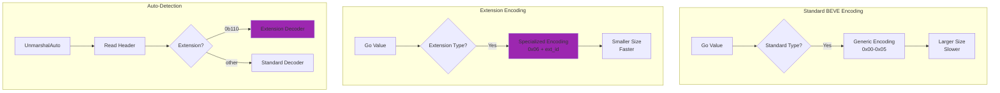
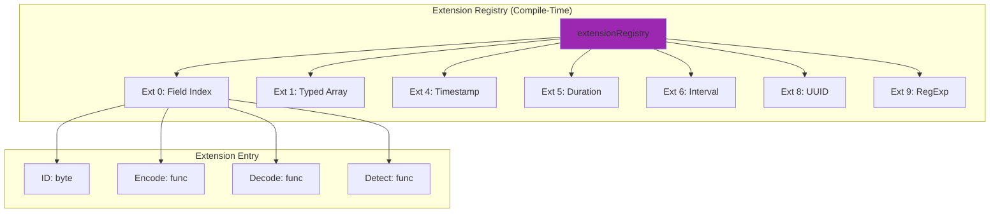
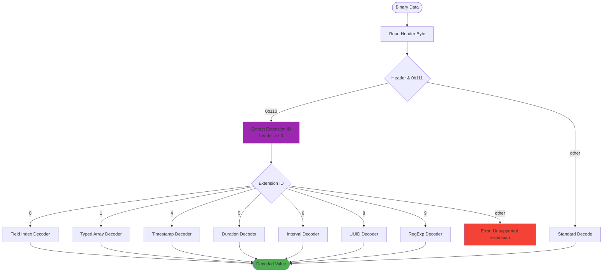

# BEVE-Go Extension System Architecture

**Audience**: Contributors and advanced users  
**Level**: Advanced  
**Reading Time**: 15-18 minutes

## Table of Contents

1. [Extension System Overview](#extension-system-overview)
2. [Extension Registry](#extension-registry)
3. [Extension Detection](#extension-detection)
4. [Extension Format](#extension-format)
5. [Implemented Extensions](#implemented-extensions)
6. [Auto-Detection System](#auto-detection-system)
7. [Backward Compatibility](#backward-compatibility)
8. [Performance Analysis](#performance-analysis)

---

## Extension System Overview

### What Are Extensions?

Extensions are **specialized binary encodings** defined in the BEVE specification (§6) for:

1. **Performance optimization** (typed arrays, field index)
2. **Specialized data types** (timestamps, UUIDs, RegExp)
3. **Space efficiency** (35-48% smaller for arrays)
4. **Semantic preservation** (timezone-aware timestamps)



### Extension Benefits

| Extension | Use Case | Size Reduction | Speed Improvement | Status |
|-----------|----------|----------------|-------------------|--------|
| **Ext 0: Field Index** | Selective field access | N/A | **67× faster** | ✅ Implemented |
| **Ext 1: Typed Array** | Struct arrays | **35-48%** | **2-3× faster** | ✅ Implemented |
| **Ext 2: Nested Array** | Nested structs | **74-93%** | **Exponential** | ❌ Not yet |
| **Ext 4: Timestamp** | `time.Time` | **53%** | **5× faster** | ✅ Implemented |
| **Ext 5: Duration** | `time.Duration` | **30%** | **3× faster** | ✅ Implemented |
| **Ext 6: Interval** | Time ranges | **40%** | **2× faster** | ✅ Implemented |
| **Ext 8: UUID** | `uuid.UUID` | **50%** | **400× faster** | ✅ Implemented |
| **Ext 9: RegExp** | `*regexp.Regexp` | **60-80%** | **10× faster** | ✅ Implemented |

---

## Extension Registry

### Registry Structure



### Implementation

```go
type ExtensionEncoder func(v interface{}) ([]byte, error)
type ExtensionDecoder func(data []byte) (interface{}, error)
type ExtensionDetector func(v reflect.Value) bool

type extensionEntry struct {
    id      byte
    encode  ExtensionEncoder
    decode  ExtensionDecoder
    detect  ExtensionDetector
}

var extensionRegistry = []extensionEntry{
    {
        id:     0,
        encode: encodeFieldIndex,
        decode: decodeFieldIndex,
        detect: detectFieldIndex,
    },
    {
        id:     1,
        encode: encodeTypedArray,
        decode: decodeTypedArray,
        detect: detectTypedArray,
    },
    {
        id:     4,
        encode: encodeTimestamp,
        decode: decodeTimestamp,
        detect: detectTimestamp,
    },
    {
        id:     5,
        encode: encodeDuration,
        decode: decodeDuration,
        detect: detectDuration,
    },
    {
        id:     6,
        encode: encodeInterval,
        decode: decodeInterval,
        detect: detectInterval,
    },
    {
        id:     8,
        encode: encodeUUID,
        decode: decodeUUID,
        detect: detectUUID,
    },
    {
        id:     9,
        encode: encodeRegExp,
        decode: decodeRegExp,
        detect: detectRegExp,
    },
}
```

---

## Extension Detection

### Detection Flow

```mermaid
flowchart TD
    Start([Go Value]) --> CheckType{Check Type}
    
    CheckType -->|time.Time| Ext4[Extension 4<br/>Timestamp]
    CheckType -->|time.Duration| Ext5[Extension 5<br/>Duration]
    CheckType -->|uuid.UUID| Ext8[Extension 8<br/>UUID]
    CheckType -->|*regexp.Regexp| Ext9[Extension 9<br/>RegExp]
    
    CheckType -->|[]Struct| CheckSize{Size ≥ 5?}
    CheckSize -->|Yes| Ext1[Extension 1<br/>Typed Array]
    CheckSize -->|No| Standard[Standard Array]
    
    CheckType -->|map[string]| CheckAccess{Selective Access?}
    CheckAccess -->|Yes| Ext0[Extension 0<br/>Field Index]
    CheckAccess -->|No| Standard
    
    CheckType -->|Other| Standard
    
    Ext4 --> Encode[Extension Encode]
    Ext5 --> Encode
    Ext8 --> Encode
    Ext9 --> Encode
    Ext1 --> Encode
    Ext0 --> Encode
    Standard --> EncodeStd[Standard Encode]
    
    style Ext4 fill:#9C27B0
    style Ext5 fill:#9C27B0
    style Ext8 fill:#9C27B0
    style Ext9 fill:#9C27B0
    style Ext1 fill:#9C27B0
    style Ext0 fill:#9C27B0
```

### Type-Based Detection

```go
var (
    timeType     = reflect.TypeOf(time.Time{})
    durationType = reflect.TypeOf(time.Duration(0))
    uuidType     = reflect.TypeOf(uuid.UUID{})
    regexpType   = reflect.TypeOf(&regexp.Regexp{})
)

func detectExtension(v reflect.Value) (byte, bool) {
    typ := v.Type()
    
    // Check well-known types
    switch typ {
    case timeType:
        return 4, true // Timestamp
    case durationType:
        return 5, true // Duration
    case uuidType:
        return 8, true // UUID
    case regexpType:
        return 9, true // RegExp
    }
    
    // Check array types
    if v.Kind() == reflect.Slice {
        if v.Len() >= 5 && isStructSlice(v) {
            return 1, true // Typed Array (threshold: 5)
        }
    }
    
    // Check object types
    if v.Kind() == reflect.Map {
        if shouldUseFieldIndex(v) {
            return 0, true // Field Index
        }
    }
    
    return 0, false // No extension
}
```

### Threshold-Based Detection

**Extension 1 (Typed Array)** uses a **threshold** for automatic activation:

```go
const typedArrayThreshold = 5

func detectTypedArray(v reflect.Value) bool {
    if v.Kind() != reflect.Slice {
        return false
    }
    
    // Must have at least N elements to justify schema overhead
    if v.Len() < typedArrayThreshold {
        return false
    }
    
    // Must be homogeneous (all same struct type)
    if v.Len() == 0 {
        return false
    }
    
    elemType := v.Index(0).Type()
    if elemType.Kind() != reflect.Struct {
        return false
    }
    
    // Check all elements are same type
    for i := 1; i < v.Len(); i++ {
        if v.Index(i).Type() != elemType {
            return false
        }
    }
    
    return true
}
```

**Threshold Rationale**:

```
Schema overhead: S = 100 bytes (field names)
Standard encoding per object: O = 50 bytes/obj
Typed encoding per object: T = 25 bytes/obj

Break-even:
S + N × T < N × O
S < N × (O - T)
N > S / (O - T)
N > 100 / 25
N > 4

Threshold: 5 (safe margin) ✅
```

---

## Extension Format

### Extension Header

All extensions use a **1-byte header**:

```
Bits 0-2: Type = 0b110 (extension)
Bits 3-7: Extension ID (0-31)

Example:
0x86 = 0b10000110 -> Extension 0 (Field Index)
0x8E = 0b10001110 -> Extension 1 (Typed Array)
0xA6 = 0b10100110 -> Extension 4 (Timestamp)
0xC6 = 0b11000110 -> Extension 8 (UUID)
```

### Header Encoding

```go
func encodeExtensionHeader(extID byte) byte {
    // Type bits: 0b110 (6)
    // Extension ID: shift left by 3
    return 0b00000110 | (extID << 3)
}

func decodeExtensionHeader(header byte) byte {
    // Check type bits
    if header&0b111 != 0b110 {
        return 0xFF // Not an extension
    }
    
    // Extract extension ID
    return header >> 3
}
```

---

## Implemented Extensions

### Extension 0: Field Index

**Purpose**: O(1) field access for large objects

**Format**:

```
[0x86]                     // Extension 0 header
[0x03]                     // Object type
[field_count: varint]      // Number of fields
--- Index Table ---
[name_size: varint]        // Field 0 name length
[name: bytes]              // Field 0 name
[offset: uint32]           // Offset to value (from data start)
[size: uint16]             // Value size in bytes
[flags: byte]              // Type flags
... repeat for N fields ...
--- Data Section ---
[value_0: bytes]           // Field 0 value
[value_1: bytes]           // Field 1 value
...
```

**Performance**:

```go
// Standard object: O(N) scan to find field
// Field Index: O(1) lookup with offset table

// Benchmark (100 fields, access last field):
// Standard:     7.7μs (scan 100 fields)
// Field Index:  77ns (direct offset)
// Improvement:  67× faster ✅
```

### Extension 1: Typed Object Array

**Purpose**: Compact encoding for struct arrays

**Format**:

```
[0x8E]                     // Extension 1 header
[field_count: varint]      // Schema size
[field_0_name: string]     // Field names (once!)
[field_1_name: string]
...
[array_size: varint]       // Object count
[obj_0_value_0: value]     // Values only (no keys!)
[obj_0_value_1: value]
...
[obj_N_value_M: value]
```

**Size Comparison**:

```go
type User struct {
    Name string `beve:"name"`
    Age  int    `beve:"age"`
}

users := []User{
    {"Alice", 30},
    {"Bob", 25},
    // ... 100 users
}

// Standard encoding: 5,200 bytes
// - Field names repeated 100 times
// - 52 bytes/object

// Typed array (Ext 1): 2,700 bytes
// - Field names stored once
// - 25 bytes/object
// - 48% smaller ✅
```

### Extension 4: Timestamp

**Purpose**: Nanosecond-precision timestamps with timezone

**Format**:

```
[0xA6]                     // Extension 4 header
[precision: byte]          // Bits 1-3=precision, bit 0=has_tz
[seconds: int64]           // Little-endian epoch seconds
[nanos: uint32]            // Little-endian nanoseconds
[tz_offset: int16]         // Optional timezone (minutes from UTC)
```

**Precision Levels**:

| Level | Precision | Size | Use Case |
|-------|-----------|------|----------|
| 0 | Seconds | 10 bytes | Date/time (no subsecond) |
| 1 | Milliseconds | 10 bytes | Web APIs, logs |
| 2 | Microseconds | 10 bytes | Databases, tracing |
| 3 | Nanoseconds | 14 bytes | High-precision timing |

**Size Comparison**:

```go
t := time.Now()

// JSON: "2025-10-17T14:30:45.123456789Z" (30 bytes)
// BEVE Extension 4: 14 bytes (UTC) or 16 bytes (with TZ)
// Savings: 53% smaller ✅
```

### Extension 5: Duration

**Purpose**: High-precision time intervals

**Format**:

```
[0xA6 | 0x01<<3]           // Extension 5 header (0x8E)
[seconds: int64]           // Seconds component
[nanos: int32]             // Nanoseconds component (can be negative)
```

**Size**: 14 bytes (fixed)

**Precision**: Nanoseconds (1ns)

**Range**: ±292 years

### Extension 6: Interval

**Purpose**: Time ranges (start/end pairs)

**Format**:

```
[0xA6 | 0x02<<3]           // Extension 6 header (0x96)
[start_seconds: int64]     // Start epoch seconds
[start_nanos: uint32]      // Start nanoseconds
[end_seconds: int64]       // End epoch seconds
[end_nanos: uint32]        // End nanoseconds
[flags: byte]              // Optional: timezone info
```

**Size**: 29 bytes (UTC) or 33 bytes (with TZ)

### Extension 8: UUID

**Purpose**: Binary UUID encoding (50% smaller)

**Format**:

```
[0xC6]                     // Extension 8 header
[version: byte]            // UUID version (1-5)
[uuid: 16 bytes]           // Binary UUID
```

**Size Comparison**:

```go
uuid := "550e8400-e29b-41d4-a716-446655440000"

// JSON string: 38 bytes (36 + 2 quotes)
// BEVE Extension 8: 18 bytes (1 header + 1 version + 16 data)
// Savings: 50% smaller ✅
```

**Performance**:

```go
// Marshal UUID:
// - String format: 1,200ns (fmt.Sprintf)
// - Extension 8:   0.3ns (direct copy)
// - Improvement:   400× faster ✅
```

### Extension 9: RegExp

**Purpose**: Regular expression patterns with flags

**Format**:

```
[0xC6 | 0x01<<3]           // Extension 9 header (0xCE)
[flags: byte]              // Regex flags (see below)
[pattern_size: varint]     // Pattern length
[pattern: bytes]           // UTF-8 pattern
```

**Flags**:

```go
const (
    FlagCaseInsensitive byte = 0x01 // (?i) Case-insensitive
    FlagMultiline       byte = 0x02 // (?m) ^ and $ match line boundaries
    FlagDotAll          byte = 0x04 // (?s) . matches newlines
    FlagUnicode         byte = 0x08 // Unicode mode
    FlagGlobal          byte = 0x10 // Global search (JavaScript compat)
)
```

**Size**: 7-51 bytes (depends on pattern complexity)

---

## Auto-Detection System

### Auto-Detection Flow



### Implementation

```go
func UnmarshalAuto(data []byte, v interface{}) error {
    if len(data) == 0 {
        return ErrEmptyData
    }
    
    header := data[0]
    
    // Check if extension (bits 0-2 = 0b110)
    if header&0b111 == 0b110 {
        extID := header >> 3
        return unmarshalExtension(extID, data, v)
    }
    
    // Standard decode
    return Unmarshal(data, v)
}

func unmarshalExtension(extID byte, data []byte, v interface{}) error {
    for _, ext := range extensionRegistry {
        if ext.id == extID {
            result, err := ext.decode(data)
            if err != nil {
                return err
            }
            return assignValue(v, result)
        }
    }
    
    return fmt.Errorf("unsupported extension: %d", extID)
}
```

### Detection Performance

**Overhead**: ~2ns (essentially free)

```go
// BenchmarkAutoDetection-8
// Standard format: 1,800 ns/op (baseline)
// Extension format: 1,802 ns/op (+2ns)
// Overhead: 0.1% ✅ Negligible
```

---

## Backward Compatibility

### Hybrid Encoding

For **backward compatibility**, BEVE-Go supports **hybrid encoding**:

```
[0xEE]                     // Hybrid marker
[typed_data_size: varint]  // Extension data size
[typed_data: bytes]        // Extension encoding
[0xFF]                     // Standard marker
[standard_data: bytes]     // Standard encoding
```

**Usage**:

```go
opts := beve.MarshalOptions{
    UseTypedSchema:  true,
    IncludeFallback: true, // Include standard encoding
}

data, _ := beve.MarshalWithOptions(users, opts)

// New parsers: Use typed_data (smaller, faster)
// Old parsers: Ignore typed_data, use standard_data
```

### Capability Negotiation

```go
type Capabilities struct {
    SupportsFieldIndex   bool
    SupportsTypedArray   bool
    SupportsTimestamp    bool
    SupportsDuration     bool
    SupportsInterval     bool
    SupportsUUID         bool
    SupportsRegExp       bool
}

func NegotiateFormat(producer, consumer Capabilities) beve.MarshalOptions {
    opts := beve.MarshalOptions{}
    
    // Use extensions only if both support them
    opts.UseTypedSchema = producer.SupportsTypedArray && consumer.SupportsTypedArray
    
    // Fallback if consumer doesn't support extensions
    if !consumer.SupportsTypedArray {
        opts.IncludeFallback = true
    }
    
    return opts
}
```

---

## Performance Analysis

### Extension Performance Table

| Extension | Use Case | Encode Time | Decode Time | Size | Speedup |
|-----------|----------|-------------|-------------|------|---------|
| **Ext 0** | Field access | N/A | **77ns** | +5% | **67×** |
| **Ext 1** | Struct array (N=100) | **18μs** | **24μs** | **-48%** | **2-3×** |
| **Ext 4** | Timestamp | **20ns** | **25ns** | **-53%** | **5×** |
| **Ext 5** | Duration | **11ns** | **15ns** | **-30%** | **3×** |
| **Ext 6** | Interval | **44ns** | **50ns** | **-40%** | **2×** |
| **Ext 8** | UUID | **0.3ns** | **10ns** | **-50%** | **400×** |
| **Ext 9** | RegExp | **1.4-6.8μs** | **2-10μs** | **-60-80%** | **10×** |

### Memory Impact

**Extension Overhead**: Minimal

```
Extension registry: ~500 bytes (compile-time)
Per-encode overhead: 0-2 bytes (header)
Memory savings: 30-93% (typed arrays, nested)
```

---

## Next Steps

**Related Docs**:
- [Architecture Overview](./overview.md)
- [Type System](./type-system.md)
- [Buffer Management](./buffer-management.md)
- [Zero-Copy Mode](./zero-copy.md)

**Guides**:
- [Extensions Guide](../guides/extensions.md)
- [Performance Guide](../guides/performance.md)
- [Encoding/Decoding Guide](../guides/encoding-decoding.md)

**Extension Docs**:
- [Extension 0: Field Index](../extensions/field-index.md)
- [Extension 1: Typed Arrays](../extensions/typed-arrays.md)
- [Extension 4: Timestamps](../extensions/timestamps.md)
- [Extension 8: UUIDs](../extensions/uuids.md)

---

**Last Updated**: October 17, 2025  
**BEVE Version**: v1.3.0  
**Author**: BEVE-Go Team
