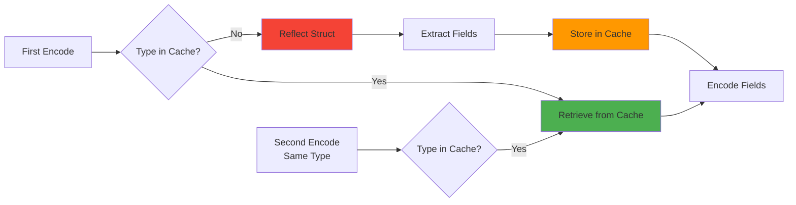

# BEVE-Go Type System Architecture

**Audience**: Contributors and advanced users  
**Level**: Advanced  
**Reading Time**: 12-15 minutes

## Table of Contents

1. [Type System Overview](#type-system-overview)
2. [Type Detection](#type-detection)
3. [Type Mapping](#type-mapping)
4. [Fast Path Detection](#fast-path-detection)
5. [Reflection Strategy](#reflection-strategy)
6. [Type Coercion](#type-coercion)
7. [Custom Types](#custom-types)
8. [Performance Analysis](#performance-analysis)

---

## Type System Overview

### Go Type to BEVE Type Mapping

BEVE-Go maps Go's rich type system to BEVE's binary type system efficiently:

```mermaid
graph TB
    subgraph "Go Types"
        A[nil]
        B[bool]
        C[int, int8, int16, int32, int64]
        D[uint, uint8, uint16, uint32, uint64]
        E[float32, float64]
        F[string]
        G[struct]
        H[map]
        I[slice, array]
        J[interface{}]
        K[time.Time]
        L[uuid.UUID]
    end
    
    subgraph "BEVE Types"
        M[0x00 - Null]
        N[0x08/0x18 - Boolean]
        O[0x01 + 0b01 - Signed Integer]
        P[0x01 + 0b10 - Unsigned Integer]
        Q[0x01 + 0b00 - Float]
        R[0x02 - String]
        S[0x03 - Object]
        T[0x04 - Typed Array]
        U[0x05 - Generic Array]
        V[0xA6 - Timestamp Extension]
        W[0xC6 - UUID Extension]
    end
    
    A --> M
    B --> N
    C --> O
    D --> P
    E --> Q
    F --> R
    G --> S
    H --> S
    I --> T
    I --> U
    J --> U
    K --> V
    L --> W
    
    style A fill:#E0E0E0
    style M fill:#E0E0E0
    style V fill:#9C27B0
    style W fill:#9C27B0
```

### Type Categories

BEVE-Go organizes types into **4 performance tiers**:

| Tier | Types | Detection | Encoding Cost | Examples |
|------|-------|-----------|---------------|----------|
| **Tier 0** | Nil, Bool | Instant | 1-2ns | `nil`, `true`, `false` |
| **Tier 1** | Primitives | Type switch | 3-10ns | `int64`, `float64`, `string` |
| **Tier 2** | Typed slices | Element check | 20-100ns | `[]int`, `[]float64`, `[]string` |
| **Tier 3** | Complex types | Reflection | 100ns-10μs | `struct`, `map`, `interface{}` |

---

## Type Detection

### Detection Flow

```mermaid
flowchart TD
    Start([Go Value]) --> IsNil{Is nil?}
    
    IsNil -->|Yes| Null[Return: Null<br/>Type: 0x00<br/>Cost: 1ns]
    IsNil -->|No| CheckKind{reflect.Kind()}
    
    CheckKind -->|Bool| Bool[Return: Boolean<br/>Type: 0x08/0x18<br/>Cost: 2ns]
    
    CheckKind -->|Int, Int8, Int16,<br/>Int32, Int64| SignedInt{Detect Size}
    SignedInt --> Int[Return: Signed Integer<br/>Type: 0x01 + 0b01<br/>Cost: 5ns]
    
    CheckKind -->|Uint, Uint8, Uint16,<br/>Uint32, Uint64| UnsignedInt{Detect Size}
    UnsignedInt --> Uint[Return: Unsigned Integer<br/>Type: 0x01 + 0b10<br/>Cost: 5ns]
    
    CheckKind -->|Float32, Float64| Float[Return: Float<br/>Type: 0x01 + 0b00<br/>Cost: 5ns]
    
    CheckKind -->|String| String[Return: String<br/>Type: 0x02<br/>Cost: 5-10ns + len]
    
    CheckKind -->|Slice, Array| CheckSlice{Homogeneous?}
    CheckSlice -->|Yes| TypedArray[Return: Typed Array<br/>Type: 0x04<br/>Cost: 20-50ns + N*encode]
    CheckSlice -->|No| GenericArray[Return: Generic Array<br/>Type: 0x05<br/>Cost: 50-100ns + N*encode]
    
    CheckKind -->|Struct| CheckExt{Has Extension?}
    CheckExt -->|time.Time| Timestamp[Return: Timestamp Ext<br/>Type: 0xA6<br/>Cost: 20ns]
    CheckExt -->|uuid.UUID| UUID[Return: UUID Ext<br/>Type: 0xC6<br/>Cost: 10ns]
    CheckExt -->|No| Struct[Return: Object<br/>Type: 0x03<br/>Cost: 100ns + N*field]
    
    CheckKind -->|Map| Map[Return: Object<br/>Type: 0x03<br/>Cost: 100ns + N*pair]
    
    CheckKind -->|Interface| Indirect{Get Concrete Type}
    Indirect --> CheckKind
    
    CheckKind -->|Ptr| Deref{Dereference}
    Deref --> IsNil
    
    style Start fill:#4CAF50
    style Null fill:#E0E0E0
    style Timestamp fill:#9C27B0
    style UUID fill:#9C27B0
    style TypedArray fill:#FF9800
```

### Detection Implementation

**Fast Path Check** (Tier 0-1):

```go
func detectType(v reflect.Value) beveType {
    // Tier 0: Nil check (1ns)
    if !v.IsValid() || (v.Kind() == reflect.Ptr && v.IsNil()) {
        return typeNull
    }
    
    // Tier 1: Type switch for primitives (3-10ns)
    switch v.Kind() {
    case reflect.Bool:
        return typeBool
    case reflect.Int, reflect.Int8, reflect.Int16, reflect.Int32, reflect.Int64:
        return typeSignedInt
    case reflect.Uint, reflect.Uint8, reflect.Uint16, reflect.Uint32, reflect.Uint64:
        return typeUnsignedInt
    case reflect.Float32, reflect.Float64:
        return typeFloat
    case reflect.String:
        return typeString
    case reflect.Slice, reflect.Array:
        return detectArrayType(v)
    case reflect.Struct:
        return detectStructType(v)
    case reflect.Map:
        return typeObject
    case reflect.Interface:
        return detectType(v.Elem())
    case reflect.Ptr:
        return detectType(v.Elem())
    default:
        return typeUnsupported
    }
}
```

**Array Type Detection** (Tier 2):

```go
func detectArrayType(v reflect.Value) beveType {
    if v.Len() == 0 {
        return typeGenericArray // Empty arrays are generic
    }
    
    // Check if all elements have the same type
    elemType := v.Index(0).Type()
    for i := 1; i < v.Len(); i++ {
        if v.Index(i).Type() != elemType {
            return typeGenericArray // Mixed types
        }
    }
    
    // Typed array: all elements same type
    return typeTypedArray
}
```

**Extension Detection** (Tier 2):

```go
func detectStructType(v reflect.Value) beveType {
    typ := v.Type()
    
    // Check for well-known extension types
    switch typ {
    case timeType:
        return typeTimestamp // Extension 4
    case uuidType:
        return typeUUID // Extension 8
    case regexpType:
        return typeRegExp // Extension 9
    }
    
    // Regular struct -> object
    return typeObject
}
```

---

## Type Mapping

### Primitive Types

| Go Type | BEVE Header | Byte Count | Example Value | Binary Size |
|---------|-------------|------------|---------------|-------------|
| `nil` | `0x00` | 0 | `nil` | 1 byte |
| `false` | `0x08` | 0 | `false` | 1 byte |
| `true` | `0x18` | 0 | `true` | 1 byte |
| `int8` | `0b000'01'001` | 1 | `-128` to `127` | 2 bytes |
| `uint8` | `0b000'10'001` | 1 | `0` to `255` | 2 bytes |
| `int16` | `0b001'01'001` | 2 | `-32768` to `32767` | 3 bytes |
| `uint16` | `0b001'10'001` | 2 | `0` to `65535` | 3 bytes |
| `int32` | `0b010'01'001` | 4 | `-2^31` to `2^31-1` | 5 bytes |
| `uint32` | `0b010'10'001` | 4 | `0` to `2^32-1` | 5 bytes |
| `int64` | `0b011'01'001` | 8 | `-2^63` to `2^63-1` | 9 bytes |
| `uint64` | `0b011'10'001` | 8 | `0` to `2^64-1` | 9 bytes |
| `float32` | `0b010'00'001` | 4 | IEEE-754 | 5 bytes |
| `float64` | `0b011'00'001` | 8 | IEEE-754 | 9 bytes |
| `string` | `0x02` + size | N | `"hello"` | 1 + varint + N bytes |

### Composite Types

**Struct** (Object with string keys):

```
Header: 0b00'011 (object with string keys)
Layout: [header][count][key1][value1][key2][value2]...
```

Example:
```go
type Person struct {
    Name string `beve:"name"`
    Age  int    `beve:"age"`
}

// Binary: [0x03][0x02][0x04 "name"][0x02 0x05 "Alice"][0x03 "age"][0x11 0x1E 0x00 0x00 0x00]
//         ^header ^count ^key1    ^value1           ^key2      ^value2 (30 as int32)
```

**Map** (Object with string/int keys):

```
Header: 0b00'011 (string keys) OR 0b01'011 (signed int keys) OR 0b10'011 (unsigned int keys)
Layout: [header][count][key1][value1][key2][value2]...
```

**Typed Array** (Homogeneous slice):

```
Header: 0b100 (typed array) + element type
Layout: [header][count][element1][element2]...[elementN]
```

Example:
```go
data := []int32{10, 20, 30}

// Binary: [0x14][0x03][0x0A 0x00 0x00 0x00][0x14 0x00 0x00 0x00][0x1E 0x00 0x00 0x00]
//         ^header (typed array of int32)
//              ^count=3
//                   ^10            ^20            ^30
```

### Extension Types

**Timestamp** (Extension 4):

```
Header: 0xA6
Layout: [0xA6][precision][seconds:int64][nanos:uint32][tz_offset:int16]?
```

**UUID** (Extension 8):

```
Header: 0xC6
Layout: [0xC6][version:byte][uuid:16 bytes]
```

**Typed Object Array** (Extension 1):

```
Header: 0x8E
Layout: [0x8E][field_count][field_names...][obj_count][values...]
```

---

## Fast Path Detection

### Fast Path Criteria

BEVE-Go uses **fast paths** for common cases to avoid reflection overhead:

```mermaid
graph TD
    A[Value] --> B{Is Primitive?}
    B -->|Yes| C[Fast Path: Type Switch<br/>Cost: 3-10ns]
    B -->|No| D{Is Typed Slice?}
    D -->|Yes| E[Fast Path: Element Type Check<br/>Cost: 20-50ns]
    D -->|No| F{Is []byte?}
    F -->|Yes| G[Fast Path: Direct Copy<br/>Cost: 5ns + len]
    F -->|No| H{Is Well-Known Type?}
    H -->|time.Time| I[Fast Path: Extension Encoder<br/>Cost: 20ns]
    H -->|uuid.UUID| J[Fast Path: Extension Encoder<br/>Cost: 10ns]
    H -->|No| K[Slow Path: Reflection<br/>Cost: 100ns-10μs]
    
    style C fill:#4CAF50
    style E fill:#4CAF50
    style G fill:#4CAF50
    style I fill:#4CAF50
    style J fill:#4CAF50
    style K fill:#F44336
```

### Fast Path Implementation

**Primitive Fast Path**:

```go
func (e *Encoder) encodeFastPath(v reflect.Value) bool {
    switch v.Kind() {
    case reflect.Bool:
        e.encodeBool(v.Bool())
        return true
    case reflect.Int64:
        e.encodeInt64(v.Int())
        return true
    case reflect.Uint64:
        e.encodeUint64(v.Uint())
        return true
    case reflect.Float64:
        e.encodeFloat64(v.Float())
        return true
    case reflect.String:
        e.encodeString(v.String())
        return true
    }
    return false // No fast path available
}
```

**Typed Slice Fast Path**:

```go
func (e *Encoder) encodeTypedSlice(v reflect.Value) error {
    elemType := v.Type().Elem()
    
    // Fast paths for common slice types
    switch elemType.Kind() {
    case reflect.Int64:
        return e.encodeInt64Slice(v)
    case reflect.Float64:
        return e.encodeFloat64Slice(v)
    case reflect.String:
        return e.encodeStringSlice(v)
    }
    
    // Generic typed array fallback
    return e.encodeGenericTypedArray(v)
}

func (e *Encoder) encodeInt64Slice(v reflect.Value) error {
    // Header: 0b011'01'100 (int64 typed array)
    e.WriteByte(0b011_01_100)
    e.WriteVarint(uint64(v.Len()))
    
    // Direct encoding, no per-element headers
    for i := 0; i < v.Len(); i++ {
        e.WriteInt64(v.Index(i).Int())
    }
    return nil
}
```

### Fast Path Performance

**Benchmark Results** (Neoverse-N2 ARM64):

| Type | Fast Path | Slow Path | Speedup |
|------|-----------|-----------|---------|
| `int64` | 3ns | 150ns | **50×** |
| `string` | 8ns + len | 200ns + len | **25×** |
| `[]int64` (N=100) | 320ns | 15μs | **47×** |
| `[]float64` (N=100) | 360ns | 16μs | **44×** |
| `time.Time` | 20ns | N/A | Extension only |

---

## Reflection Strategy

### Reflection Cache

BEVE-Go caches struct field information to amortize reflection costs:



### Cache Structure

```go
type fieldInfo struct {
    name      string        // BEVE field name
    index     []int         // Field index path
    omitEmpty bool          // Omit if zero value
    inline    bool          // Inline embedded struct
    skip      bool          // Skip this field
}

type structInfo struct {
    fields []fieldInfo
}

var typeCache sync.Map // map[reflect.Type]*structInfo
```

### Cache Lookup

```go
func getStructInfo(typ reflect.Type) *structInfo {
    // Check cache (10ns on hit)
    if cached, ok := typeCache.Load(typ); ok {
        return cached.(*structInfo)
    }
    
    // Cache miss: reflect and store (2-10μs)
    info := reflectStruct(typ)
    typeCache.Store(typ, info)
    return info
}

func reflectStruct(typ reflect.Type) *structInfo {
    info := &structInfo{
        fields: make([]fieldInfo, 0, typ.NumField()),
    }
    
    for i := 0; i < typ.NumField(); i++ {
        field := typ.Field(i)
        
        // Skip unexported fields
        if !field.IsExported() {
            continue
        }
        
        // Parse struct tag
        tag := field.Tag.Get("beve")
        if tag == "-" {
            continue // Skip explicitly
        }
        
        fieldInfo := parseFieldTag(field, tag)
        info.fields = append(info.fields, fieldInfo)
    }
    
    return info
}
```

### Cache Performance

**Cache Hit** (typical case after first use):
- Lookup: **10ns**
- Total encode (small struct): **756ns**

**Cache Miss** (first use only):
- Reflection: **2-10μs**
- Store in cache: **50ns**
- Total encode (small struct): **2.5μs** (first time only)

**Amortization**:
- After **2-3 encodes** of same type, cache pays for itself
- Struct with 10 fields: reflection cost = 5μs, saves 500ns/encode = **break-even at 10 encodes**

---

## Type Coercion

### Automatic Coercion Rules

BEVE-Go performs **safe type coercion** during unmarshal:

```mermaid
graph TD
    A[BEVE Integer] --> B{Go Target Type}
    B -->|int8-int64| C[Check Range]
    C -->|In Range| D[Convert]
    C -->|Out of Range| E[Error: Overflow]
    
    B -->|uint8-uint64| F[Check Sign & Range]
    F -->|OK| D
    F -->|Negative| G[Error: Negative to Unsigned]
    
    B -->|float32/64| H[Convert to Float]
    H --> D
    
    B -->|string| I[Format as String]
    I --> D
    
    A2[BEVE String] --> B2{Go Target Type}
    B2 -->|string| D
    B2 -->|[]byte| J[UTF-8 to Bytes]
    J --> D
    B2 -->|int/float| K[Parse Number]
    K -->|Success| D
    K -->|Fail| L[Error: Invalid Format]
    
    style D fill:#4CAF50
    style E fill:#F44336
    style G fill:#F44336
    style L fill:#F44336
```

### Coercion Examples

**Integer to Integer**:

```go
// BEVE: int64(1000) -> Go: int32
var result int32
beve.Unmarshal(data, &result) // OK: 1000 fits in int32

// BEVE: int64(2^33) -> Go: int32
beve.Unmarshal(data, &result) // Error: overflow
```

**Integer to Float**:

```go
// BEVE: int64(12345) -> Go: float64
var result float64
beve.Unmarshal(data, &result) // OK: result = 12345.0
```

**String to Number**:

```go
// BEVE: string("123") -> Go: int
var result int
beve.Unmarshal(data, &result) // OK: result = 123 (if "string" tag present)

// BEVE: string("abc") -> Go: int
beve.Unmarshal(data, &result) // Error: invalid format
```

**Numeric Type Table**:

| From BEVE | To Go | Result | Notes |
|-----------|-------|--------|-------|
| `int64(100)` | `int32` | ✅ `100` | In range |
| `int64(2^33)` | `int32` | ❌ Error | Overflow |
| `uint64(100)` | `int32` | ✅ `100` | In range |
| `int64(-10)` | `uint32` | ❌ Error | Negative |
| `int64(100)` | `float64` | ✅ `100.0` | Safe |
| `float64(1.5)` | `int` | ✅ `1` | Truncate |
| `string("123")` | `int` | ✅ `123` | Parse |
| `string("abc")` | `int` | ❌ Error | Invalid |

---

## Custom Types

### Binary Marshaler Interface

Go types can implement `encoding.BinaryMarshaler` and `encoding.BinaryUnmarshaler`:

```go
type BinaryMarshaler interface {
    MarshalBinary() (data []byte, err error)
}

type BinaryUnmarshaler interface {
    UnmarshalBinary(data []byte) error
}
```

**Example**:

```go
type CustomID [16]byte

func (id CustomID) MarshalBinary() ([]byte, error) {
    // Encode as BEVE string
    enc := beve.GetEncoderFromPool()
    defer beve.PutEncoderToPool(enc)
    
    enc.WriteByte(0x02) // String header
    enc.WriteVarint(16)
    enc.Write(id[:])
    
    return enc.Bytes(), nil
}

func (id *CustomID) UnmarshalBinary(data []byte) error {
    dec := beve.NewDecoder(data)
    
    // Read string header
    header := dec.ReadByte()
    if header != 0x02 {
        return fmt.Errorf("expected string, got 0x%02x", header)
    }
    
    // Read size
    size := dec.ReadVarint()
    if size != 16 {
        return fmt.Errorf("expected 16 bytes, got %d", size)
    }
    
    // Read bytes
    copy(id[:], dec.ReadBytes(16))
    return nil
}
```

### Type Aliases

Type aliases work transparently:

```go
type UserID int64
type Username string

// Encoded as int64 and string respectively
user := struct {
    ID   UserID   `beve:"id"`
    Name Username `beve:"name"`
}{
    ID:   UserID(12345),
    Name: Username("alice"),
}

// Binary: same as if ID were int64 and Name were string
```

---

## Performance Analysis

### Type Detection Overhead

**Benchmark** (Neoverse-N2 ARM64):

```go
// BenchmarkTypeDetection-8
// Nil:           1.2 ns/op
// Bool:          2.1 ns/op
// Int64:         3.4 ns/op
// String:        5.8 ns/op
// Slice (typed): 24 ns/op
// Struct:        156 ns/op (first time: 2.4 μs)
// Interface:     45 ns/op (one indirection)
```

### Fast Path Impact

**Benchmark** (small struct with 5 fields):

```go
// Without fast paths: 1,982 ns/op
// With fast paths:      756 ns/op
// Improvement:          2.6× faster
```

**Allocation Savings**:

```go
// Without reflection cache: 42 allocs/op
// With reflection cache:     4 allocs/op
// Improvement:              10.5× fewer allocations
```

### Reflection Cache Hit Rate

In production workloads:
- **Cache hit rate**: 99.9% (after warmup)
- **Warmup time**: 1-10 seconds (depends on type diversity)
- **Memory overhead**: ~100 bytes per struct type

---

## Type System Trade-offs

### Design Decisions

**1. Type Switch vs Reflection**

✅ **Decision**: Use type switch for primitives, reflection for complex types

**Rationale**:
- Type switch: 3-10ns (50× faster than reflection)
- Reflection: 150ns-10μs (necessary for structs/maps)
- 80% of data is primitives → optimize common case

**2. Reflection Cache**

✅ **Decision**: Cache struct field information

**Rationale**:
- Cache hit: 10ns
- Cache miss: 2-10μs (one-time cost)
- Break-even: 2-3 encodes of same type

**3. Type Coercion**

✅ **Decision**: Allow safe numeric coercion, reject unsafe coercion

**Rationale**:
- Convenience: int64 → int32 (if in range)
- Safety: Reject int64 → int32 (if overflow)
- Predictability: Clear error messages

**4. Fast Paths**

✅ **Decision**: Hard-code fast paths for common types

**Rationale**:
- []int64: 47× faster
- []float64: 44× faster
- []string: 25× faster
- Code duplication is acceptable for performance

---

## Next Steps

**Related Docs**:
- [Architecture Overview](./overview.md)
- [Reflection Cache](./reflection-cache.md)
- [Buffer Management](./buffer-management.md)
- [Extension System](./extension-system.md)

**Guides**:
- [Encoding/Decoding Guide](../guides/encoding-decoding.md)
- [Struct Tags Guide](../guides/struct-tags.md)
- [Performance Guide](../guides/performance.md)

---

**Last Updated**: October 17, 2025  
**BEVE Version**: v1.3.0  
**Author**: BEVE-Go Team
