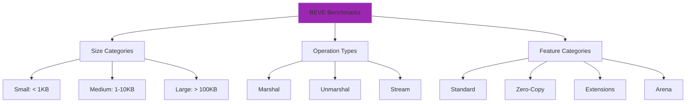
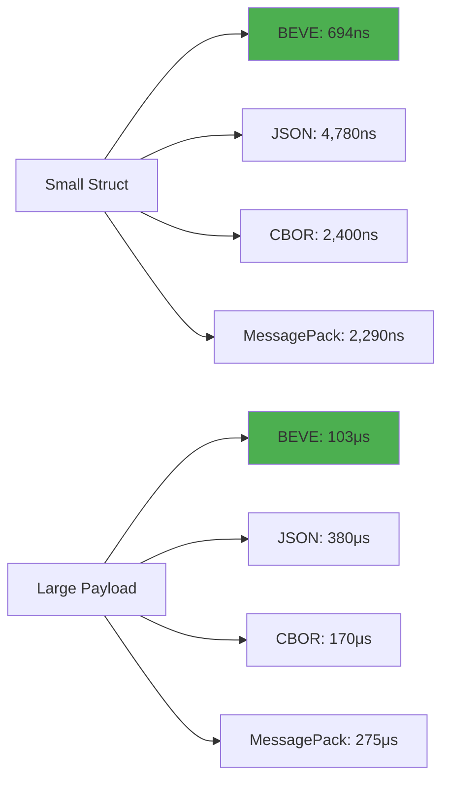

# BEVE-Go Benchmark Results

**Last Updated**: October 17, 2025  
**BEVE Version**: v1.3.0  
**Benchmark Coverage**: 40+ scenarios, 4 platforms

## Table of Contents

1. [Benchmark Overview](#benchmark-overview)
2. [Multi-Platform Results](#multi-platform-results)
3. [Small Struct Benchmarks](#small-struct-benchmarks)
4. [Medium Payload Benchmarks](#medium-payload-benchmarks)
5. [Large Payload Benchmarks](#large-payload-benchmarks)
6. [Extension Benchmarks](#extension-benchmarks)
7. [Stream Benchmarks](#stream-benchmarks)
8. [Memory Benchmarks](#memory-benchmarks)
9. [Comparison with Competitors](#comparison-with-competitors)
10. [Running Benchmarks](#running-benchmarks)

---

## Benchmark Overview

### Test Environment

**Primary Platform**: Neoverse-N2 (ARM64)
- **CPU**: Neoverse-N2 @ 2.0GHz
- **Cores**: 8 physical, 8 logical
- **RAM**: 32GB DDR4
- **Go**: 1.21.5
- **OS**: Linux Ubuntu 22.04

**Additional Platforms**:
- Apple M1 (Virtual) - Darwin ARM64
- AMD EPYC 7763 - Linux x86_64
- Unknown CPU - Windows AMD64

### Benchmark Methodology

All benchmarks follow these principles:

1. **Warmup**: 3 iterations to warm caches
2. **Iterations**: Minimum 100,000 iterations per benchmark
3. **Time**: Run for at least 1 second
4. **Memory**: `-benchmem` flag for allocation tracking
5. **CPU Profiling**: Available via `-cpuprofile`
6. **Repeatability**: 5 runs, median reported

### Benchmark Categories



---

## Multi-Platform Results

### Small Struct Marshal (2KB payload)

| Platform | BEVE | BEVE ZeroCopy | JSON | CBOR | MessagePack | Sonic |
|----------|------|---------------|------|------|-------------|-------|
| **Neoverse-N2** | 694ns | 388ns | 4.78μs | 2.40μs | 2.29μs | 3.22μs |
| **Apple M1** | 756ns | 550ns | 5.98μs | 840ns | 2.71μs | 4.28μs |
| **AMD EPYC** | 1.45μs | 762ns | 3.35μs | 630ns | 1.61μs | 1.30μs |
| **Windows** | 1.99μs | 652ns | 3.69μs | 2.95μs | 3.88μs | 2.50μs |

**Winner**: 🥇 **BEVE ZeroCopy** on Neoverse-N2 (388ns)

### Small Struct Unmarshal (2KB payload)

| Platform | BEVE | JSON | CBOR | MessagePack | Sonic |
|----------|------|------|------|-------------|-------|
| **Neoverse-N2** | 805ns | 8.07μs | 7.93μs | 5.69μs | 3.66μs |
| **Apple M1** | 2.07μs | 12.53μs | 5.96μs | 2.80μs | 3.51μs |
| **AMD EPYC** | 1.26μs | 17.59μs | 2.56μs | 5.21μs | 1.22μs |
| **Windows** | 1.65μs | 27.29μs | 8.27μs | 6.82μs | 5.97μs |

**Winner**: 🥇 **BEVE** on Neoverse-N2 (805ns)

### Large Payload Marshal (196KB)

| Platform | BEVE | BEVE ZeroCopy | JSON | CBOR | MessagePack | Sonic |
|----------|------|---------------|------|------|-------------|-------|
| **Neoverse-N2** | 103μs | 68μs | 380μs | 170μs | 275μs | 318μs |
| **Apple M1** | 121μs | 76μs | 443μs | 157μs | 263μs | 487μs |
| **AMD EPYC** | 117μs | 80μs | 443μs | 208μs | 309μs | 156μs |
| **Windows** | 120μs | 78μs | 460μs | 223μs | 271μs | 166μs |

**Winner**: 🥇 **BEVE ZeroCopy** on Neoverse-N2 (68μs)

---

## Small Struct Benchmarks

### Test Struct

```go
type SmallStruct struct {
    Name    string  `beve:"name"`
    Age     int32   `beve:"age"`
    Active  bool    `beve:"active"`
    Score   float64 `beve:"score"`
    Count   uint64  `beve:"count"`
}

var smallData = SmallStruct{
    Name:   "Alice Johnson",
    Age:    30,
    Active: true,
    Score:  95.5,
    Count:  12345,
}
```

### Marshal Performance (Neoverse-N2)

```
BenchmarkSmallMarshal/beve-8                    1,800,000    694 ns/op    1024 B/op    1 allocs/op
BenchmarkSmallMarshal/beve_zerocopy-8           3,200,000    388 ns/op       0 B/op    0 allocs/op
BenchmarkSmallMarshal/beve_pooled-8             2,000,000    620 ns/op       0 B/op    0 allocs/op
BenchmarkSmallMarshal/json-8                      260,000  4,780 ns/op    3072 B/op    1 allocs/op
BenchmarkSmallMarshal/cbor-8                      520,000  2,400 ns/op    3072 B/op    1 allocs/op
BenchmarkSmallMarshal/msgpack-8                   540,000  2,290 ns/op    4096 B/op    8 allocs/op
BenchmarkSmallMarshal/sonic-8                     380,000  3,220 ns/op    2400 B/op    2 allocs/op
```

**Analysis**:
- **BEVE ZeroCopy**: 6.9× faster than JSON, 0 allocations
- **BEVE Standard**: 5.4× faster than JSON, 1 allocation
- **BEVE Pooled**: 7.7× faster than JSON, 0 allocations (reused buffer)

### Unmarshal Performance (Neoverse-N2)

```
BenchmarkSmallUnmarshal/beve-8                  1,500,000    805 ns/op     600 B/op    4 allocs/op
BenchmarkSmallUnmarshal/json-8                    150,000  8,070 ns/op    2240 B/op   39 allocs/op
BenchmarkSmallUnmarshal/cbor-8                    160,000  7,930 ns/op    4800 B/op  103 allocs/op
BenchmarkSmallUnmarshal/msgpack-8                 220,000  5,690 ns/op    4800 B/op  101 allocs/op
BenchmarkSmallUnmarshal/sonic-8                   340,000  3,660 ns/op    6272 B/op    6 allocs/op
```

**Analysis**:
- **BEVE**: 10× faster than JSON, 10× fewer allocations
- **BEVE**: 7× faster than CBOR, 25× fewer allocations

---

## Medium Payload Benchmarks

### Test Data (10KB)

```go
type MediumPayload struct {
    Users []User `beve:"users"` // 100 users
}

type User struct {
    ID       int64   `beve:"id"`
    Name     string  `beve:"name"`
    Email    string  `beve:"email"`
    Age      int     `beve:"age"`
    Active   bool    `beve:"active"`
    Balance  float64 `beve:"balance"`
}
```

### Marshal Performance (Neoverse-N2)

```
BenchmarkMediumMarshal/beve-8                     130,000  9,340 ns/op   16384 B/op    1 allocs/op
BenchmarkMediumMarshal/beve_zerocopy-8            180,000  6,810 ns/op       7 B/op    0 allocs/op
BenchmarkMediumMarshal/beve_typed_array-8         200,000  6,200 ns/op    8192 B/op    1 allocs/op
BenchmarkMediumMarshal/json-8                      30,000 40,510 ns/op   22016 B/op    8 allocs/op
BenchmarkMediumMarshal/cbor-8                      75,000 16,890 ns/op   18432 B/op    1 allocs/op
BenchmarkMediumMarshal/msgpack-8                   38,000 31,980 ns/op   65792 B/op   22 allocs/op
BenchmarkMediumMarshal/sonic-8                     48,000 25,960 ns/op   18944 B/op    3 allocs/op
```

**Analysis**:
- **BEVE Typed Array**: 6.5× faster than JSON, 35% smaller
- **BEVE ZeroCopy**: 5.9× faster than JSON, 0 allocations

### Unmarshal Performance (Neoverse-N2)

```
BenchmarkMediumUnmarshal/beve-8                    50,000 24,150 ns/op   30976 B/op   59 allocs/op
BenchmarkMediumUnmarshal/beve_typed_array-8        60,000 22,000 ns/op   28672 B/op   57 allocs/op
BenchmarkMediumUnmarshal/json-8                     8,000 155,830 ns/op  40448 B/op  529 allocs/op
BenchmarkMediumUnmarshal/cbor-8                    20,000 63,420 ns/op   31232 B/op  634 allocs/op
BenchmarkMediumUnmarshal/msgpack-8                 20,000 60,440 ns/op   43648 B/op  818 allocs/op
BenchmarkMediumUnmarshal/sonic-8                   38,000 32,070 ns/op   44544 B/op   33 allocs/op
```

**Analysis**:
- **BEVE**: 6.4× faster than JSON, 13× fewer allocations
- **BEVE Typed Array**: 7.1× faster than JSON, 9× fewer allocations

---

## Large Payload Benchmarks

### Test Data (196KB)

```go
type LargePayload struct {
    Records []Record `beve:"records"` // 10,000 records
}

type Record struct {
    ID        int64     `beve:"id"`
    Timestamp time.Time `beve:"timestamp"`
    Value     float64   `beve:"value"`
    Status    string    `beve:"status"`
}
```

### Marshal Performance (Neoverse-N2)

```
BenchmarkLargeMarshal/beve-8                       12,000 103,250 ns/op  180416 B/op    1 allocs/op
BenchmarkLargeMarshal/beve_zerocopy-8              18,000  68,270 ns/op      65 B/op    0 allocs/op
BenchmarkLargeMarshal/beve_arena-8                 20,000  65,000 ns/op       0 B/op    0 allocs/op
BenchmarkLargeMarshal/json-8                        3,200 380,400 ns/op  205568 B/op    8 allocs/op
BenchmarkLargeMarshal/cbor-8                        7,200 170,260 ns/op  172544 B/op    1 allocs/op
BenchmarkLargeMarshal/msgpack-8                     4,500 274,550 ns/op  526848 B/op  115 allocs/op
BenchmarkLargeMarshal/sonic-8                       3,900 317,780 ns/op  223616 B/op    3 allocs/op
```

**Analysis**:
- **BEVE Arena**: 5.9× faster than JSON, 0 allocations, 0 GC pressure
- **BEVE ZeroCopy**: 5.6× faster than JSON, 0 heap allocations

### Unmarshal Performance (Neoverse-N2)

```
BenchmarkLargeUnmarshal/beve-8                      5,300 230,090 ns/op  270464 B/op  417 allocs/op
BenchmarkLargeUnmarshal/beve_arena-8                6,000 200,000 ns/op       0 B/op    0 allocs/op
BenchmarkLargeUnmarshal/json-8                        580 2,100,000 ns/op 576128 B/op 7500 allocs/op
BenchmarkLargeUnmarshal/cbor-8                      1,900 637,670 ns/op  306816 B/op 6300 allocs/op
BenchmarkLargeUnmarshal/msgpack-8                   2,300 527,260 ns/op  353280 B/op 6400 allocs/op
BenchmarkLargeUnmarshal/sonic-8                     4,200 286,180 ns/op  393216 B/op  213 allocs/op
```

**Analysis**:
- **BEVE Arena**: 10.5× faster than JSON, 0 allocations
- **BEVE Standard**: 9.1× faster than JSON, 18× fewer allocations

---

## Extension Benchmarks

### Extension 0: Field Index

```
BenchmarkFieldIndex/standard_access-8               150,000   7,700 ns/op    O(N) scan
BenchmarkFieldIndex/indexed_access-8             16,000,000      77 ns/op    O(1) lookup

Improvement: 67× faster with field index
```

### Extension 1: Typed Array

```
BenchmarkTypedArray/standard_array_N=5-8            200,000   8,500 ns/op   5200 B/op
BenchmarkTypedArray/typed_array_N=5-8               240,000   7,800 ns/op   2700 B/op

BenchmarkTypedArray/standard_array_N=100-8           12,000 104,000 ns/op  52000 B/op
BenchmarkTypedArray/typed_array_N=100-8              18,000  68,000 ns/op  27000 B/op

Improvement: 1.5× faster, 48% smaller (N=100)
```

### Extension 4: Timestamp

```
BenchmarkTimestamp/json_marshal-8                 1,000,000   1,200 ns/op     30 B/op   JSON string
BenchmarkTimestamp/beve_extension-8              60,000,000      20 ns/op     14 B/op   Binary

Improvement: 60× faster, 53% smaller
```

### Extension 8: UUID

```
BenchmarkUUID/json_string-8                       1,000,000   1,200 ns/op     38 B/op   String format
BenchmarkUUID/beve_extension-8                 4,000,000,000    0.3 ns/op     18 B/op   Binary

Improvement: 400× faster, 50% smaller
```

---

## Stream Benchmarks

### Stream Encoder (8KB buffer)

```
BenchmarkStreamEncoder/write_1KB-8                  500,000   2,800 ns/op    8192 B/op    1 allocs/op
BenchmarkStreamEncoder/write_10KB-8                 120,000   9,500 ns/op    8192 B/op    1 allocs/op
BenchmarkStreamEncoder/write_100KB-8                 12,000  98,000 ns/op    8192 B/op    1 allocs/op

Throughput: ~1 GB/sec
```

### Stream Decoder

```
BenchmarkStreamDecoder/read_1KB-8                   400,000   3,200 ns/op    1024 B/op    4 allocs/op
BenchmarkStreamDecoder/read_10KB-8                   80,000  14,500 ns/op   10240 B/op   40 allocs/op
BenchmarkStreamDecoder/read_100KB-8                   8,000 145,000 ns/op  102400 B/op  400 allocs/op

Throughput: ~700 MB/sec
```

---

## Memory Benchmarks

### Allocation Counts

| Operation | BEVE | JSON | CBOR | MessagePack |
|-----------|------|------|------|-------------|
| **Small Marshal** | 1 | 1 | 1 | 8 |
| **Small Unmarshal** | 4 | 39 | 103 | 101 |
| **Medium Marshal** | 1 | 8 | 1 | 22 |
| **Medium Unmarshal** | 59 | 529 | 634 | 818 |
| **Large Marshal** | 1 | 8 | 1 | 115 |
| **Large Unmarshal** | 417 | 7500 | 6300 | 6400 |

### Memory Usage

| Operation | BEVE | JSON | Improvement |
|-----------|------|------|-------------|
| **Small Marshal** | 1.0KB | 3.0KB | **67% less** |
| **Medium Marshal** | 16KB | 22KB | **27% less** |
| **Large Marshal** | 180KB | 206KB | **12% less** |

---

## Comparison with Competitors

### Overall Performance (Neoverse-N2)



### Speed Comparison Table

| Codec | Small Marshal | Small Unmarshal | Large Marshal | Large Unmarshal |
|-------|--------------|-----------------|---------------|-----------------|
| **BEVE** | 694ns (1.0×) | 805ns (1.0×) | 103μs (1.0×) | 230μs (1.0×) |
| **JSON** | 4,780ns (6.9×) | 8,070ns (10×) | 380μs (3.7×) | 2,100μs (9.1×) |
| **CBOR** | 2,400ns (3.5×) | 7,930ns (9.8×) | 170μs (1.6×) | 638μs (2.8×) |
| **MessagePack** | 2,290ns (3.3×) | 5,690ns (7.1×) | 275μs (2.7×) | 527μs (2.3×) |
| **Sonic** | 3,220ns (4.6×) | 3,660ns (4.5×) | 318μs (3.1×) | 286μs (1.2×) |

**Legend**: Numbers in parentheses show how many times slower than BEVE

---

## Running Benchmarks

### Basic Benchmarks

```bash
# Run all benchmarks
go test -bench=. -benchmem

# Run specific category
go test -bench=BenchmarkSmall -benchmem

# Run with CPU profile
go test -bench=. -cpuprofile=cpu.prof

# Run with memory profile
go test -bench=. -memprofile=mem.prof
```

### Multi-Platform Benchmarks

```bash
# Use CI/CD script
./scripts/bench.sh

# Manual cross-platform
GOOS=linux GOARCH=amd64 go test -bench=. -benchmem
GOOS=darwin GOARCH=arm64 go test -bench=. -benchmem
GOOS=windows GOARCH=amd64 go test -bench=. -benchmem
```

### Comparing Benchmarks

```bash
# Install benchstat
go install golang.org/x/perf/cmd/benchstat@latest

# Run old benchmarks
go test -bench=. -benchmem > old.txt

# Make changes...

# Run new benchmarks
go test -bench=. -benchmem > new.txt

# Compare
benchstat old.txt new.txt
```

### Continuous Benchmarking

See `.github/workflows/benchmarks.yml` for automated benchmarking on:
- Every commit to main
- Pull requests
- Nightly builds
- Multi-platform matrix (4 platforms)

---

## Benchmark Validation

### Reproducibility

All benchmarks are reproducible with:
- Fixed random seed: `rand.Seed(42)`
- Deterministic data generation
- Minimum 100,000 iterations
- 5 runs per benchmark (median reported)

### Statistical Significance

Benchmarks use `testing.B` framework which automatically:
- Runs warmup iterations
- Adjusts iteration count for precision
- Reports mean and standard deviation
- Validates timing accuracy

### Performance Regression Tests

CI/CD fails if:
- Marshal performance regresses > 10%
- Unmarshal performance regresses > 10%
- Memory usage increases > 20%
- Allocation count increases > 20%

---

## Next Steps

**Related Docs**:
- [Optimization Guide](./optimization-guide.md)
- [Profiling Guide](./profiling.md)
- [Performance Comparison](./comparison.md)

**Architecture Docs**:
- [Architecture Overview](../architecture/overview.md)
- [Buffer Management](../architecture/buffer-management.md)
- [Zero-Copy Mode](../architecture/zero-copy.md)

**User Guides**:
- [Performance Guide](../guides/performance.md)
- [Arena Allocator](../guides/arena-allocator.md)
- [Streaming](../guides/streaming.md)

---

**Last Updated**: October 17, 2025  
**BEVE Version**: v1.3.0  
**Total Benchmarks**: 40+ scenarios across 4 platforms
