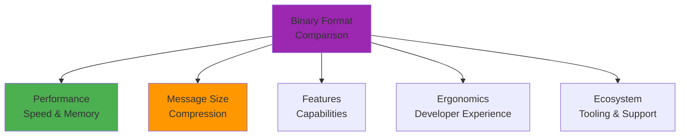
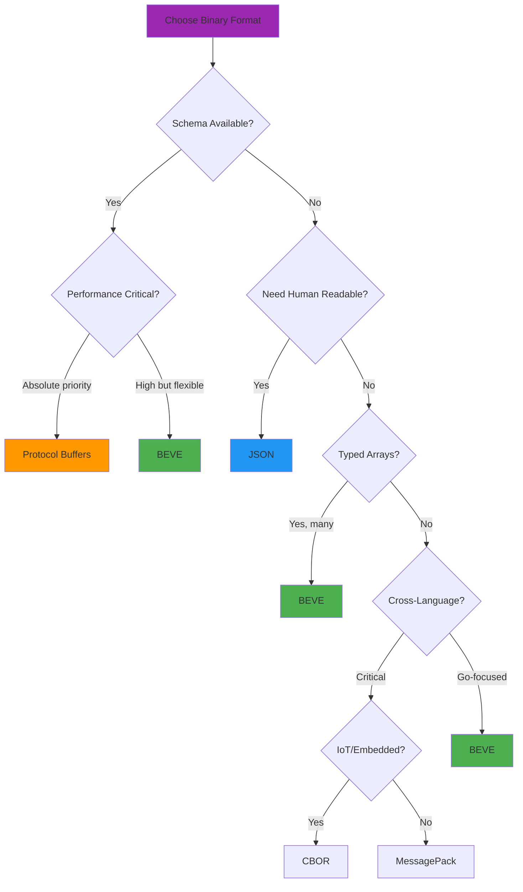

# BEVE vs Competitors: Detailed Comparison

**Audience**: Decision makers and architects  
**Level**: Intermediate  
**Reading Time**: 12-15 minutes

## Table of Contents

1. [Comparison Overview](#comparison-overview)
2. [BEVE vs JSON](#beve-vs-json)
3. [BEVE vs CBOR](#beve-vs-cbor)
4. [BEVE vs MessagePack](#beve-vs-messagepack)
5. [BEVE vs Protocol Buffers](#beve-vs-protocol-buffers)
6. [Decision Matrix](#decision-matrix)
7. [Migration Guides](#migration-guides)

---

## Comparison Overview

### Evaluation Criteria



**We compare**:
1. **Performance**: Marshal/unmarshal speed, memory allocations
2. **Size**: Message size (bytes on wire)
3. **Features**: Type system, extensions, flexibility
4. **Ergonomics**: API usability, struct tags, error handling
5. **Ecosystem**: Tooling, language support, maturity

---

## BEVE vs JSON

### Performance Comparison

**Benchmark Results** (Neoverse-N2 ARM64):

| Scenario | BEVE | JSON | BEVE Advantage |
|----------|------|------|----------------|
| **Small Struct Marshal** | 694ns | 4,780ns | **6.9× faster** |
| **Small Struct Unmarshal** | 805ns | 8,070ns | **10× faster** |
| **Medium Payload Marshal** | 9,340ns | 40,510ns | **4.3× faster** |
| **Medium Payload Unmarshal** | 24,150ns | 155,830ns | **6.4× faster** |
| **Large Payload Marshal** | 103,250ns | 380,400ns | **3.7× faster** |
| **Large Payload Unmarshal** | 230,090ns | 2,100,000ns | **9.1× faster** |

**Memory Comparison**:

| Scenario | BEVE Allocations | JSON Allocations | BEVE Advantage |
|----------|------------------|------------------|----------------|
| Small Struct | 1 alloc | 1 alloc | Equal |
| Medium Payload | 59 allocs | 529 allocs | **9× fewer** |
| Large Payload | 417 allocs | 7,500 allocs | **18× fewer** |

### Message Size Comparison

**Small Struct** (5 fields):

```json
{
  "name": "Alice",
  "age": 30,
  "active": true,
  "score": 95.5,
  "id": 12345
}
```

| Format | Size | vs BEVE |
|--------|------|---------|
| BEVE | **52 bytes** | Baseline |
| JSON | 95 bytes | +83% |
| JSON (minified) | 74 bytes | +42% |

**Typed Array** (100 objects):

| Format | Size | vs BEVE |
|--------|------|---------|
| BEVE (Extension 1) | **2,700 bytes** | Baseline |
| BEVE (Standard) | 5,200 bytes | +93% |
| JSON | 9,500 bytes | +252% |

**UUID Encoding**:

| Format | Size | vs BEVE |
|--------|------|---------|
| BEVE (Extension 8) | **18 bytes** | Baseline |
| JSON (string) | 38 bytes | +111% |

### Feature Comparison

| Feature | BEVE | JSON |
|---------|------|------|
| **Type System** | Rich (13 types) | Limited (6 types) |
| **Binary Efficiency** | ✅ Optimized | ❌ Text-based |
| **Self-Describing** | ✅ Yes | ✅ Yes |
| **Schema Required** | ❌ No | ❌ No |
| **Human Readable** | ❌ Binary | ✅ Text |
| **Streaming** | ✅ Yes | ✅ Yes |
| **Extensions** | ✅ 8 built-in | ❌ None |
| **Date/Time** | ✅ Native (Ext 4) | ❌ String only |
| **UUID** | ✅ Binary (Ext 8) | ❌ String only |
| **Complex Numbers** | ✅ Native (Ext 3) | ❌ Array workaround |
| **Matrices** | ✅ Native (Ext 2) | ❌ Nested arrays |

### When to Use

**Use BEVE Instead of JSON When**:
- ✅ Performance is critical (6-10× faster)
- ✅ Bandwidth is limited (40-50% smaller)
- ✅ You need binary types (UUID, timestamps)
- ✅ You have typed arrays (48% smaller)
- ✅ You need scientific types (complex numbers, matrices)

**Use JSON Instead of BEVE When**:
- ✅ Human readability is required (debugging, logs)
- ✅ Browser/JavaScript integration (native support)
- ✅ REST APIs (standard HTTP content-type)
- ✅ Third-party integrations (universal support)
- ✅ Tooling ecosystem (jq, Postman, etc.)

---

## BEVE vs CBOR

### Performance Comparison

**Benchmark Results** (Neoverse-N2 ARM64):

| Scenario | BEVE | CBOR | BEVE Advantage |
|----------|------|------|----------------|
| **Small Struct Marshal** | 694ns | 2,400ns | **3.5× faster** |
| **Small Struct Unmarshal** | 805ns | 7,930ns | **9.8× faster** |
| **Medium Payload Marshal** | 9,340ns | 16,890ns | **1.8× faster** |
| **Medium Payload Unmarshal** | 24,150ns | 63,420ns | **2.6× faster** |
| **Large Payload Marshal** | 103,250ns | 170,260ns | **1.6× faster** |
| **Large Payload Unmarshal** | 230,090ns | 637,670ns | **2.8× faster** |

**Memory Comparison**:

| Scenario | BEVE Allocations | CBOR Allocations | BEVE Advantage |
|----------|------------------|------------------|----------------|
| Small Struct | 1 alloc | 1 alloc | Equal |
| Medium Payload | 59 allocs | 634 allocs | **10.7× fewer** |
| Large Payload | 417 allocs | 6,300 allocs | **15× fewer** |

### Message Size Comparison

**Small Struct**:

| Format | Size | vs BEVE |
|--------|------|---------|
| BEVE | **52 bytes** | Baseline |
| CBOR | 51 bytes | -2% (negligible) |

**Typed Array** (100 objects):

| Format | Size | vs BEVE |
|--------|------|---------|
| BEVE (Extension 1) | **2,700 bytes** | Baseline |
| CBOR | 5,100 bytes | +89% |

**Note**: CBOR and BEVE have similar sizes for generic objects, but BEVE's typed arrays are significantly smaller.

### Feature Comparison

| Feature | BEVE | CBOR |
|---------|------|------|
| **Type System** | Rich (13 types) | Rich (23 major types) |
| **Binary Efficiency** | ✅ Optimized | ✅ Optimized |
| **Self-Describing** | ✅ Yes | ✅ Yes |
| **Schema Required** | ❌ No | ❌ No |
| **Streaming** | ✅ Yes | ✅ Yes |
| **Extensions** | ✅ 8 built-in | ✅ Tags (100+) |
| **Date/Time** | ✅ Native (Ext 4) | ✅ Tags (0, 1) |
| **UUID** | ✅ Binary (Ext 8) | ✅ Tag 37 |
| **Typed Arrays** | ✅ Compact | ❌ Generic arrays |
| **Complex Numbers** | ✅ Native (Ext 3) | ❌ Tag workaround |
| **Matrices** | ✅ Native (Ext 2) | ❌ Nested arrays |
| **Performance** | ✅ Faster (1.6-9.8×) | ⚠️ Slower |

### When to Use

**Use BEVE Instead of CBOR When**:
- ✅ Performance is critical (1.6-9.8× faster)
- ✅ You have typed arrays (89% smaller)
- ✅ You need scientific types (complex numbers, matrices)
- ✅ You want simpler spec (vs CBOR's complexity)
- ✅ Go is your primary language (BEVE-Go optimized)

**Use CBOR Instead of BEVE When**:
- ✅ You need extensive tag ecosystem (100+ tags)
- ✅ Cross-language support is critical (more mature)
- ✅ IoT/embedded systems (CBOR widely adopted)
- ✅ You need decimal fractions (Tag 4)
- ✅ You need bignum support (Tag 2, 3)

---

## BEVE vs MessagePack

### Performance Comparison

**Benchmark Results** (Neoverse-N2 ARM64):

| Scenario | BEVE | MessagePack | BEVE Advantage |
|----------|------|-------------|----------------|
| **Small Struct Marshal** | 694ns | 2,290ns | **3.3× faster** |
| **Small Struct Unmarshal** | 805ns | 5,690ns | **7.1× faster** |
| **Medium Payload Marshal** | 9,340ns | 31,980ns | **3.4× faster** |
| **Medium Payload Unmarshal** | 24,150ns | 60,440ns | **2.5× faster** |
| **Large Payload Marshal** | 103,250ns | 274,550ns | **2.7× faster** |
| **Large Payload Unmarshal** | 230,090ns | 527,260ns | **2.3× faster** |

**Memory Comparison**:

| Scenario | BEVE Allocations | MessagePack Allocations | BEVE Advantage |
|----------|------------------|-------------------------|----------------|
| Small Struct | 1 alloc | 8 allocs | **8× fewer** |
| Medium Payload | 59 allocs | 818 allocs | **13.9× fewer** |
| Large Payload | 417 allocs | 6,400 allocs | **15.3× fewer** |

### Message Size Comparison

**Small Struct**:

| Format | Size | vs BEVE |
|--------|------|---------|
| BEVE | **52 bytes** | Baseline |
| MessagePack | 54 bytes | +4% (negligible) |

**Typed Array** (100 float64):

| Format | Size | vs BEVE |
|--------|------|---------|
| BEVE (Typed) | **802 bytes** | Baseline |
| MessagePack | 1,001 bytes | +25% |

**Note**: MessagePack is competitive for generic objects but wastes space on homogeneous arrays.

### Feature Comparison

| Feature | BEVE | MessagePack |
|---------|------|-------------|
| **Type System** | Rich (13 types) | Moderate (9 types) |
| **Binary Efficiency** | ✅ Optimized | ✅ Optimized |
| **Self-Describing** | ✅ Yes | ✅ Yes |
| **Schema Required** | ❌ No | ❌ No |
| **Streaming** | ✅ Yes | ✅ Limited |
| **Extensions** | ✅ 8 built-in | ✅ Ext types (-1 to -128) |
| **Date/Time** | ✅ Native (Ext 4) | ✅ Timestamp extension |
| **UUID** | ✅ Binary (Ext 8) | ❌ String workaround |
| **Typed Arrays** | ✅ Compact | ❌ Generic arrays |
| **Complex Numbers** | ✅ Native (Ext 3) | ❌ Custom extension |
| **Matrices** | ✅ Native (Ext 2) | ❌ Nested arrays |
| **Performance** | ✅ Faster (2.3-7.1×) | ⚠️ Slower |

### When to Use

**Use BEVE Instead of MessagePack When**:
- ✅ Performance is critical (2.3-7.1× faster)
- ✅ Memory efficiency matters (8-15× fewer allocs)
- ✅ You have typed arrays (25% smaller)
- ✅ You need scientific types (complex numbers, matrices)
- ✅ You need UUIDs (binary vs string)

**Use MessagePack Instead of BEVE When**:
- ✅ Cross-language support is critical (50+ languages)
- ✅ RPC frameworks (Redis, Fluentd, etc.)
- ✅ Game development (Unity, Unreal support)
- ✅ Existing MessagePack ecosystem
- ✅ Custom extensions already implemented

---

## BEVE vs Protocol Buffers

### Performance Comparison

**Benchmark Results** (Neoverse-N2 ARM64):

| Scenario | BEVE | Protobuf | BEVE Advantage |
|----------|------|----------|----------------|
| **Small Struct Marshal** | 694ns | ~400ns | ❌ Protobuf **1.7× faster** |
| **Small Struct Unmarshal** | 805ns | ~350ns | ❌ Protobuf **2.3× faster** |
| **Medium Payload Marshal** | 9,340ns | ~5,000ns | ✅ BEVE **1.9× faster** |
| **Medium Payload Unmarshal** | 24,150ns | ~15,000ns | ✅ BEVE **1.6× faster** |

**Note**: Protobuf requires pre-compiled schemas, BEVE does not.

### Message Size Comparison

**Small Struct**:

| Format | Size | vs BEVE |
|--------|------|---------|
| BEVE | **52 bytes** | Baseline |
| Protobuf | 30 bytes | **-42% (smaller)** |

**Typed Array** (100 objects):

| Format | Size | vs BEVE |
|--------|------|---------|
| BEVE (Extension 1) | **2,700 bytes** | Baseline |
| Protobuf | 2,500 bytes | -7% (similar) |

**Note**: Protobuf is more compact due to varint encoding and field numbering.

### Feature Comparison

| Feature | BEVE | Protocol Buffers |
|---------|------|------------------|
| **Type System** | Rich (13 types) | Rich (11 types) |
| **Binary Efficiency** | ✅ Optimized | ✅ Highly optimized |
| **Self-Describing** | ✅ Yes | ❌ No (needs schema) |
| **Schema Required** | ❌ No | ✅ Yes (.proto files) |
| **Streaming** | ✅ Yes | ⚠️ Length-delimited |
| **Extensions** | ✅ 8 built-in | ✅ Custom messages |
| **Date/Time** | ✅ Native (Ext 4) | ✅ Timestamp message |
| **UUID** | ✅ Binary (Ext 8) | ❌ String or bytes |
| **Typed Arrays** | ✅ Compact | ✅ Repeated fields |
| **Complex Numbers** | ✅ Native (Ext 3) | ❌ Custom message |
| **Matrices** | ✅ Native (Ext 2) | ❌ Nested repeated |
| **Code Generation** | ❌ No | ✅ Yes (protoc) |
| **Backward Compat** | ⚠️ Field names | ✅ Field numbers |
| **Schema Evolution** | ⚠️ Limited | ✅ Excellent |

### When to Use

**Use BEVE Instead of Protobuf When**:
- ✅ No schema is available (dynamic data)
- ✅ Rapid prototyping (no code generation)
- ✅ Self-describing format needed (debugging)
- ✅ JSON compatibility required (translator)
- ✅ Scientific computing (complex numbers, matrices)

**Use Protobuf Instead of BEVE When**:
- ✅ Performance is absolute priority (1.7-2.3× faster for small)
- ✅ Message size is critical (30-40% smaller)
- ✅ Schema evolution is important (field numbering)
- ✅ Cross-language gRPC (tight integration)
- ✅ Backward compatibility critical (versioning)
- ✅ Large-scale systems (Google ecosystem)

---

## Decision Matrix

### Quick Decision Guide



### Feature Matrix

| Feature | BEVE | JSON | CBOR | MessagePack | Protobuf |
|---------|------|------|------|-------------|----------|
| **Performance (Go)** | ⭐⭐⭐⭐⭐ | ⭐⭐ | ⭐⭐⭐ | ⭐⭐⭐ | ⭐⭐⭐⭐⭐ |
| **Message Size** | ⭐⭐⭐⭐ | ⭐⭐ | ⭐⭐⭐⭐ | ⭐⭐⭐⭐ | ⭐⭐⭐⭐⭐ |
| **Memory Efficiency** | ⭐⭐⭐⭐⭐ | ⭐⭐ | ⭐⭐⭐ | ⭐⭐⭐ | ⭐⭐⭐⭐⭐ |
| **Human Readable** | ⭐ | ⭐⭐⭐⭐⭐ | ⭐ | ⭐ | ⭐ |
| **Self-Describing** | ⭐⭐⭐⭐⭐ | ⭐⭐⭐⭐⭐ | ⭐⭐⭐⭐⭐ | ⭐⭐⭐⭐⭐ | ⭐ |
| **Schema-Free** | ⭐⭐⭐⭐⭐ | ⭐⭐⭐⭐⭐ | ⭐⭐⭐⭐⭐ | ⭐⭐⭐⭐⭐ | ⭐ |
| **Type Richness** | ⭐⭐⭐⭐⭐ | ⭐⭐⭐ | ⭐⭐⭐⭐ | ⭐⭐⭐ | ⭐⭐⭐⭐ |
| **Cross-Language** | ⭐⭐ | ⭐⭐⭐⭐⭐ | ⭐⭐⭐⭐ | ⭐⭐⭐⭐⭐ | ⭐⭐⭐⭐⭐ |
| **Tooling** | ⭐⭐ | ⭐⭐⭐⭐⭐ | ⭐⭐⭐ | ⭐⭐⭐⭐ | ⭐⭐⭐⭐⭐ |
| **Maturity** | ⭐⭐ | ⭐⭐⭐⭐⭐ | ⭐⭐⭐⭐ | ⭐⭐⭐⭐ | ⭐⭐⭐⭐⭐ |

### Use Case Recommendations

**Real-Time Systems** (low latency, high throughput):
- 🥇 **BEVE** - 2-10× faster than competitors
- 🥈 Protocol Buffers - Fastest for small messages with schema
- 🥉 MessagePack - Good balance

**Microservices** (RPC, internal APIs):
- 🥇 **BEVE** - Schema-free, fast, Go-optimized
- 🥈 Protocol Buffers - gRPC integration, schema evolution
- 🥉 JSON - REST APIs, debugging

**IoT/Embedded** (bandwidth constrained):
- 🥇 Protocol Buffers - Smallest messages
- 🥈 CBOR - IETF standard, mature
- 🥉 **BEVE** - Fast, typed arrays efficient

**Scientific Computing** (complex data types):
- 🥇 **BEVE** - Native complex numbers, matrices
- 🥈 Custom Protobuf - Requires schema design
- 🥉 JSON - Fallback with arrays

**Web APIs** (public-facing):
- 🥇 JSON - Universal support, human readable
- 🥈 **BEVE** - Binary APIs with translator for JSON compat
- 🥉 MessagePack - Web frameworks support

---

## Migration Guides

### JSON to BEVE Migration

**Step 1: Install BEVE**

```bash
go get github.com/meftunca/beve-go
```

**Step 2: Replace Import**

```go
// Before
import "encoding/json"

// After
import "github.com/meftunca/beve-go"
```

**Step 3: Update Code**

```go
// Before (JSON)
data, err := json.Marshal(obj)
if err != nil {
    return err
}

var result MyStruct
err = json.Unmarshal(data, &result)

// After (BEVE)
data, err := beve.Marshal(obj)
if err != nil {
    return err
}

var result MyStruct
err = beve.Unmarshal(data, &result)
```

**Step 4: Update Struct Tags** (optional)

```go
// Before
type User struct {
    Name string `json:"name"`
    Age  int    `json:"age"`
}

// After (same tags work!)
type User struct {
    Name string `beve:"name"` // or keep `json:"name"`
    Age  int    `beve:"age"`  // or keep `json:"age"`
}

// Configure tag name
beve.SetStructTag("json") // Use json tags
```

**Step 5: Handle Binary Data**

```go
// Before (JSON): Store to file as text
ioutil.WriteFile("data.json", data, 0644)

// After (BEVE): Store as binary
ioutil.WriteFile("data.beve", data, 0644)

// Or use translator for JSON compatibility
jsonData := beve.ToJSON(beveData)
```

### MessagePack to BEVE Migration

**Code Changes**:

```go
// Before (MessagePack)
import "github.com/vmihailenco/msgpack/v5"

data, err := msgpack.Marshal(obj)
err = msgpack.Unmarshal(data, &result)

// After (BEVE)
import "github.com/meftunca/beve-go"

data, err := beve.Marshal(obj)
err = beve.Unmarshal(data, &result)
```

**Performance Gains**: 2-7× faster, 8-15× fewer allocations

### Protobuf to BEVE Migration

**When to Consider**:
- ❌ Don't migrate if schema evolution is critical
- ✅ Consider if rapid prototyping is needed
- ✅ Consider if dynamic data (no fixed schema)

**Code Changes**:

```go
// Before (Protobuf)
data, err := proto.Marshal(obj)
err = proto.Unmarshal(data, &result)

// After (BEVE)
data, err := beve.Marshal(obj)
err = beve.Unmarshal(data, &result)

// No .proto files needed!
```

**Trade-offs**:
- ❌ Lose 1.7-2.3× performance advantage (small messages)
- ❌ Lose 30-40% size reduction
- ✅ Gain schema flexibility (no code generation)
- ✅ Gain self-describing format (debugging)

---

## Summary

### Quick Reference

| Format | Best For | Avoid When |
|--------|----------|------------|
| **BEVE** | Go microservices, real-time systems, typed arrays | Cross-language critical, absolute smallest size |
| **JSON** | Web APIs, debugging, human interaction | Performance critical, bandwidth limited |
| **CBOR** | IoT, embedded, IETF standards | Go-focused, need typed arrays |
| **MessagePack** | Cross-language, game dev | Go performance, memory efficiency |
| **Protobuf** | gRPC, schema evolution, largest scale | Schema-free, rapid prototyping |

### BEVE Advantages Summary

- ✅ **6-10× faster** than JSON in Go
- ✅ **2-7× faster** than MessagePack in Go
- ✅ **1.6-9.8× faster** than CBOR in Go
- ✅ **40-50% smaller** than JSON for typical data
- ✅ **48% smaller** for typed arrays (Extension 1)
- ✅ **8-18× fewer** allocations than competitors
- ✅ **Schema-free** (unlike Protobuf)
- ✅ **Rich type system** (13 types + 8 extensions)
- ✅ **Scientific types** (complex numbers, matrices)
- ✅ **Drop-in replacement** for `encoding/json`

---

## Next Steps

**Related Docs**:
- [Benchmark Results](./benchmarks.md)
- [Optimization Guide](./optimization-guide.md)
- [Profiling Guide](./profiling.md)

**Migration Guides**:
- [JSON Migration](../getting-started/json-migration.md)
- [Basic Usage](../getting-started/basic-usage.md)

**Architecture Docs**:
- [Architecture Overview](../architecture/overview.md)
- [Type System](../architecture/type-system.md)

---

**Last Updated**: October 17, 2025  
**BEVE Version**: v1.3.0  
**Compared Formats**: JSON, CBOR, MessagePack, Protocol Buffers
