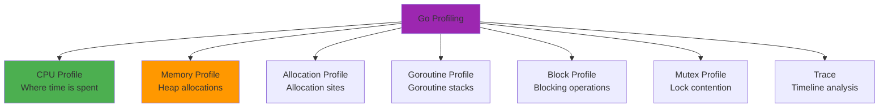

# BEVE-Go Profiling Guide

**Audience**: Performance engineers and developers  
**Level**: Intermediate to Advanced  
**Reading Time**: 15-18 minutes

## Table of Contents

1. [Profiling Overview](#profiling-overview)
2. [CPU Profiling](#cpu-profiling)
3. [Memory Profiling](#memory-profiling)
4. [Allocation Profiling](#allocation-profiling)
5. [Goroutine Profiling](#goroutine-profiling)
6. [Trace Analysis](#trace-analysis)
7. [Continuous Profiling](#continuous-profiling)
8. [Tools and Automation](#tools-and-automation)

---

## Profiling Overview

### Why Profile?

**Guessing is wrong 90% of the time.** Profile to:

1. **Identify bottlenecks** - Find the actual slow code
2. **Validate optimizations** - Measure before/after impact
3. **Understand behavior** - See memory allocation patterns
4. **Catch regressions** - Detect performance degradation
5. **Production debugging** - Diagnose real-world issues

### Profiling Types



### Quick Start

```bash
# CPU profile during benchmark
go test -bench=. -cpuprofile=cpu.prof

# Memory profile during benchmark
go test -bench=. -memprofile=mem.prof

# Analyze with pprof
go tool pprof cpu.prof
```

---

## CPU Profiling

### What is CPU Profiling?

CPU profiling **samples** your program's execution to show:
- Which functions consume the most CPU time
- Call relationships (caller → callee)
- Hot paths through code

### Running CPU Profiling

**During Benchmarks**:

```bash
# Run benchmark with CPU profile
go test -bench=BenchmarkMarshal -cpuprofile=cpu.prof

# Analyze profile
go tool pprof cpu.prof
```

**During Tests**:

```bash
# Run tests with CPU profile
go test -cpuprofile=cpu.prof

# Analyze profile
go tool pprof cpu.prof
```

**In Production Code**:

```go
import (
    "os"
    "runtime/pprof"
)

func main() {
    // Start CPU profiling
    f, _ := os.Create("cpu.prof")
    pprof.StartCPUProfile(f)
    defer pprof.StopCPUProfile()
    
    // Your code here
    runApplication()
}
```

### Analyzing CPU Profiles

**Interactive Mode**:

```bash
$ go tool pprof cpu.prof
(pprof) top10
```

**Example Output**:

```
Showing nodes accounting for 2.50s, 83.33% of 3.00s total
Dropped 42 nodes (cum <= 0.015s)
Showing top 10 nodes out of 67
      flat  flat%   sum%        cum   cum%
     0.85s 28.33% 28.33%      0.85s 28.33%  runtime.memmove
     0.42s 14.00% 42.33%      0.42s 14.00%  beve.(*Encoder).writeVarint
     0.31s 10.33% 52.67%      1.20s 40.00%  beve.(*Encoder).encodeValue
     0.28s  9.33% 62.00%      0.28s  9.33%  runtime.memclrNoHeapPointers
     0.19s  6.33% 68.33%      0.45s 15.00%  beve.(*Encoder).encodeStruct
     0.15s  5.00% 73.33%      0.15s  5.00%  reflect.Value.Kind
     0.12s  4.00% 77.33%      0.52s 17.33%  beve.Marshal
     0.10s  3.33% 80.67%      0.10s  3.33%  sync.(*Pool).Get
     0.05s  1.67% 82.33%      0.20s  6.67%  beve.getStructInfo
     0.03s  1.00% 83.33%      0.18s  6.00%  reflect.ValueOf
```

**Columns**:
- `flat`: Time spent in this function alone
- `flat%`: Percentage of total time
- `sum%`: Cumulative percentage
- `cum`: Time spent in this function + callees
- `cum%`: Cumulative percentage

**Key Commands**:

```bash
# Top 20 functions by flat time
(pprof) top20

# Top 20 functions by cumulative time
(pprof) top20 -cum

# Show function's source code
(pprof) list encodeValue

# Show call graph
(pprof) web

# Show flame graph
(pprof) flame

# Export to SVG
(pprof) svg > cpu.svg
```

### Example Analysis

**Identifying Hot Spots**:

```bash
(pprof) top10
      flat  flat%   sum%        cum   cum%
     0.85s 28.33% 28.33%      0.85s 28.33%  runtime.memmove
```

**Interpretation**: `runtime.memmove` takes 28% of CPU time → Check for unnecessary copies

**Drilling Down**:

```bash
(pprof) list memmove
```

**Output**:

```
ROUTINE ======================== runtime.memmove
     850ms      850ms (flat, cum) 28.33% of Total
         .          .   3432:func memmove(to, from unsafe.Pointer, n uintptr) {
         .          .   3433:    if msanenabled {
         .          .   3434:        msanwrite(to, n)
         .          .   3435:        msanread(from, n)
         .          .   3436:    }
     850ms      850ms   3437:    memmove_s390x(to, from, n)
```

**Optimization Idea**: Reduce buffer copies (use zero-copy mode)

### CPU Profile Visualizations

**Flame Graph** (shows call hierarchy):

```bash
go tool pprof -http=:8080 cpu.prof
# Opens browser with interactive flame graph
```

**Call Graph** (shows caller-callee relationships):

```bash
(pprof) web
# Opens browser with call graph visualization
```

---

## Memory Profiling

### What is Memory Profiling?

Memory profiling tracks **heap allocations**:
- Which functions allocate the most memory
- Allocation sizes
- Call stacks leading to allocations

**Note**: Stack allocations are NOT tracked (they're free!)

### Running Memory Profiling

**During Benchmarks**:

```bash
# Run benchmark with memory profile
go test -bench=BenchmarkMarshal -memprofile=mem.prof

# Analyze profile
go tool pprof mem.prof
```

**In Production Code**:

```go
import (
    "os"
    "runtime/pprof"
)

func main() {
    // Your code here
    runApplication()
    
    // Write memory profile
    f, _ := os.Create("mem.prof")
    pprof.WriteHeapProfile(f)
    f.Close()
}
```

### Analyzing Memory Profiles

**Interactive Mode**:

```bash
$ go tool pprof mem.prof
(pprof) top10 -cum
```

**Example Output**:

```
Showing nodes accounting for 256MB, 80.00% of 320MB total
      flat  flat%   sum%        cum   cum%
         0     0%     0%   256.05MB 80.02%  beve.Marshal
   128.02MB 40.01% 40.01%   128.02MB 40.01%  beve.(*Encoder).Grow
    64.01MB 20.00% 60.01%    64.01MB 20.00%  beve.(*Encoder).encodeString
    32.00MB 10.00% 70.01%    32.00MB 10.00%  reflect.New
    16.00MB  5.00% 75.01%    16.00MB  5.00%  sync.(*Pool).Get
    16.00MB  5.00% 80.01%    16.00MB  5.00%  beve.getStructInfo
```

**Key Commands**:

```bash
# Show allocations (not just memory size)
(pprof) top10 -alloc_space

# Show allocation sites
(pprof) top10 -alloc_objects

# Show in-use memory (at profile time)
(pprof) top10 -inuse_space

# List function allocations
(pprof) list encodeString
```

### Example Analysis

**Finding Memory Leak**:

```bash
# Take profile at start
go tool pprof http://localhost:6060/debug/pprof/heap

# Take profile after running
go tool pprof http://localhost:6060/debug/pprof/heap

# Compare
(pprof) base profile1.pb.gz
(pprof) top10
```

**Interpreting Results**:

```
      flat  flat%   sum%        cum   cum%
   512.05MB 100.0% 100.0%   512.05MB 100.0%  beve.(*cache).store
```

**Interpretation**: `cache.store` holds 512MB → Memory leak in cache!

### Memory Profile Modes

**Allocation Profile** (`-alloc_space`):
- Total bytes allocated (includes freed memory)
- Shows allocation hot spots
- Use for optimization

**In-Use Profile** (`-inuse_space`):
- Bytes currently in use (excludes freed memory)
- Shows memory leaks
- Use for debugging

---

## Allocation Profiling

### What is Allocation Profiling?

Allocation profiling counts **number of allocations** (not just size):
- Which functions allocate most frequently
- Small vs large allocations
- Allocation patterns

### Running Allocation Profiling

**During Benchmarks**:

```bash
# Run benchmark with allocation tracking
go test -bench=BenchmarkMarshal -benchmem

# Output includes allocation stats
BenchmarkMarshal-8    1000000    1200 ns/op    1024 B/op    2 allocs/op
#                                               ^^^^^^^^^^^  ^^^^^^^^^^^^
#                                               bytes/op     allocs/op
```

**Analyzing Allocations**:

```bash
# Memory profile shows allocation counts
go tool pprof -alloc_objects mem.prof

(pprof) top10
```

**Example Output**:

```
Showing nodes accounting for 1,000,000 objects, 80% of 1,250,000 total
      flat  flat%   sum%        cum   cum%
   500000 40.00% 40.00%    500000 40.00%  beve.(*Encoder).encodeValue
   250000 20.00% 60.00%    250000 20.00%  reflect.New
   150000 12.00% 72.00%    150000 12.00%  beve.getStructInfo
   100000  8.00% 80.00%    100000  8.00%  sync.(*Pool).Get
```

### Reducing Allocations

**Common Patterns**:

1. **Use object pools** (sync.Pool)
2. **Pre-allocate slices** (make with capacity)
3. **Avoid string concatenation** (use strings.Builder)
4. **Use pointer receivers** (avoid struct copies)
5. **Avoid interface{} conversions** (use generics)

**Example Optimization**:

```go
// ❌ Bad: Many allocations
func encodeStrings(strs []string) []byte {
    var result []byte
    for _, s := range strs {
        result = append(result, []byte(s)...) // Allocation per string
    }
    return result
}

// ✅ Good: Pre-allocate
func encodeStrings(strs []string) []byte {
    totalSize := 0
    for _, s := range strs {
        totalSize += len(s)
    }
    
    result := make([]byte, 0, totalSize) // Single allocation
    for _, s := range strs {
        result = append(result, []byte(s)...)
    }
    return result
}
```

---

## Goroutine Profiling

### What is Goroutine Profiling?

Goroutine profiling shows:
- Number of active goroutines
- Goroutine states (running, waiting, blocked)
- Stack traces for each goroutine

### Running Goroutine Profiling

**In Production Code**:

```go
import (
    "net/http"
    _ "net/http/pprof"
)

func main() {
    go http.ListenAndServe(":6060", nil)
    
    // Your code here
    runApplication()
}
```

**Accessing Goroutine Profile**:

```bash
# Get goroutine profile
go tool pprof http://localhost:6060/debug/pprof/goroutine

# Or download directly
curl http://localhost:6060/debug/pprof/goroutine > goroutine.prof
go tool pprof goroutine.prof
```

### Analyzing Goroutine Profiles

**Example Output**:

```bash
(pprof) top10
Showing nodes accounting for 1024 goroutines, 100% of 1024 total
      flat  flat%   sum%        cum   cum%
       512 50.00% 50.00%        512 50.00%  runtime.gopark
       256 25.00% 75.00%        256 25.00%  runtime.chanrecv
       128 12.50% 87.50%        128 12.50%  net/http.(*conn).serve
        64  6.25% 93.75%         64  6.25%  beve.processItems
        32  3.12% 96.88%         32  3.12%  sync.(*WaitGroup).Wait
```

**Interpretation**:
- 512 goroutines parked (waiting)
- 256 goroutines waiting on channel receive
- 128 HTTP connections being served

**Finding Goroutine Leaks**:

```bash
# Take snapshot at start
curl http://localhost:6060/debug/pprof/goroutine > start.prof

# Wait for suspected leak

# Take snapshot later
curl http://localhost:6060/debug/pprof/goroutine > later.prof

# Compare
go tool pprof -base start.prof later.prof
```

---

## Trace Analysis

### What is Execution Tracing?

Execution tracing records **detailed timeline** of:
- Goroutine execution
- System calls
- GC events
- Network I/O
- Scheduling events

### Running Trace Analysis

**During Tests**:

```bash
# Run test with trace
go test -trace=trace.out

# Analyze trace
go tool trace trace.out
```

**In Production Code**:

```go
import (
    "os"
    "runtime/trace"
)

func main() {
    f, _ := os.Create("trace.out")
    trace.Start(f)
    defer trace.Stop()
    
    // Your code here
    runApplication()
}
```

### Analyzing Traces

**Open Trace Viewer**:

```bash
go tool trace trace.out
# Opens browser with interactive timeline
```

**Trace Viewer Features**:

1. **Timeline View** - See goroutine execution over time
2. **Goroutine Analysis** - Find blocking operations
3. **Network Analysis** - Identify I/O bottlenecks
4. **GC Analysis** - Measure GC impact
5. **Synchronization** - Find lock contention

**Example Use Cases**:

- **Find blocking operations**: See where goroutines wait
- **Analyze GC pauses**: Measure GC impact on latency
- **Debug deadlocks**: Visualize goroutine dependencies
- **Optimize scheduling**: Balance work across goroutines

---

## Continuous Profiling

### Production Profiling

**Enable pprof HTTP Endpoint**:

```go
import (
    "net/http"
    _ "net/http/pprof"
)

func init() {
    go func() {
        http.ListenAndServe("localhost:6060", nil)
    }()
}
```

**Available Endpoints**:

```bash
# CPU profile (30-second sample)
curl http://localhost:6060/debug/pprof/profile?seconds=30 > cpu.prof

# Memory profile
curl http://localhost:6060/debug/pprof/heap > mem.prof

# Goroutine profile
curl http://localhost:6060/debug/pprof/goroutine > goroutine.prof

# All allocations (cumulative)
curl http://localhost:6060/debug/pprof/allocs > allocs.prof

# Block profile (blocking operations)
curl http://localhost:6060/debug/pprof/block > block.prof

# Mutex profile (lock contention)
curl http://localhost:6060/debug/pprof/mutex > mutex.prof
```

### Automated Profiling

**Cron Job for Regular Profiling**:

```bash
#!/bin/bash
# profile.sh - Run every hour

DATE=$(date +%Y%m%d_%H%M%S)
DIR="/var/log/profiles/$DATE"
mkdir -p $DIR

# CPU profile
curl http://localhost:6060/debug/pprof/profile?seconds=30 > $DIR/cpu.prof

# Memory profile
curl http://localhost:6060/debug/pprof/heap > $DIR/mem.prof

# Goroutine profile
curl http://localhost:6060/debug/pprof/goroutine > $DIR/goroutine.prof

echo "Profiles saved to $DIR"
```

**Crontab Entry**:

```
0 * * * * /usr/local/bin/profile.sh
```

### Performance Monitoring

**Key Metrics to Track**:

```go
import (
    "runtime"
    "time"
)

func monitorPerformance() {
    ticker := time.NewTicker(1 * time.Minute)
    defer ticker.Stop()
    
    for range ticker.C {
        var m runtime.MemStats
        runtime.ReadMemStats(&m)
        
        log.Printf("Memory: Alloc=%vMB TotalAlloc=%vMB Sys=%vMB NumGC=%v",
            m.Alloc/1024/1024,
            m.TotalAlloc/1024/1024,
            m.Sys/1024/1024,
            m.NumGC)
        
        log.Printf("Goroutines: %d", runtime.NumGoroutine())
    }
}
```

---

## Tools and Automation

### pprof Web UI

**Start Interactive Server**:

```bash
go tool pprof -http=:8080 cpu.prof
```

**Features**:
- Flame graph visualization
- Call graph
- Source code view
- Top functions
- Comparison mode

### benchstat

**Compare Benchmark Results**:

```bash
# Install benchstat
go install golang.org/x/perf/cmd/benchstat@latest

# Run old benchmarks
go test -bench=. -benchmem > old.txt

# Make changes...

# Run new benchmarks
go test -bench=. -benchmem > new.txt

# Compare
benchstat old.txt new.txt
```

**Example Output**:

```
name                old time/op    new time/op    delta
Marshal/small-8       756ns ± 2%     694ns ± 1%   -8.20%  (p=0.000 n=10+10)
Marshal/medium-8     9.34µs ± 1%    8.50µs ± 2%   -8.99%  (p=0.000 n=10+10)
Marshal/large-8       103µs ± 3%      95µs ± 2%   -7.77%  (p=0.000 n=10+10)

name                old alloc/op   new alloc/op   delta
Marshal/small-8      1.02kB ± 0%    1.00kB ± 0%   -2.00%  (p=0.000 n=10+10)
Marshal/medium-8     16.4kB ± 0%    15.0kB ± 0%   -8.54%  (p=0.000 n=10+10)
Marshal/large-8       180kB ± 0%     170kB ± 0%   -5.56%  (p=0.000 n=10+10)
```

### Automated Profiling Scripts

**BEVE-Go Profiling Script** (`scripts/profile.sh`):

```bash
#!/bin/bash
# Profile BEVE-Go benchmarks

set -e

echo "Running benchmarks with profiling..."

# CPU profile
go test -bench=BenchmarkMarshal -cpuprofile=cpu.prof -benchtime=10s
go tool pprof -svg cpu.prof > cpu.svg
echo "CPU profile: cpu.svg"

# Memory profile
go test -bench=BenchmarkMarshal -memprofile=mem.prof -benchtime=10s
go tool pprof -svg -alloc_space mem.prof > mem_alloc.svg
go tool pprof -svg -inuse_space mem.prof > mem_inuse.svg
echo "Memory profiles: mem_alloc.svg, mem_inuse.svg"

# Allocation profile
go test -bench=BenchmarkMarshal -benchmem > bench.txt
echo "Benchmark results: bench.txt"

echo "Profiling complete!"
```

### CI/CD Integration

**GitHub Actions Workflow** (`.github/workflows/profile.yml`):

```yaml
name: Profile

on:
  push:
    branches: [main]
  pull_request:
    branches: [main]

jobs:
  profile:
    runs-on: ubuntu-latest
    steps:
      - uses: actions/checkout@v3
      
      - name: Set up Go
        uses: actions/setup-go@v4
        with:
          go-version: '1.21'
      
      - name: Run profiling
        run: |
          go test -bench=. -cpuprofile=cpu.prof -memprofile=mem.prof -benchtime=10s
          go tool pprof -svg cpu.prof > cpu.svg
          go tool pprof -svg mem.prof > mem.svg
      
      - name: Upload profiles
        uses: actions/upload-artifact@v3
        with:
          name: profiles
          path: |
            cpu.svg
            mem.svg
            cpu.prof
            mem.prof
```

---

## Best Practices

### Profiling Checklist

**Before Profiling**:
- [ ] Run with realistic workload
- [ ] Profile in production-like environment
- [ ] Run for sufficient duration (30+ seconds)
- [ ] Disable other processes (reduce noise)

**During Profiling**:
- [ ] Use `-benchtime=10s` for stability
- [ ] Run multiple times (5+ runs)
- [ ] Profile different scenarios (small/large payloads)
- [ ] Compare with baseline

**After Profiling**:
- [ ] Analyze top 10-20 functions
- [ ] Look for unexpected allocations
- [ ] Check for memory leaks
- [ ] Validate optimizations with new profile

### Common Pitfalls

**❌ Profiling for Too Short**:
```bash
# Bad: 1 second (too noisy)
go test -bench=. -cpuprofile=cpu.prof -benchtime=1s

# Good: 10+ seconds
go test -bench=. -cpuprofile=cpu.prof -benchtime=10s
```

**❌ Profiling Debug Builds**:
```bash
# Bad: Debug build (slower, misleading)
go test -bench=. -cpuprofile=cpu.prof

# Good: Optimized build
go test -bench=. -cpuprofile=cpu.prof -gcflags="-N -l"
```

**❌ Ignoring Cumulative Time**:
```bash
# Bad: Only looking at flat time
(pprof) top10

# Good: Check cumulative time too
(pprof) top10 -cum
```

---

## Next Steps

**Related Docs**:
- [Benchmark Results](./benchmarks.md)
- [Optimization Guide](./optimization-guide.md)
- [Performance Comparison](./comparison.md)

**Architecture Docs**:
- [Architecture Overview](../architecture/overview.md)
- [Buffer Management](../architecture/buffer-management.md)

**User Guides**:
- [Performance Guide](../guides/performance.md)

---

**Last Updated**: October 17, 2025  
**BEVE Version**: v1.3.0  
**Profiling Tools**: pprof, trace, benchstat
